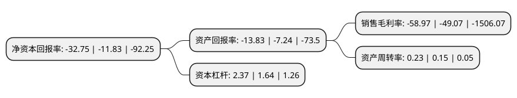

> 本页面由自动化程序生成于 2022年5月20日 01:09
> 内容可能存在错误，如有bug请提交issue至：https://github.com/Eroleice/doc-pi/issues
{.is-warning}

# 上市公司基本情况

## 基本资料

大连晨鑫网络科技股份有限公司（以下简称“*ST晨鑫”）成立于2001年08月22日，大连市。于2010年07月13日在深交所中小板上市。

*ST晨鑫注册资本142,719.3万元，主要产品:海珍品苗及围堰海参。主营业务:海珍品苗种的繁育，科研与销售。以下是详细信息：

- 公司名称: 大连晨鑫网络科技股份有限公司
- 股票代码: 002447.SZ
- 所在地: 辽宁 - 大连市
- 成立日期: 2001年08月22日
- 注册资本: 142,719.3万元
- 法定代表人: 侯郁波
- 主营业务: 主要产品:海珍品苗及围堰海参主营业务:海珍品苗种的繁育，科研与销售
- 公司官网: www.morningstarnet.com
- 公司介绍: 公司确定了以向移动游戏及互联网大文化产业全面转型的发展战略，主营业务转向移动游戏、电子竞技等领域。全资子公司壕鑫互联推出“区块链电竞加速基础服务”——壕鑫竞斗云，同时推出基于区块链技术的虚拟宠物PolyPony宝利马；与此同时，壕鑫互联拥有自有流量平台1862.cn，形成了以体育类及电竞类游戏为核心，多品类游戏同步发展的业务布局。未来，公司将围绕全资子公司壕鑫互联继续打造“线上游戏—线下赛事竞技—媒体直播”相结合的“竞技平台金三角”模式，带给用户全方位竞技类游戏体验。公司制定了“电竞+AR/VR+区块链”三大战略。在原本的游戏发行业务上，着力开展基于区块链的相关业务——“竞斗云”，逐步将区块链技术渗透至各相关业务布局中，打造以“竞斗云”为品牌，硬件产品为骨架，保利马积分为血液，上层相关区块链应用为内容的“竞斗云区块链生态”。

## 股东及高管情况

上市公司第一大股东为刘德群，持股139,573,900股，占比9.78%，**疑似为**上市公司实际控制人。

截至2022年03月31日，上市公司的前十大股东中，共有9名自然人股东，1名机构股东，其中5%以上大股东共有3名。上市公司前十大股东明细如下：

> 未能通过持股比例判定出上市公司实际控制人（持股30%以上）
> 可能存在通过间接持股、联合持股、协议控制等方式拥有实际控制权的主体，具体请参考上市公司定期公告！
{.is-warning}

> 上市公司第一大股东持股不超过10%，请检查是否存在公司控制权风险！
{.is-danger}

> 截至2022年03月31日，上市公司前十大股东信息如下：

| 股东名称 | 持股数量（股） | 持股比例 |
| --- | --- | --- |
| 刘德群 | 139,573,900 | 9.78% |
| 薛成标 | 99,630,000 | 6.98% |
| 钜成企业管理集团有限公司 | 95,371,200 | 6.68% |
| 朱龙清 | 18,305,550 | 1.28% |
| 马丽 | 9,605,000 | 0.67% |
| 伍玉龙 | 7,567,300 | 0.53% |
| 华志娟 | 7,112,700 | 0.5% |
| 李军旗 | 7,097,950 | 0.5% |
| 陶红 | 7,027,200 | 0.49% |
| 白云 | 6,884,108 | 0.48% |

## 利润表分析

上市公司2021年总收入为1.53亿元，净利润为-0.91亿元，**未实现盈利**。

## 杜邦分析

> 数据列示周期：2021年 | 2020年 | 2019年
{.is-info}

上市公司的净资产收益率在近一年有所上升，上升幅度为176.84%，其变化情况分解如下：
- 上市公司的销售毛利率在近一年上升了20.18%，可能是生产效率的提升、商品原材料价格下跌或商品价格的上涨所致。
- 上市公司的资产周转率在近一年上升了53.33%，可能是源自于更快的销售回款或库存管理效果提升。
- 上市公司的财务杠杆比率在近一年上升了44.51%，可能是增加负债扩大生产规模。

