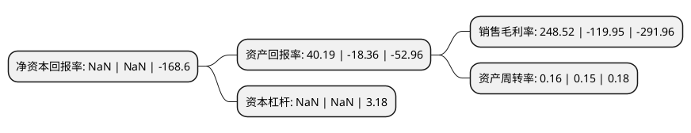

> 本页面由自动化程序生成于 2022年5月20日 01:09
> 内容可能存在错误，如有bug请提交issue至：https://github.com/Eroleice/doc-pi/issues
{.is-warning}

# 上市公司基本情况

## 基本资料

众应互联科技股份有限公司（以下简称“*ST众应”）成立于1993年04月02日，丽水市。于2010年08月31日在深交所中小板上市。

*ST众应注册资本52,179.439万元，主营业务为研发，制造和销售各类铭板，薄膜开关，传统塑胶件和IMD产品等消费品外观件。公司的外观件产品按照材料和用途的差别，分为铭板薄膜开关，传统塑胶件和IMD产品。以下是详细信息：

- 公司名称: 众应互联科技股份有限公司
- 股票代码: 002464.SZ
- 所在地: 浙江 - 丽水市
- 成立日期: 1993年04月02日
- 注册资本: 52,179.439万元
- 法定代表人: 李化亮
- 主营业务: 主营业务为研发，制造和销售各类铭板，薄膜开关，传统塑胶件和IMD产品等消费品外观件公司的外观件产品按照材料和用途的差别，分为铭板薄膜开关，传统塑胶件和IMD产品
- 公司官网: www.wholeasy.com
- 公司介绍: 公司是表面材料应用技术领域内工艺体系完整、应用材料多样的专业厂家，也是全球IMD技术全方位解决方案的实践与领导者。2015年公司实现产业转型，收购香港摩伽科技有限公司100%股权，实现了重大资产重组。通过对MMOGA的收购，公司由原来的传统制造业，成功转型为轻资产的网络游戏电子商务平台企业。金利科技是国内领先的具有国际互联网游戏品牌的公司，MMOGA是欧洲地区大型的互联网B2C游戏垂直电商平台之一,专门为正版授权/注册码及游戏虚拟物品提供相关交易服务。MMOGA专注于线上游戏相关产品的零售行业，致力于为全球的优秀游戏商品经销商和游戏玩家提供一个安全、可靠、高效、便利、专业的中介交易平台,目前拥有庞大的注册会员群体。公司将利用国际、国内的平台资源，继续提升MMOGA既有的行业领导地位和品牌优势；建立与国际知名一线游戏研发商的战略合作关系；开启与中国一线品牌互联网、游戏、电子商务等巨头的战略合作；创新发展MMOGA现有业务模式、系统流程、品牌和行业公信力等竞争优势；结合中国互联网、电子商务、游戏、娱乐、文化和媒体行业的特点，稳健、创造性地打造国内一流的娱乐产业公司。

## 股东及高管情况

上市公司第一大股东为宁波冉盛盛瑞投资管理合伙企业(有限合伙)，持股125,440,000股，占比24.04%，**疑似为**上市公司实际控制人。

截至2022年03月31日，上市公司的前十大股东中，共有8名自然人股东，2名机构股东，其中5%以上大股东共有2名。上市公司前十大股东明细如下：

> 未能通过持股比例判定出上市公司实际控制人（持股30%以上）
> 可能存在通过间接持股、联合持股、协议控制等方式拥有实际控制权的主体，具体请参考上市公司定期公告！
{.is-warning}

> 截至2022年03月31日，上市公司前十大股东信息如下：

| 股东名称 | 持股数量（股） | 持股比例 |
| --- | --- | --- |
| 宁波冉盛盛瑞投资管理合伙企业(有限合伙) | 125,440,000 | 24.04% |
| 宁波梅山保税港区瑞燊股权投资合伙企业(有限合伙) | 52,156,749 | 10% |
| 夏永全 | 3,300,334 | 0.63% |
| 孙毓鸿 | 3,216,646 | 0.62% |
| 郭文辉 | 2,394,060 | 0.46% |
| 曹泽学 | 2,048,900 | 0.39% |
| 徐国英 | 2,016,600 | 0.39% |
| 朱在祥 | 1,947,652 | 0.37% |
| 姜月 | 1,925,300 | 0.37% |
| 张凤英 | 1,798,300 | 0.34% |

## 利润表分析

上市公司2021年总收入为2.33亿元，净利润为5.8亿元，实现盈利。

## 杜邦分析

> 数据列示周期：2021年 | 2020年 | 2019年
{.is-info}

上市公司的净资产收益率在近一年有所下降，下降幅度为NaN%，其变化情况分解如下：
- 上市公司的销售毛利率在近一年下降了-307.19%，可能是生产效率的下降、商品原材料价格上涨或商品价格的下跌所致。
- 上市公司的资产周转率在近一年上升了6.67%，可能是源自于更快的销售回款或库存管理效果提升。
- 上市公司的财务杠杆比率在近一年下降了NaN%，可能是减少负债降低财务费用。

