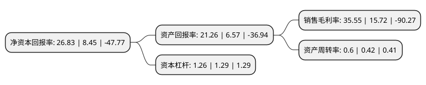

> 本页面由自动化程序生成于 2022年5月20日 01:09
> 内容可能存在错误，如有bug请提交issue至：https://github.com/Eroleice/doc-pi/issues
{.is-warning}

# 上市公司基本情况

## 基本资料

恺英网络股份有限公司（以下简称“恺英网络”）成立于2000年01月03日，泉州市。于2010年12月07日在深交所中小板上市。

恺英网络注册资本215,251.763万元，主营业务为网页游戏与手机游戏等精品娱乐内容的研发和运营;网页游戏平台与移动应用分发平台的运营以及互联网+高科技的布局。以下是详细信息：

- 公司名称: 恺英网络股份有限公司
- 股票代码: 002517.SZ
- 所在地: 福建 - 泉州市
- 成立日期: 2000年01月03日
- 注册资本: 215,251.763万元
- 法定代表人: 陈永聪
- 主营业务: 主营业务为网页游戏与手机游戏等精品娱乐内容的研发和运营;网页游戏平台与移动应用分发平台的运营以及互联网+高科技的布局
- 公司官网: www.kingnet.com
- 公司介绍: 公司是中国知名的互联网企业。公司始终坚持“游戏+平台+互联网高科技”的发展战略，主要业务包括：1.游戏业务：网页游戏、手机游戏与H5游戏等精品娱乐内容的研发和运营；2.平台业务：网页游戏平台、移动应用分发平台、区块链平台的运营、XY游H5游戏运营平台；3.互联网高科技：科技金融、VR/AR、大数据智能处理中心等项目的布局。公司以“游戏”为核心，集游戏研发、运营、发行为一体，旗下盛和游戏、浙江九翎拥有强大游戏研发实力。公司通过游戏产品(移动游戏、网页游戏、H5游戏)和发行平台(XY页游平台、XY助手、XY游、MG游戏)进行横向延伸，通过电竞、动画、漫画、影视剧等泛娱乐内容进行纵向布局，全力为用户打造优质感官体验。公司秉持“研发+发行双轮驱动”理念，开发并运营了《摩天大楼》、《蜀山传奇》、《全民奇迹MU》、《王者传奇》、《敢达争锋对决》、《战舰世界闪击战》等多款热门游戏。公司正在集中更多的精力、资源来深度挖掘和发展游戏业务；同时在做好一个专业、用心的游戏内容提供商和运营商的基础上围绕主业做延伸，实现创新和突破。

## 股东及高管情况

上市公司第一大股东为王悦，持股461,570,064股，占比21.44%，**疑似为**上市公司实际控制人。

截至2022年03月31日，上市公司的前十大股东中，共有6名自然人股东，3名机构股东，1个海外主体，其中5%以上大股东共有2名。上市公司前十大股东明细如下：

> 未能通过持股比例判定出上市公司实际控制人（持股30%以上）
> 可能存在通过间接持股、联合持股、协议控制等方式拥有实际控制权的主体，具体请参考上市公司定期公告！
{.is-warning}

> 截至2022年03月31日，上市公司前十大股东信息如下：

| 股东名称 | 持股数量（股） | 持股比例 |
| --- | --- | --- |
| 王悦 | 461,570,064 | 21.44% |
| 金锋 | 210,675,484 | 9.79% |
| 金丹良 | 93,344,287 | 4.34% |
| 香港中央结算有限公司(陆股通) | 91,410,880 | 4.25% |
| 嵊州嵊和企业管理合伙企业(有限合伙) | 81,616,948 | 3.79% |
| 林诗奕 | 50,690,050 | 2.35% |
| 上海海桐开元兴息股权投资合伙企业(有限合伙) | 49,847,800 | 2.32% |
| 杭州浩祥投资合伙企业(有限合伙) | 39,670,000 | 1.84% |
| 周瑜 | 15,299,486 | 0.71% |
| 董文淙 | 13,579,800 | 0.63% |

## 利润表分析

上市公司2021年总收入为23.75亿元，净利润为8.44亿元，实现盈利。

## 杜邦分析

> 数据列示周期：2021年 | 2020年 | 2019年
{.is-info}

上市公司的净资产收益率在近一年有所上升，上升幅度为217.51%，其变化情况分解如下：
- 上市公司的销售毛利率在近一年上升了126.15%，可能是生产效率的提升、商品原材料价格下跌或商品价格的上涨所致。
- 上市公司的资产周转率在近一年上升了42.86%，可能是源自于更快的销售回款或库存管理效果提升。
- 上市公司的财务杠杆比率在近一年下降了-2.33%，可能是减少负债降低财务费用。

