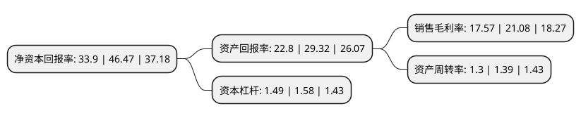

> 本页面由自动化程序生成于 2022年5月20日 01:10
> 内容可能存在错误，如有bug请提交issue至：https://github.com/Eroleice/doc-pi/issues
{.is-warning}

# 上市公司基本情况

## 基本资料

三七互娱网络科技集团股份有限公司（以下简称“三七互娱”）成立于1995年05月26日，芜湖市。于2011年03月02日在深交所中小板上市。

三七互娱注册资本221,786.428万元，汽车零部件制造，销售，网络游戏运营及开发等以下是详细信息：

- 公司名称: 三七互娱网络科技集团股份有限公司
- 股票代码: 002555.SZ
- 所在地: 安徽 - 芜湖市
- 成立日期: 1995年05月26日
- 注册资本: 221,786.428万元
- 法定代表人: 李卫伟
- 主营业务: 汽车零部件制造，销售，网络游戏运营及开发等
- 公司官网: www.37wan.net
- 公司介绍: 公司主要从事互动娱乐业务以及汽车塑料燃油箱制造、销售业务，其中互动娱乐业务以手机游戏和网页游戏的研发、发行和运营为主，同时布局影视、动漫、音乐、VR及直播等泛娱乐业务。公司核心团队由经验丰富的手机游戏、网页游戏发行团队，以及技术领先的研发团队组成。公司自主研发的一系列性能优异、稳定性强的游戏引擎、游戏框架等核心技术，能够支持开发高性能、可玩性强的大型精品网络游戏，是公司持续推出高质量精品游戏的重要保障。公司于2017年5月完成对上海墨鹍公司以及江苏智铭公司整体收购，增强了公司游戏研发实力以及发行能力。

## 股东及高管情况

上市公司第一大股东为李卫伟，持股322,113,019股，占比14.52%，**疑似为**上市公司实际控制人。

截至2022年03月31日，上市公司的前十大股东中，共有6名自然人股东，3个产品账户，1个海外主体，其中5%以上大股东共有4名。上市公司前十大股东明细如下：

> 未能通过持股比例判定出上市公司实际控制人（持股30%以上）
> 可能存在通过间接持股、联合持股、协议控制等方式拥有实际控制权的主体，具体请参考上市公司定期公告！
{.is-warning}

> 截至2022年03月31日，上市公司前十大股东信息如下：

| 股东名称 | 持股数量（股） | 持股比例 |
| --- | --- | --- |
| 李卫伟 | 322,113,019 | 14.52% |
| 曾开天 | 245,344,374 | 11.06% |
| 胡宇航 | 201,597,684 | 9.09% |
| 香港中央结算有限公司(陆股通) | 131,298,540 | 5.92% |
| 吴卫红 | 77,289,762 | 3.48% |
| 吴卫东 | 62,843,457 | 2.83% |
| 徐志高 | 36,453,903 | 1.64% |
| 招商银行股份有限公司-兴全合润混合型证券投资基金 | 33,342,910 | 1.5% |
| 中国建设银行股份有限公司-中欧养老产业混合型证券投资基金 | 19,649,506 | 0.89% |
| 中国银行股份有限公司-富国创新趋势股票型证券投资基金 | 19,210,301 | 0.87% |

## 利润表分析

上市公司2021年总收入为162.16亿元，净利润为28.49亿元，实现盈利。

## 杜邦分析

> 数据列示周期：2021年 | 2020年 | 2019年
{.is-info}

上市公司的净资产收益率在近一年有所下降，下降幅度为-27.05%，其变化情况分解如下：
- 上市公司的销售毛利率在近一年下降了-16.65%，可能是生产效率的下降、商品原材料价格上涨或商品价格的下跌所致。
- 上市公司的资产周转率在近一年下降了-6.47%，可能是源自于更慢的销售回款或库存管理效果下降。
- 上市公司的财务杠杆比率在近一年下降了-5.7%，可能是减少负债降低财务费用。

