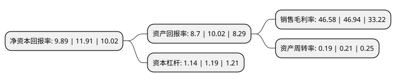

> 本页面由自动化程序生成于 2022年5月20日 01:10
> 内容可能存在错误，如有bug请提交issue至：https://github.com/Eroleice/doc-pi/issues
{.is-warning}

# 上市公司基本情况

## 基本资料

巨人网络集团股份有限公司（以下简称“巨人网络”）成立于1997年07月22日，重庆市。于2011年03月02日在深交所中小板上市。

巨人网络注册资本202,437.993万元，主营业务为客户端游戏，移动游戏和互联网社区工具。以下是详细信息：

- 公司名称: 巨人网络集团股份有限公司
- 股票代码: 002558.SZ
- 所在地: 重庆 - 重庆市
- 成立日期: 1997年07月22日
- 注册资本: 202,437.993万元
- 法定代表人: 刘伟
- 主营业务: 主营业务为客户端游戏，移动游戏和互联网社区工具
- 公司官网: www.ga-me.com
- 公司介绍: 公司原主营业务为内河涉外豪华游轮运营业务和旅行社业务。2016年公司通过重大资产重组，将原有资产、负债、业务和人员等剥离，巨人网络整体注入公司。公司主营业务从游轮运营和旅行社业务变为网络游戏，成为一家以网络游戏为主的综合性互联网企业，定位三大核心业务：互联网娱乐、互联网金融与互联网医疗。其中互联网娱乐板块的发展战略为：坚持自主研发、聚焦精品、布局全球市场。

## 股东及高管情况

上市公司第一大股东为上海巨人投资管理有限公司，持股564,205,115股，占比27.87%，**疑似为**上市公司实际控制人。

截至2022年03月31日，上市公司的前十大股东中，共有1名自然人股东，7名机构股东，2个产品账户，其中5%以上大股东共有4名。上市公司前十大股东明细如下：

> 未能通过持股比例判定出上市公司实际控制人（持股30%以上）
> 可能存在通过间接持股、联合持股、协议控制等方式拥有实际控制权的主体，具体请参考上市公司定期公告！
{.is-warning}

> 截至2022年03月31日，上市公司前十大股东信息如下：

| 股东名称 | 持股数量（股） | 持股比例 |
| --- | --- | --- |
| 上海巨人投资管理有限公司 | 564,205,115 | 27.87% |
| 上海腾澎投资合伙企业(有限合伙) | 195,574,676 | 9.66% |
| 上海鼎晖孚远股权投资合伙企业(有限合伙) | 105,013,588 | 5.19% |
| 上海中堇翊源投资咨询中心(有限合伙) | 101,542,458 | 5.02% |
| 上海澎腾投资合伙企业(有限合伙) | 88,547,351 | 4.37% |
| 巨人网络集团股份有限公司-第一期员工持股计划 | 60,731,398 | 3% |
| 上海孚烨股权投资合伙企业(有限合伙) | 52,098,430 | 2.57% |
| 乔晓辉 | 46,163,836 | 2.28% |
| 上海铼钸投资咨询中心(有限合伙) | 44,006,597 | 2.17% |
| 中国工商银行股份有限公司-东方红睿玺三年定期开放灵活配置混合型证券投资基金 | 30,839,243 | 1.52% |

## 利润表分析

上市公司2021年总收入为21.24亿元，净利润为9.89亿元，实现盈利。

## 杜邦分析

> 数据列示周期：2021年 | 2020年 | 2019年
{.is-info}

上市公司的净资产收益率在近一年有所下降，下降幅度为-16.96%，其变化情况分解如下：
- 上市公司的销售毛利率在近一年下降了-0.77%，可能是生产效率的下降、商品原材料价格上涨或商品价格的下跌所致。
- 上市公司的资产周转率在近一年下降了-9.52%，可能是源自于更慢的销售回款或库存管理效果下降。
- 上市公司的财务杠杆比率在近一年下降了-4.2%，可能是减少负债降低财务费用。

