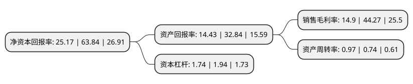

> 本页面由自动化程序生成于 2022年5月20日 01:10
> 内容可能存在错误，如有bug请提交issue至：https://github.com/Eroleice/doc-pi/issues
{.is-warning}

# 上市公司基本情况

## 基本资料

上海姚记科技股份有限公司（以下简称“姚记科技”）成立于1989年09月13日，上海市。于2011年08月05日在深交所中小板上市。

姚记科技注册资本40,484.959万元，主要经营为移动游戏的研发，发行和运营业务，以及各类扑克牌的设计，生产和销售业务。以下是详细信息：

- 公司名称: 上海姚记科技股份有限公司
- 股票代码: 002605.SZ
- 所在地: 上海 - 上海市
- 成立日期: 1989年09月13日
- 注册资本: 40,484.959万元
- 法定代表人: 姚朔斌
- 主营业务: 主要经营为移动游戏的研发，发行和运营业务，以及各类扑克牌的设计，生产和销售业务
- 公司官网: www.yaojikeji.com
- 公司介绍: 公司主要从事移动游戏的研发、发行和运营业务，以及各类扑克牌的设计、生产和销售业务，目前，基于传统主业与“大娱乐”战略的联动性，公司逐步实现了以移动游戏业务为重心，不断向互联网领域扩张的竞争格局。公司采用全自动生产线结合自主研发的部分核心设备，使用高端扑克牌专用纸张、专业上光技术和环保油墨，将传统的手工及机械操作式扑克牌生产流程改进为自动化生产方式。公司主要采用传统的经销商分销模式，通过各级经销商实现产品的快速销售，对外销售主要采用“款到发货”的方式保证货款安全。公司的“姚记”品牌已获得市场充分认可，具有较高的市场地位和知名度，“姚记”商标先后荣获“上海市著名商标”、“上海市名牌产品”等荣誉称号，被国家工商行政管理总局商标局认定为“中国驰名商标”，是中国文教体育用品协会向社会公布的“中国扑克牌行业知名品牌”的六大品牌之一。

## 股东及高管情况

上市公司第一大股东为姚朔斌，持股70,502,252股，占比17.41%，**疑似为**上市公司实际控制人。

截至2022年03月31日，上市公司的前十大股东中，共有5名自然人股东，5个产品账户，其中5%以上大股东共有4名。上市公司前十大股东明细如下：

> 未能通过持股比例判定出上市公司实际控制人（持股30%以上）
> 可能存在通过间接持股、联合持股、协议控制等方式拥有实际控制权的主体，具体请参考上市公司定期公告！
{.is-warning}

> 截至2022年03月31日，上市公司前十大股东信息如下：

| 股东名称 | 持股数量（股） | 持股比例 |
| --- | --- | --- |
| 姚朔斌 | 70,502,252 | 17.41% |
| 姚晓丽 | 53,224,352 | 13.15% |
| 姚硕榆 | 34,052,252 | 8.41% |
| 姚文琛 | 27,798,813 | 6.87% |
| 中国工商银行股份有限公司-富国创新科技混合型证券投资基金 | 10,890,194 | 2.69% |
| 邱金兰 | 9,058,869 | 2.24% |
| 珠海阿巴马资产管理有限公司-阿巴马悦享红利28号私募证券投资基金 | 6,929,419 | 1.71% |
| 广州市玄元投资管理有限公司-玄元科新241号私募证券投资基金 | 6,627,900 | 1.64% |
| 上海迎水投资管理有限公司-迎水翡玉17号私募证券投资基金 | 6,338,500 | 1.57% |
| 上海迎水投资管理有限公司-迎水翡玉18号私募证券投资基金 | 6,338,500 | 1.57% |

## 利润表分析

上市公司2021年总收入为38.07亿元，净利润为5.67亿元，实现盈利。

## 杜邦分析

> 数据列示周期：2021年 | 2020年 | 2019年
{.is-info}

上市公司的净资产收益率在近一年有所下降，下降幅度为-60.57%，其变化情况分解如下：
- 上市公司的销售毛利率在近一年下降了-66.34%，可能是生产效率的下降、商品原材料价格上涨或商品价格的下跌所致。
- 上市公司的资产周转率在近一年上升了31.08%，可能是源自于更快的销售回款或库存管理效果提升。
- 上市公司的财务杠杆比率在近一年下降了-10.31%，可能是减少负债降低财务费用。

