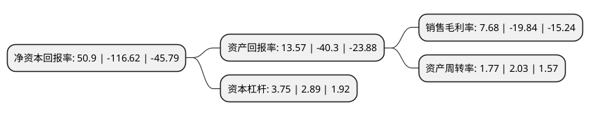

> 本页面由自动化程序生成于 2022年5月20日 01:10
> 内容可能存在错误，如有bug请提交issue至：https://github.com/Eroleice/doc-pi/issues
{.is-warning}

# 上市公司基本情况

## 基本资料

跨境通宝电子商务股份有限公司（以下简称“*ST跨境”）成立于2003年03月07日，太原市。于2011年12月08日在深交所中小板上市。

*ST跨境注册资本155,804.133万元，主营业务:男女裤装的研发设计，组织外包生产，物流配送，连锁销售，跨境电商。以下是详细信息：

- 公司名称: 跨境通宝电子商务股份有限公司
- 股票代码: 002640.SZ
- 所在地: 山西 - 太原市
- 成立日期: 2003年03月07日
- 注册资本: 155,804.133万元
- 法定代表人: 李勇
- 主营业务: 主营业务:男女裤装的研发设计，组织外包生产，物流配送，连锁销售，跨境电商
- 公司官网: www.kjtbao.com
- 公司介绍: 公司是国内最早从事连锁经营的服装销售企业之一。公司目前不仅保留原有的服装零售业务，更是发力跨境电商，将国内各类3C电子产品、服装服饰、美容等各类品牌产品供应给全球客户。目前，跨境通的跨境电商业务已覆盖到包括美国、加拿大、英国、德国、俄罗斯、法国、西班牙等全球多个国家与地区。公司通过特许加盟与直营销售相结合的连锁经营模式，通过品牌推广、终端渠道建设、产品设计开发和供应链管理，组织公司自有品牌百圆裤装的批发与零售，产品包括男女西裤、休闲裤、牛仔裤。公司多次获得了中国特许经营领域的最高奖项——中国特许奖。百圆裤业品牌还先后被认定为中国驰名商标，并获得了中国裤装市场售后服务满意第一品牌、中国优秀特许品牌、山西省著名商标等多项荣誉。

## 股东及高管情况

上市公司第一大股东为杨建新，持股213,360,500股，占比13.69%，**疑似为**上市公司实际控制人。

截至2022年03月31日，上市公司的前十大股东中，共有7名自然人股东，1名机构股东，2个产品账户，其中5%以上大股东共有3名。上市公司前十大股东明细如下：

> 未能通过持股比例判定出上市公司实际控制人（持股30%以上）
> 可能存在通过间接持股、联合持股、协议控制等方式拥有实际控制权的主体，具体请参考上市公司定期公告！
{.is-warning}

> 截至2022年03月31日，上市公司前十大股东信息如下：

| 股东名称 | 持股数量（股） | 持股比例 |
| --- | --- | --- |
| 杨建新 | 213,360,500 | 13.69% |
| 广州开发区新兴产业投资基金管理有限公司 | 132,000,000 | 8.47% |
| 徐佳东 | 131,513,827 | 8.44% |
| 上海中平国瑀资产管理有限公司-上海中平国璟并购股权投资基金合伙企业(有限合伙) | 26,590,000 | 1.71% |
| 王杭义 | 23,296,300 | 1.5% |
| 新余睿景企业管理服务有限公司 | 12,335,000 | 0.79% |
| 武文强 | 12,207,272 | 0.78% |
| 郑汉辉 | 10,708,266 | 0.69% |
| 童涛 | 10,400,000 | 0.67% |
| 周敏 | 10,200,044 | 0.65% |

## 利润表分析

上市公司2021年总收入为88.17亿元，净利润为6.76亿元，实现盈利。

## 杜邦分析

> 数据列示周期：2021年 | 2020年 | 2019年
{.is-info}

上市公司的净资产收益率在近一年有所下降，下降幅度为-143.65%，其变化情况分解如下：
- 上市公司的销售毛利率在近一年下降了-138.71%，可能是生产效率的下降、商品原材料价格上涨或商品价格的下跌所致。
- 上市公司的资产周转率在近一年下降了-12.81%，可能是源自于更慢的销售回款或库存管理效果下降。
- 上市公司的财务杠杆比率在近一年上升了29.76%，可能是增加负债扩大生产规模。

