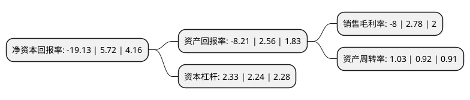

> 本页面由自动化程序生成于 2022年5月20日 01:11
> 内容可能存在错误，如有bug请提交issue至：https://github.com/Eroleice/doc-pi/issues
{.is-warning}

# 上市公司基本情况

## 基本资料

深圳万润科技股份有限公司（以下简称“万润科技”）成立于2002年12月13日，深圳市。于2012年02月17日在深交所中小板上市。

万润科技注册资本85,512.596万元，主营业务:中高端LED光源器件封装和LED照明产品的研发，设计生研发，设计生研发，设计生产和销售。公司的主要产品可以分为LED光源器件和LED照明产品两大类，其中LED光源器件根据封装形式又可以分为直插式LED和贴片式LED产品。LED照明产品根据具体应用领域不同又可以细分为LED通用照明产品和LED景观装饰照明产品。以下是详细信息：

- 公司名称: 深圳万润科技股份有限公司
- 股票代码: 002654.SZ
- 所在地: 广东 - 深圳市
- 成立日期: 2002年12月13日
- 注册资本: 85,512.596万元
- 法定代表人: 龚道夷
- 主营业务: 主营业务:中高端LED光源器件封装和LED照明产品的研发，设计生研发，设计生研发，设计生产和销售公司的主要产品可以分为LED光源器件和LED照明产品两大类，其中LED光源器件根据封装形式又可以分为直插式LED和贴片式LED产品LED照明产品根据具体应用领域不同又可以细分为LED通用照明产品和LED景观装饰照明产品
- 公司官网: www.masonled.com
- 公司介绍: 公司是一家以LED产业和广告传媒业“双主业”驱动发展、创新力强的大型现代化企业集团。在LED领域，公司是国内领先，集研发、设计、生产和销售于一体的中高端LED光源器件封装和LED应用照明产品提供商，为客户提供高品质LED光源器件和LED应用照明产品一体化解决方案。荣膺“国家高新技术企业”、中国“LED最具国际竞争力TOP10企业”、“中国最具国际竞争力LED封装企业TOP10”、2017年度福布斯上市公司潜力企业榜100强、2017年中国上市公司口碑榜“最具社会责任奖”等上百项荣誉。先后通过中国节能产品认证，中国CQC、CCC认证；ISO9001。美国UL、DLC，澳洲SAA，以及欧盟CE、ROHS、SGS认证；获得了国家重点新产品证书、广东省高新技术产品证书及广东省名牌产品证书；拥有美国UL、德国莱茵TUV授权目击实验室资质。

## 股东及高管情况

上市公司第一大股东为湖北宏泰集团有限公司，持股201,978,254股，占比23.62%，**疑似为**上市公司实际控制人。

截至2022年03月31日，上市公司的前十大股东中，共有3名自然人股东，5名机构股东，2个产品账户，其中5%以上大股东共有2名。上市公司前十大股东明细如下：

> 未能通过持股比例判定出上市公司实际控制人（持股30%以上）
> 可能存在通过间接持股、联合持股、协议控制等方式拥有实际控制权的主体，具体请参考上市公司定期公告！
{.is-warning}

> 截至2022年03月31日，上市公司前十大股东信息如下：

| 股东名称 | 持股数量（股） | 持股比例 |
| --- | --- | --- |
| 湖北宏泰集团有限公司 | 201,978,254 | 23.62% |
| 李志江 | 66,869,584 | 7.82% |
| 杭州橙思众想股权投资合伙企业(有限合伙) | 25,960,519 | 3.04% |
| 深圳市前海方位投资管理有限公司-方位成长19号私募证券投资基金 | 17,102,519 | 2% |
| 杭州信立传视股权投资合伙企业(有限合伙) | 15,176,920 | 1.77% |
| 陈如兵 | 13,966,800 | 1.63% |
| 青骓投资管理有限公司-青骓星牛二期私募证券投资基金 | 11,340,700 | 1.33% |
| 余江县万象新动投资管理中心(有限合伙) | 9,576,765 | 1.12% |
| 沈道义 | 9,429,900 | 1.1% |
| 杭州信传股权投资合伙企业(有限合伙) | 8,558,413 | 1% |

## 利润表分析

上市公司2021年总收入为44.11亿元，净利润为-3.54亿元，**未实现盈利**。

## 杜邦分析

> 数据列示周期：2021年 | 2020年 | 2019年
{.is-info}

上市公司的净资产收益率在近一年有所下降，下降幅度为-434.44%，其变化情况分解如下：
- 上市公司的销售毛利率在近一年下降了-387.77%，可能是生产效率的下降、商品原材料价格上涨或商品价格的下跌所致。
- 上市公司的资产周转率在近一年上升了11.96%，可能是源自于更快的销售回款或库存管理效果提升。
- 上市公司的财务杠杆比率在近一年上升了4.02%，可能是增加负债扩大生产规模。

