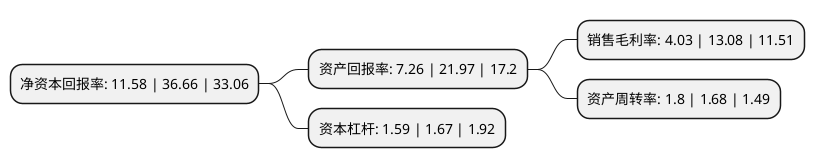

> 本页面由自动化程序生成于 2022年5月20日 01:12
> 内容可能存在错误，如有bug请提交issue至：https://github.com/Eroleice/doc-pi/issues
{.is-warning}

# 上市公司基本情况

## 基本资料

厦门吉宏科技股份有限公司（以下简称“吉宏股份”）成立于2003年12月24日，厦门市。于2016年07月12日在深交所中小板上市。

吉宏股份注册资本38,748.009万元，主营业务:提供以快速消费品为核心领域的包装印刷综合解决方案的服务。公司的主要产品为彩色包装纸盒，彩色包装箱，塑料软包装，环保纸袋等。以下是详细信息：

- 公司名称: 厦门吉宏科技股份有限公司
- 股票代码: 002803.SZ
- 所在地: 福建 - 厦门市
- 成立日期: 2003年12月24日
- 注册资本: 38,748.009万元
- 法定代表人: 庄浩
- 主营业务: 主营业务:提供以快速消费品为核心领域的包装印刷综合解决方案的服务公司的主要产品为彩色包装纸盒，彩色包装箱，塑料软包装，环保纸袋等
- 公司官网: www.jihong.cn
- 公司介绍: 公司的主要产品为彩色包装纸盒、彩色包装箱、塑料软包装等，广泛应用于快速消费品的外包装。经过多年的努力，凭借新颖的设计创意、先进的产品工艺和优良的产品品质，公司已与伊利集团、恒安集团、纳爱斯集团、金红叶集团、金佰利、联想移动通信等大型公司建立了长期稳定的合作关系。公司自成立之日起，一直致力于成为消费品包装印刷领域中的优质综合服务商，并在技术、服务、质量、品牌、管理等方面形成了核心竞争力，先后获得“厦门最具成长型的企业”、“政府指定文化传播企业”、“中国质量信得过企业”等荣誉。公司设立了研发设计部，持续加大对产品研发的投入，较早实现了计算机直接制版(CTP)技术的开发与熟练应用，并掌握了多色、高速、自动、联动等先进印刷技术。通过持续加大对技术与产品研发的投入，公司的数字化技术和信息化水平得到有效提升，并于2011年被评为“高新技术企业”。

## 股东及高管情况

上市公司第一大股东为庄浩，持股76,788,382股，占比19.82%，**疑似为**上市公司实际控制人。

截至2022年03月31日，上市公司的前十大股东中，共有6名自然人股东，3名机构股东，1个产品账户，其中5%以上大股东共有3名。上市公司前十大股东明细如下：

> 未能通过持股比例判定出上市公司实际控制人（持股30%以上）
> 可能存在通过间接持股、联合持股、协议控制等方式拥有实际控制权的主体，具体请参考上市公司定期公告！
{.is-warning}

> 截至2022年03月31日，上市公司前十大股东信息如下：

| 股东名称 | 持股数量（股） | 持股比例 |
| --- | --- | --- |
| 庄浩 | 76,788,382 | 19.82% |
| 庄澍 | 34,671,025 | 8.95% |
| 赣州金融控股集团有限责任公司 | 29,000,000 | 7.48% |
| 西藏永悦诗超企业管理有限公司 | 14,597,900 | 3.77% |
| 赣州发展融资租赁有限责任公司 | 12,696,662 | 3.28% |
| 贺静颖 | 6,638,925 | 1.71% |
| 张和平 | 6,638,925 | 1.71% |
| 王亚朋 | 5,211,800 | 1.35% |
| 中国建设银行股份有限公司-广发多元新兴股票型证券投资基金 | 4,760,305 | 1.23% |
| 王海营 | 4,048,380 | 1.04% |

## 利润表分析

上市公司2021年总收入为51.77亿元，净利润为2.08亿元，实现盈利。

## 杜邦分析

> 数据列示周期：2021年 | 2020年 | 2019年
{.is-info}

上市公司的净资产收益率在近一年有所下降，下降幅度为-68.41%，其变化情况分解如下：
- 上市公司的销售毛利率在近一年下降了-69.19%，可能是生产效率的下降、商品原材料价格上涨或商品价格的下跌所致。
- 上市公司的资产周转率在近一年上升了7.14%，可能是源自于更快的销售回款或库存管理效果提升。
- 上市公司的财务杠杆比率在近一年下降了-4.79%，可能是减少负债降低财务费用。

