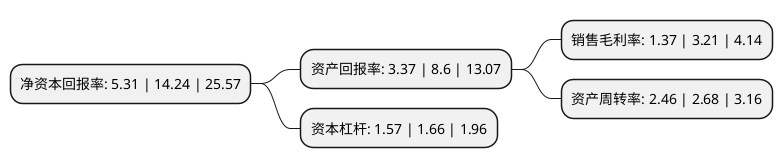

> 本页面由自动化程序生成于 2022年5月20日 01:13
> 内容可能存在错误，如有bug请提交issue至：https://github.com/Eroleice/doc-pi/issues
{.is-warning}

# 上市公司基本情况

## 基本资料

北京全时天地在线网络信息股份有限公司（以下简称“天地在线”）成立于2005年12月30日，北京市。于2020年08月05日在深交所中小板上市。

天地在线注册资本9,137.1万元，专注于为企业客户提供互联网综合营销服务及企业级SaaS营销服务以下是详细信息：

- 公司名称: 北京全时天地在线网络信息股份有限公司
- 股票代码: 002995.SZ
- 所在地: 北京 - 北京市
- 成立日期: 2005年12月30日
- 注册资本: 9,137.1万元
- 法定代表人: 信意安
- 主营业务: 专注于为企业客户提供互联网综合营销服务及企业级SaaS营销服务
- 公司官网: www.372163.com
- 公司介绍: 公司自2005年成立以来，一直专注于为客户提供互联网综合营销服务及企业级SaaS营销服务，目前已经发展成为国内互联网广告服务领域具有品牌影响力的领先企业。公司提供的互联网综合营销服务主要是包括数据挖掘和策略制定、媒体资源采购、创意设计和素材制作、投放测试和效果分析、策略优化和投放、效果跟踪和评估的整体解决方案；企业级SaaS营销服务主要是为客户提供针对SaaS产品的咨询、培训、购买和维护等全方位服务。公司总部位于北京，并在天津、广东、安徽、河北、山东、四川、陕西、江苏、山西、浙江等地成立分、子公司，初步建立了全国性的综合服务网；公司分别与腾讯、360、爱奇艺、今日头条、搜狗、搜狐等知名企业、集团建立友好合作关系，构建了多元化的互联网媒体与产品体系；公司具有一流的广告及运营服务团队，凭借对互联网、客户需求的深刻理解及十余年的专业服务经验，以大数据为依托，不断为客户提供更加精准专业的互联网综合营销服务及企业级SaaS营销服务。

## 股东及高管情况

上市公司第一大股东为信意安，持股29,658,037股，占比32.46%，为上市公司实际控制人。

截至2022年03月31日，上市公司的前十大股东中，共有5名自然人股东，5名机构股东，其中5%以上大股东共有2名。上市公司前十大股东明细如下：

> 截至2022年03月31日，上市公司前十大股东信息如下：

| 股东名称 | 持股数量（股） | 持股比例 |
| --- | --- | --- |
| 信意安 | 29,658,037 | 32.46% |
| 陈洪霞 | 14,585,005 | 15.96% |
| 汇智易德咸宁股权投资合伙企业(有限合伙) | 4,448,060 | 4.87% |
| 北京一鸣天地投资中心(有限合伙) | 3,780,139 | 4.14% |
| 赵建光 | 3,654,500 | 4% |
| 中国银河证券股份有限公司 | 1,810,760 | 1.98% |
| 北京一飞天地投资中心(有限合伙) | 1,260,046 | 1.38% |
| 张贡博 | 906,200 | 0.99% |
| 北京建元博一投资管理合伙企业(有限合伙) | 681,800 | 0.75% |
| 孙长杰 | 525,300 | 0.57% |

## 杜邦分析

> 数据列示周期：2021年 | 2020年 | 2019年
{.is-info}

上市公司的净资产收益率在近一年有所下降，下降幅度为-62.71%，其变化情况分解如下：
- 上市公司的销售毛利率在近一年下降了-57.32%，可能是生产效率的下降、商品原材料价格上涨或商品价格的下跌所致。
- 上市公司的资产周转率在近一年下降了-8.21%，可能是源自于更慢的销售回款或库存管理效果下降。
- 上市公司的财务杠杆比率在近一年下降了-5.42%，可能是减少负债降低财务费用。

