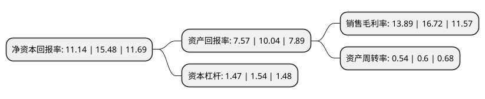

> 本页面由自动化程序生成于 2022年5月20日 01:14
> 内容可能存在错误，如有bug请提交issue至：https://github.com/Eroleice/doc-pi/issues
{.is-warning}

# 上市公司基本情况

## 基本资料

无锡宝通科技股份有限公司（以下简称“宝通科技”）成立于2000年12月27日，无锡市。于2009年12月25日在深交所创业板上市。

宝通科技注册资本41,173.595万元，主要产品:耐高温输送带，阻燃输送带，钢丝绳芯输送带，《六龙御天》，《剑侠情缘》，《暗黑黎明2》，《天龙八部3D》等核心产品。主营业务:各类高强力橡胶输送带的研发，生产，销售与服务和移动网络游戏的全球发行和运营业务。以下是详细信息：

- 公司名称: 无锡宝通科技股份有限公司
- 股票代码: 300031.SZ
- 所在地: 江苏 - 无锡市
- 成立日期: 2000年12月27日
- 注册资本: 41,173.595万元
- 法定代表人: 包志方
- 主营业务: 主要产品:耐高温输送带，阻燃输送带，钢丝绳芯输送带，《六龙御天》，《剑侠情缘》，《暗黑黎明2》，《天龙八部3D》等核心产品主营业务:各类高强力橡胶输送带的研发，生产，销售与服务和移动网络游戏的全球发行和运营业务
- 公司官网: www.botontech.cn
- 公司介绍: 公司围绕移动互联网业务和现代工业散货物料智能输送与服务业务两个板块共同发展。公司旗下子公司易幻网络一直专注于移动网络游戏的海外发行和运营。经过多年的长期海外市场专注耕耘，易幻网络在用户资源的积累、相关技术的运用、运营手法的迭代、渠道资源的整合和人才梯队的建设取得了飞跃式的发展，构建了易幻网络持久的核心竞争力。公司是国内领先的高强力橡胶输送带生产制造商及工业散货物料输送系统总包服务一体化提供商，公司专注于该领域内的产品研发、生产、销售与服务。主要产品涵盖各类高强力橡胶输送带，有耐热、耐高温、阻燃、节能环保、高强度及特种功能的钢丝绳芯输送带、织物芯输送带和特种结构输送带，广泛应用于矿产开采、钢材冶炼、建材水泥、港口码头、火力发电等行业，能适应各种输送的苛刻环境，得到了国内外知名企业的认可和赞誉。公司荣获了中国橡胶工业协会胶管胶带分会2016-2017年度“输送带十强企业”的称号。公司“BOTON宝通”牌被评为2017-2019年度江苏省重点培育和发展的国际知名品牌，公司是国家“中国名牌产品”获授单位、“中国驰名商标”、“国家级火炬计划重点高新技术企业”、“江苏省高新技术企业”。

## 股东及高管情况

上市公司第一大股东为包志方，持股82,950,952股，占比20.15%，**疑似为**上市公司实际控制人。

截至2022年03月31日，上市公司的前十大股东中，共有5名自然人股东，5个产品账户，其中5%以上大股东共有1名。上市公司前十大股东明细如下：

> 未能通过持股比例判定出上市公司实际控制人（持股30%以上）
> 可能存在通过间接持股、联合持股、协议控制等方式拥有实际控制权的主体，具体请参考上市公司定期公告！
{.is-warning}

> 截至2022年03月31日，上市公司前十大股东信息如下：

| 股东名称 | 持股数量（股） | 持股比例 |
| --- | --- | --- |
| 包志方 | 82,950,952 | 20.15% |
| 唐宇 | 6,062,952 | 1.47% |
| 梁寿如 | 4,212,600 | 1.02% |
| 上海呈瑞投资管理有限公司-呈瑞和兴46号私募证券投资基金 | 3,960,000 | 0.96% |
| 上海呈瑞投资管理有限公司-呈瑞和兴45号私募证券投资基金 | 3,960,000 | 0.96% |
| 中国农业银行股份有限公司-富国创业板两年定期开放混合型证券投资基金 | 3,544,400 | 0.86% |
| 全国社保基金四零一组合 | 3,255,767 | 0.79% |
| 中国工商银行股份有限公司-广发中证传媒交易型开放式指数证券投资基金 | 2,927,292 | 0.71% |
| 范莉 | 2,900,000 | 0.7% |
| 周立春 | 2,540,000 | 0.62% |

## 利润表分析

上市公司2021年总收入为27.59亿元，净利润为3.83亿元，实现盈利。

## 杜邦分析

> 数据列示周期：2021年 | 2020年 | 2019年
{.is-info}

上市公司的净资产收益率在近一年有所下降，下降幅度为-28.04%，其变化情况分解如下：
- 上市公司的销售毛利率在近一年下降了-16.93%，可能是生产效率的下降、商品原材料价格上涨或商品价格的下跌所致。
- 上市公司的资产周转率在近一年下降了-10%，可能是源自于更慢的销售回款或库存管理效果下降。
- 上市公司的财务杠杆比率在近一年下降了-4.55%，可能是减少负债降低财务费用。

