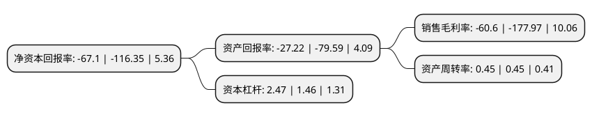

> 本页面由自动化程序生成于 2022年5月20日 01:14
> 内容可能存在错误，如有bug请提交issue至：https://github.com/Eroleice/doc-pi/issues
{.is-warning}

# 上市公司基本情况

## 基本资料

北京数知科技股份有限公司（以下简称“*ST数知”）成立于2004年09月10日，北京市。于2010年01月08日在深交所创业板上市。

*ST数知注册资本117,182.712万元，主营业务:信息基础设施投资运营和大数据+人工智能业务以下是详细信息：

- 公司名称: 北京数知科技股份有限公司
- 股票代码: 300038.SZ
- 所在地: 北京 - 北京市
- 成立日期: 2004年09月10日
- 注册资本: 117,182.712万元
- 法定代表人: 张志勇
- 主营业务: 主营业务:信息基础设施投资运营和大数据+人工智能业务
- 公司官网: www.shuzhi.ai
- 公司介绍: 公司是一家提供通信塔产品整体解决方案的高新技术企业，我国最早研发并推广三管通信塔产品的企业，我国通信塔行业最主要的供应商和最具竞争力的企业。2015年公司收购日月同行100.00%股权，开始涉足互联网营销业务；2017年度完成对全球互联网营销龙头企业BBHI的收购。公司数字营销服务已经通过构建专业化的互联网营销平台，整合各类互联网应用下载平台资源及流量资源，利用大数据分析、人工智能、用户画像等多种技术为广告主提供数字营销服务，为媒体主提供流量增值服务，以及其他传统互联网广告服务。信息基础设施投资运营业务方面，公司主要业务为信息基础设施投资与运营(通信相关业务)、通信网络基础设施产品及运维服务、通信基础设施投资运营、网络优化系统集成及设备销售、各类通信塔研发设计、生产制造、安装维护等基本业务，围绕运营商信息基础设施服务需求，自建及收购铁塔、管道、室分、驻地网等通信基站设施，为通信运营商提供运营服务及增值服务，积极开拓市场。在此基础上，公司业务延伸至智慧城市建设中的基础设施和网络层及大数据处理业务等方面。

## 股东及高管情况

上市公司第一大股东为上海诺牧投资中心(有限合伙)，持股105,175,175股，占比8.98%，**疑似为**上市公司实际控制人。

截至2022年03月31日，上市公司的前十大股东中，共有5名自然人股东，3名机构股东，1个产品账户，1名其他股东，其中5%以上大股东共有1名。上市公司前十大股东明细如下：

> 未能通过持股比例判定出上市公司实际控制人（持股30%以上）
> 可能存在通过间接持股、联合持股、协议控制等方式拥有实际控制权的主体，具体请参考上市公司定期公告！
{.is-warning}

> 上市公司第一大股东持股不超过10%，请检查是否存在公司控制权风险！
{.is-danger}

> 截至2022年03月31日，上市公司前十大股东信息如下：

| 股东名称 | 持股数量（股） | 持股比例 |
| --- | --- | --- |
| 上海诺牧投资中心(有限合伙) | 105,175,175 | 8.98% |
| 鹏华资产-工商银行-中建投信托-中建投信托·京杭单一资金信托 | 50,810,346 | 4.34% |
| 建信基金-兴业银行-中融国际信托-中融-宏金114号单一资金信托 | 36,948,526 | 3.15% |
| 北京瑞祥赛弗管理咨询中心(有限合伙) | 18,666,988 | 1.59% |
| 张志勇 | 10,658,480 | 0.91% |
| 华安未来资产-工商银行-杭州陆金承投资合伙企业(有限合伙) | 8,794,580 | 0.75% |
| 苏俊峡 | 3,933,395 | 0.34% |
| 王志祥 | 3,630,680 | 0.31% |
| 王明华 | 3,163,300 | 0.27% |
| 潘为民 | 3,130,000 | 0.27% |

## 利润表分析

上市公司2021年总收入为23.24亿元，净利润为-14.09亿元，**未实现盈利**。

## 杜邦分析

> 数据列示周期：2021年 | 2020年 | 2019年
{.is-info}

上市公司的净资产收益率在近一年有所下降，下降幅度为-42.33%，其变化情况分解如下：
- 上市公司的销售毛利率在近一年下降了-65.95%，可能是生产效率的下降、商品原材料价格上涨或商品价格的下跌所致。
- 上市公司的资产周转率在近一年下降了0%，可能是源自于更慢的销售回款或库存管理效果下降。
- 上市公司的财务杠杆比率在近一年上升了69.18%，可能是增加负债扩大生产规模。

