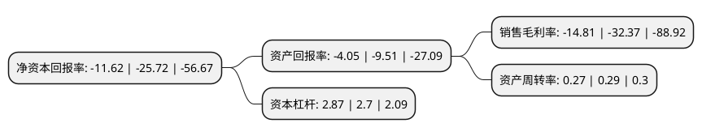

> 本页面由自动化程序生成于 2022年5月20日 01:14
> 内容可能存在错误，如有bug请提交issue至：https://github.com/Eroleice/doc-pi/issues
{.is-warning}

# 上市公司基本情况

## 基本资料

厦门三五互联科技股份有限公司（以下简称“ST三五”）成立于2004年04月01日，厦门市。于2010年02月11日在深交所创业板上市。

ST三五注册资本36,569.869万元，主要产品:企业邮箱，电子商务网站建设，网络域名业务。主营业务:通过SaaS模式，依靠自主研发的应用软件系统，重点面向中国中小企业客户，提供企业邮箱，电子商务网站建设，网络域名，办公自动化系统(OA)，客户关系管理系统(CRM)等软件产品及服务。以下是详细信息：

- 公司名称: 厦门三五互联科技股份有限公司
- 股票代码: 300051.SZ
- 所在地: 福建 - 厦门市
- 成立日期: 2004年04月01日
- 注册资本: 36,569.869万元
- 法定代表人: 章威炜
- 主营业务: 主要产品:企业邮箱，电子商务网站建设，网络域名业务主营业务:通过SaaS模式，依靠自主研发的应用软件系统，重点面向中国中小企业客户，提供企业邮箱，电子商务网站建设，网络域名，办公自动化系统(OA)，客户关系管理系统(CRM)等软件产品及服务
- 公司官网: www.35.com
- 公司介绍: 公司是中国知名的互联网应用服务类创业板上市公司，也是福建省首家创业板上市公司，连续多年获得“国家规划布局内重点软件企业”、“中国创业板最具竞争力上市公司”等殊荣。公司基于SaaS服务模式，先后在北京、天津、厦门等地成立技术研发中心，累积十多年的互联网产品研发和服务经验，研发推出企业邮箱、办公自动化系统(OA)、工作微博(Ewave)、即时通讯(EQ)、智能神话、三五财富卡、域名注册、主机托管、网站建设等一系列产品，为广大企业客户提供企业上网解决方案、企业沟通解决方案、移动云办公整体解决方案和企业移动通讯解决方案，并实现嵌入式架构，一账号登入，多应用多功能，满足企业客户信息化不同阶段的需求，全面推进企业信息化进程。

## 股东及高管情况

上市公司第一大股东为龚少晖，持股100,477,735股，占比27.48%，**疑似为**上市公司实际控制人。

截至2022年03月31日，上市公司的前十大股东中，共有8名自然人股东，2名机构股东，其中5%以上大股东共有4名。上市公司前十大股东明细如下：

> 未能通过持股比例判定出上市公司实际控制人（持股30%以上）
> 可能存在通过间接持股、联合持股、协议控制等方式拥有实际控制权的主体，具体请参考上市公司定期公告！
{.is-warning}

> 截至2022年03月31日，上市公司前十大股东信息如下：

| 股东名称 | 持股数量（股） | 持股比例 |
| --- | --- | --- |
| 龚少晖 | 100,477,735 | 27.48% |
| 龚少晖 | 81,477,735 | 22.28% |
| 海南巨星科技有限公司 | 21,251,566 | 5.81% |
| 万久根 | 19,000,000 | 5.2% |
| 深圳市高新投集团有限公司 | 9,500,000 | 2.6% |
| 蒋国祥 | 6,034,706 | 1.65% |
| 龚正伟 | 5,220,423 | 1.43% |
| 冯石根 | 4,561,617 | 1.25% |
| 李小龙 | 1,054,200 | 0.29% |
| 温寿康 | 1,039,100 | 0.28% |

## 利润表分析

上市公司2021年总收入为1.84亿元，净利润为-0.28亿元，**未实现盈利**。

## 杜邦分析

> 数据列示周期：2021年 | 2020年 | 2019年
{.is-info}

上市公司的净资产收益率在近一年有所下降，下降幅度为-54.82%，其变化情况分解如下：
- 上市公司的销售毛利率在近一年下降了-54.25%，可能是生产效率的下降、商品原材料价格上涨或商品价格的下跌所致。
- 上市公司的资产周转率在近一年下降了-6.9%，可能是源自于更慢的销售回款或库存管理效果下降。
- 上市公司的财务杠杆比率在近一年上升了6.3%，可能是增加负债扩大生产规模。

