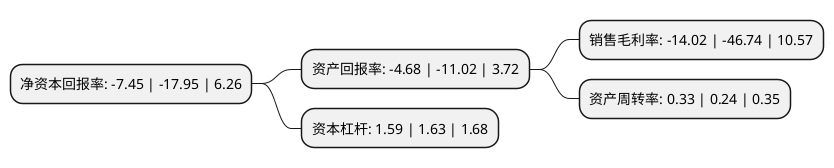

> 本页面由自动化程序生成于 2022年5月20日 01:14
> 内容可能存在错误，如有bug请提交issue至：https://github.com/Eroleice/doc-pi/issues
{.is-warning}

# 上市公司基本情况

## 基本资料

深圳中青宝互动网络股份有限公司（以下简称“中青宝”）成立于2003年07月22日，深圳市。于2010年02月11日在深交所创业板上市。

中青宝注册资本26,201.371万元，主营业务:本公司的主营业务是网络游戏的开发及运营。以下是详细信息：

- 公司名称: 深圳中青宝互动网络股份有限公司
- 股票代码: 300052.SZ
- 所在地: 广东 - 深圳市
- 成立日期: 2003年07月22日
- 注册资本: 26,201.371万元
- 法定代表人: 李瑞杰
- 主营业务: 主营业务:本公司的主营业务是网络游戏的开发及运营
- 公司官网: www.zqgame.com
- 公司介绍: 公司是一家具有自主研发、运营能力、代理能力的专业化网络游戏公司。经过多年发展，凭借着深厚的积淀在国内网络游戏研发、运营领域处于一流旗舰地位。以及对产业链上下游的广泛布局，为公司进行自主创新和建立可持续发展生态奠定坚实的基础，进一步提升公司的竞争力。目前，公司经营方向由单一的游戏业务升级为游戏、云服务和科技文旅三大板块。公司专注于网络游戏尤其是移动游戏产品的开发、发行与运营。公司全资子公司宝腾互联专注于IDC、DCOO、CLOUD业务，积极寻求自身业务突破与创新，不断提升公司竞争力，致力于为全球企业用户提供优质的ICT综合解决方案和服务。

## 股东及高管情况

上市公司第一大股东为深圳市宝德科技有限公司，持股24,903,400股，占比9.5%，**疑似为**上市公司实际控制人。

截至2022年03月31日，上市公司的前十大股东中，共有8名自然人股东，2名机构股东，其中5%以上大股东共有2名。上市公司前十大股东明细如下：

> 未能通过持股比例判定出上市公司实际控制人（持股30%以上）
> 可能存在通过间接持股、联合持股、协议控制等方式拥有实际控制权的主体，具体请参考上市公司定期公告！
{.is-warning}

> 上市公司第一大股东持股不超过10%，请检查是否存在公司控制权风险！
{.is-danger}

> 截至2022年03月31日，上市公司前十大股东信息如下：

| 股东名称 | 持股数量（股） | 持股比例 |
| --- | --- | --- |
| 深圳市宝德科技有限公司 | 24,903,400 | 9.5% |
| 深圳市宝德投资控股有限公司 | 19,141,478 | 7.31% |
| 马渲 | 2,625,000 | 1% |
| 杨朝伟 | 1,900,000 | 0.73% |
| 朱沪萍 | 836,900 | 0.32% |
| 李瑞杰 | 833,943 | 0.32% |
| 郭振忠 | 828,745 | 0.32% |
| 李梅 | 826,000 | 0.32% |
| 尚劲 | 803,200 | 0.31% |
| 邵东明 | 754,600 | 0.29% |

## 利润表分析

上市公司2021年总收入为3.55亿元，净利润为-0.5亿元，**未实现盈利**。

## 杜邦分析

> 数据列示周期：2021年 | 2020年 | 2019年
{.is-info}

上市公司的净资产收益率在近一年有所下降，下降幅度为-58.5%，其变化情况分解如下：
- 上市公司的销售毛利率在近一年下降了-70%，可能是生产效率的下降、商品原材料价格上涨或商品价格的下跌所致。
- 上市公司的资产周转率在近一年上升了37.5%，可能是源自于更快的销售回款或库存管理效果提升。
- 上市公司的财务杠杆比率在近一年下降了-2.45%，可能是减少负债降低财务费用。

