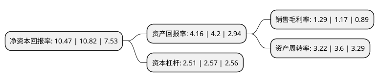

> 本页面由自动化程序生成于 2022年5月20日 01:14
> 内容可能存在错误，如有bug请提交issue至：https://github.com/Eroleice/doc-pi/issues
{.is-warning}

# 上市公司基本情况

## 基本资料

广东天龙科技集团股份有限公司（以下简称“天龙集团”）成立于2001年01月02日，肇庆市。于2010年03月26日在深交所创业板上市。

天龙集团注册资本74,987.195万元，主营业务:水性油墨的研发，生产和销售。公司的产品包括水性油墨，溶剂油墨和胶印油墨。以下是详细信息：

- 公司名称: 广东天龙科技集团股份有限公司
- 股票代码: 300063.SZ
- 所在地: 广东 - 肇庆市
- 成立日期: 2001年01月02日
- 注册资本: 74,987.195万元
- 法定代表人: 冯毅
- 主营业务: 主营业务:水性油墨的研发，生产和销售公司的产品包括水性油墨，溶剂油墨和胶印油墨
- 公司官网: www.tloongroup.com
- 公司介绍: 公司是全国大型的水性、溶剂及胶版油墨专业生产商，一直专注于水性油墨的研发、生产和销售。公司产品广泛应用于各类包装印刷。依托公司在国内领先的水性油墨研究技术和自主研发的合成树脂技术，形成了集水性油墨研发、生产、销售及售后服务于一体的完整产业链。2015年公司经过重大资产重组，实现公司战略转型升级，转型至传统化工行业与新型互联网营销行业并驾齐驱的立体式布局。公司倡导诚信、务实、创新、成就的企业精神，拥有一批优秀的专业技术人才和管理人才，已形成了完善的组织架构和科学的管理模式。天龙集团致力于建立绿色环保企业，严格执行ISO9001:2015质量管理体系、ISO14001:2015环境管理体系、RoHS绿色产品管理体系、环境标志产品保障措施体系。

## 股东及高管情况

上市公司第一大股东为冯毅，持股170,724,933股，占比22.77%，**疑似为**上市公司实际控制人。

截至2022年05月13日，上市公司的前十大股东中，共有9名自然人股东，1名机构股东，其中5%以上大股东共有4名。上市公司前十大股东明细如下：

> 未能通过持股比例判定出上市公司实际控制人（持股30%以上）
> 可能存在通过间接持股、联合持股、协议控制等方式拥有实际控制权的主体，具体请参考上市公司定期公告！
{.is-warning}

> 截至2022年05月13日，上市公司前十大股东信息如下：

| 股东名称 | 持股数量（股） | 持股比例 |
| --- | --- | --- |
| 冯毅 | 170,724,933 | 22.77% |
| 冯毅 | 170,724,933 | 22.77% |
| 程宇 | 41,180,733 | 5.49% |
| 程宇 | 38,585,633 | 5.1456% |
| 冯华 | 20,225,000 | 2.7% |
| 冯军 | 14,150,000 | 1.89% |
| 张霞 | 12,145,497 | 1.62% |
| 常州长平企业管理咨询有限公司 | 11,701,639 | 1.56% |
| 王娜 | 3,937,500 | 0.53% |
| 金克馨 | 2,969,050 | 0.4% |

## 利润表分析

上市公司2021年总收入为106.41亿元，净利润为1.37亿元，实现盈利。

## 杜邦分析

> 数据列示周期：2021年 | 2020年 | 2019年
{.is-info}

上市公司的净资产收益率在近一年有所下降，下降幅度为-3.23%，其变化情况分解如下：
- 上市公司的销售毛利率在近一年上升了10.26%，可能是生产效率的提升、商品原材料价格下跌或商品价格的上涨所致。
- 上市公司的资产周转率在近一年下降了-10.56%，可能是源自于更慢的销售回款或库存管理效果下降。
- 上市公司的财务杠杆比率在近一年下降了-2.33%，可能是减少负债降低财务费用。

