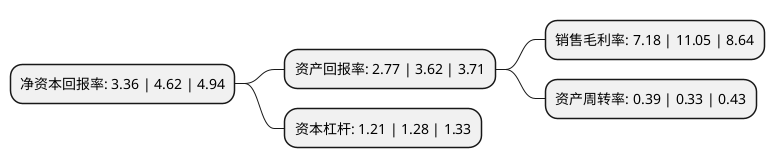

> 本页面由自动化程序生成于 2022年5月20日 01:15
> 内容可能存在错误，如有bug请提交issue至：https://github.com/Eroleice/doc-pi/issues
{.is-warning}

# 上市公司基本情况

## 基本资料

杭州顺网科技股份有限公司（以下简称“顺网科技”）成立于2005年07月11日，杭州市。于2010年08月27日在深交所创业板上市。

顺网科技注册资本69,428.724万元，互联网娱乐平台的设计，推广，网络广告推广及互联网增值服务相关业务。公司致力于打造国内领先的互联网娱乐平台，为网民提供全方位，个性化的网上娱乐体验，并充分利用公司在互联网娱乐领域的平台优势开发并提供多种形式的增值服务。以下是详细信息：

- 公司名称: 杭州顺网科技股份有限公司
- 股票代码: 300113.SZ
- 所在地: 浙江 - 杭州市
- 成立日期: 2005年07月11日
- 注册资本: 69,428.724万元
- 法定代表人: 华勇
- 主营业务: 互联网娱乐平台的设计，推广，网络广告推广及互联网增值服务相关业务公司致力于打造国内领先的互联网娱乐平台，为网民提供全方位，个性化的网上娱乐体验，并充分利用公司在互联网娱乐领域的平台优势开发并提供多种形式的增值服务
- 公司官网: www.shunwang.com/www.300113.com
- 公司介绍: 公司致力于打造国内领先的互联网娱乐平台，为网民提供全方位、个性化的网上娱乐体验，并充分利用公司在互联网娱乐领域的平台优势开发并提供多种形式的增值服务，构建了中国领先的网吧互联网娱乐平台。在满足用户娱乐内容获取与信息传递的需求方面，顺网拥有网吧行业领先的“网维大师”，并成为网吧行业的领军品牌。公司凭借业内领先的“穿透还原”和“三层更新”技术为网吧在安全管理、系统维护和娱乐内容更新管理方面提供了卓越的解决方案。

## 股东及高管情况

上市公司第一大股东为华勇，持股248,271,762股，占比35.76%，为上市公司实际控制人。

截至2022年04月27日，上市公司的前十大股东中，共有2名自然人股东，1名机构股东，6个产品账户，1个海外主体，其中5%以上大股东共有1名。上市公司前十大股东明细如下：

> 截至2022年04月27日，上市公司前十大股东信息如下：

| 股东名称 | 持股数量（股） | 持股比例 |
| --- | --- | --- |
| 华勇 | 248,271,762 | 35.76% |
| 李雪虹 | 20,926,432 | 3.01% |
| 杭州顺网科技股份有限公司回购专用证券账户 | 15,535,706 | 2.24% |
| 宁波梅山保税港区凌顶投资管理有限公司-凌顶望岳八号私募证券投资基金 | 14,929,471 | 2.15% |
| 香港中央结算有限公司(陆股通) | 14,357,851 | 2.07% |
| 中信证券股份有限公司 | 12,049,702 | 1.74% |
| 杭州顺网科技股份有限公司-2021年员工持股计划 | 8,965,900 | 1.29% |
| 上海子午投资管理有限公司-子午增强六号私募证券投资基金 | 6,900,300 | 0.99% |
| 上海复熙资产管理有限公司-复熙混合20号私募证券投资基金 | 6,864,900 | 0.99% |
| 中国工商银行股份有限公司-广发中证传媒交易型开放式指数证券投资基金 | 5,189,100 | 0.75% |

## 利润表分析

上市公司2021年总收入为11.41亿元，净利润为0.81亿元，实现盈利。

## 杜邦分析

> 数据列示周期：2021年 | 2020年 | 2019年
{.is-info}

上市公司的净资产收益率在近一年有所下降，下降幅度为-27.27%，其变化情况分解如下：
- 上市公司的销售毛利率在近一年下降了-35.02%，可能是生产效率的下降、商品原材料价格上涨或商品价格的下跌所致。
- 上市公司的资产周转率在近一年上升了18.18%，可能是源自于更快的销售回款或库存管理效果提升。
- 上市公司的财务杠杆比率在近一年下降了-5.47%，可能是减少负债降低财务费用。

