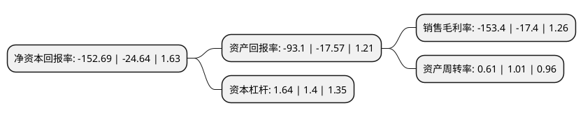

> 本页面由自动化程序生成于 2022年5月20日 01:15
> 内容可能存在错误，如有bug请提交issue至：https://github.com/Eroleice/doc-pi/issues
{.is-warning}

# 上市公司基本情况

## 基本资料

天泽信息产业股份有限公司（以下简称“天泽信息”）成立于2000年05月25日，长沙市。于2011年04月26日在深交所创业板上市。

天泽信息注册资本42,210.733万元，主要产品:车辆远程管理信息服务及配套软硬件。主营业务:车辆远程管理信息服务及配套软硬件的研发与销售，业务范围涵盖工程机械，公路运输(物流，客运)，行政执法等专业应用领域。以下是详细信息：

- 公司名称: 天泽信息产业股份有限公司
- 股票代码: 300209.SZ
- 所在地: 湖南 - 长沙市
- 成立日期: 2000年05月25日
- 注册资本: 42,210.733万元
- 法定代表人: 肖四清
- 主营业务: 主要产品:车辆远程管理信息服务及配套软硬件主营业务:车辆远程管理信息服务及配套软硬件的研发与销售，业务范围涵盖工程机械，公路运输(物流，客运)，行政执法等专业应用领域
- 公司官网: www.tiza.com.cn
- 公司介绍: 公司专注于提供车联网IT服务，致力于打造车联网IT服务运营蓝海市场龙头企业。公司主营业务涵盖商用车、农用机械、公共运输、仓储、电梯、工程机械等等专业应用行业，以推动我国物联网的高速发展为愿景。公司综合利用云计算、GPU计算加速、信息安全、数据挖掘、智能搜索等业内领先技术，面向商业智能、电梯管理、机械管理、车辆管理、售后资源管理、仓库管理等领域具有需求的用户，对车辆及随车人、物的状态信息进行采集、传输、存储、分析和展现，帮助用户实现成本控制、管理透明、保障安全的目标。多年来，公司业务实现了快速增长，拥有众多国际、国内知名品牌客户：如卡特彼勒、中联重科、日立建机、久保田、玉柴重工、北汽福田、雨润集团、太古集团(可口可乐)等。公司将在车联网IT服务及其他相关业务领域进行拓展，真诚善待企业核心资源，持续创造业绩价值，成为员工忠诚、客户信赖、社会尊重、投资者受益的品牌企业。

## 股东及高管情况

上市公司第一大股东为肖四清，持股42,322,065股，占比10.03%，**疑似为**上市公司实际控制人。

截至2022年03月31日，上市公司的前十大股东中，共有4名自然人股东，5名机构股东，1个产品账户，其中5%以上大股东共有3名。上市公司前十大股东明细如下：

> 未能通过持股比例判定出上市公司实际控制人（持股30%以上）
> 可能存在通过间接持股、联合持股、协议控制等方式拥有实际控制权的主体，具体请参考上市公司定期公告！
{.is-warning}

> 截至2022年03月31日，上市公司前十大股东信息如下：

| 股东名称 | 持股数量（股） | 持股比例 |
| --- | --- | --- |
| 肖四清 | 42,322,065 | 10.03% |
| 孙伯荣 | 32,981,320 | 7.81% |
| 无锡中住集团有限公司 | 31,098,014 | 7.37% |
| 刘智辉 | 15,756,086 | 3.73% |
| 陈进 | 13,927,232 | 3.3% |
| 汤臣倍健股份有限公司 | 7,300,000 | 1.73% |
| 科之杰新材料集团福建有限公司 | 6,689,900 | 1.58% |
| 天泽信息产业股份有限公司-2022年员工持股计划 | 6,496,970 | 1.54% |
| 福建建研科技有限公司 | 6,310,091 | 1.49% |
| 方正和生投资有限责任公司 | 6,154,795 | 1.46% |

## 利润表分析

上市公司2021年总收入为17.63亿元，净利润为-27.06亿元，**未实现盈利**。

## 杜邦分析

> 数据列示周期：2021年 | 2020年 | 2019年
{.is-info}

上市公司的净资产收益率在近一年有所上升，上升幅度为519.68%，其变化情况分解如下：
- 上市公司的销售毛利率在近一年上升了781.61%，可能是生产效率的提升、商品原材料价格下跌或商品价格的上涨所致。
- 上市公司的资产周转率在近一年下降了-39.6%，可能是源自于更慢的销售回款或库存管理效果下降。
- 上市公司的财务杠杆比率在近一年上升了17.14%，可能是增加负债扩大生产规模。

