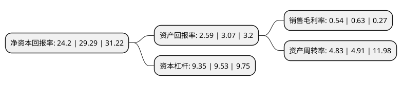

> 本页面由自动化程序生成于 2022年5月20日 01:15
> 内容可能存在错误，如有bug请提交issue至：https://github.com/Eroleice/doc-pi/issues
{.is-warning}

# 上市公司基本情况

## 基本资料

上海钢联电子商务股份有限公司（以下简称“上海钢联”）成立于2000年04月30日，上海市。于2011年06月08日在深交所创业板上市。

上海钢联注册资本19,093.062万元，主营业务是以钢铁及相关行业信息服务为基础的B2B电子商务服务。以下是详细信息：

- 公司名称: 上海钢联电子商务股份有限公司
- 股票代码: 300226.SZ
- 所在地: 上海 - 上海市
- 成立日期: 2000年04月30日
- 注册资本: 19,093.062万元
- 法定代表人: 朱军红
- 主营业务: 主营业务是以钢铁及相关行业信息服务为基础的B2B电子商务服务
- 公司官网: www.mysteel.com
- 公司介绍: 公司是国内领先的立足黑色、有色、能源化工、农产品等大宗商品提供商业资讯服务、数据研究服务、电子商务服务及其增值服务的互联网平台综合运营商。公司围绕建设大宗商品电子商务生态体系的发展战略，逐步打造了以大数据为基础的网络综合资讯、上下游行业研究、专家团队咨询、电商交易平台、智能化云仓储、信息化物流、供应链服务为一体的互联网大宗商品闭环生态圈，并形成了以黑色金属为龙头，覆盖有色金属，能源化工，农产品等多领域的大宗商品产业链。公司先后荣获“上海市著名商标”、“中国行业电子商务网站TOP100”、“3A级信用企业”等称号。

## 股东及高管情况

上市公司第一大股东为上海兴业投资发展有限公司，持股48,125,692股，占比25.21%，**疑似为**上市公司实际控制人。

截至2022年03月31日，上市公司的前十大股东中，共有1名自然人股东，2名机构股东，7个产品账户，其中5%以上大股东共有1名。上市公司前十大股东明细如下：

> 未能通过持股比例判定出上市公司实际控制人（持股30%以上）
> 可能存在通过间接持股、联合持股、协议控制等方式拥有实际控制权的主体，具体请参考上市公司定期公告！
{.is-warning}

> 截至2022年03月31日，上市公司前十大股东信息如下：

| 股东名称 | 持股数量（股） | 持股比例 |
| --- | --- | --- |
| 上海兴业投资发展有限公司 | 48,125,692 | 25.21% |
| 中国工商银行股份有限公司-富国天惠精选成长混合型证券投资基金(LOF) | 9,251,300 | 4.85% |
| 朱军红 | 8,887,230 | 4.65% |
| 深圳市微明恒远投资管理有限公司-微明恒远新程1期私募证券投资基金 | 6,940,000 | 3.63% |
| 兴业银行股份有限公司-富国兴远优选12个月持有期混合型证券投资基金 | 4,797,716 | 2.51% |
| 全国社保基金一一四组合 | 4,478,194 | 2.35% |
| 上海理成资产管理有限公司-理成风景1号投资基金 | 2,991,500 | 1.57% |
| 杭州睿星投资管理有限公司-睿星财富2号证券投资基金 | 2,300,000 | 1.2% |
| 南京南钢钢铁联合有限公司 | 1,873,540 | 0.98% |
| 中国民生银行股份有限公司-中邮新思路灵活配置混合型证券投资基金 | 1,809,802 | 0.95% |

## 利润表分析

上市公司2021年总收入为657.74亿元，净利润为3.52亿元，实现盈利。

## 杜邦分析

> 数据列示周期：2021年 | 2020年 | 2019年
{.is-info}

上市公司的净资产收益率在近一年有所下降，下降幅度为-17.38%，其变化情况分解如下：
- 上市公司的销售毛利率在近一年下降了-14.29%，可能是生产效率的下降、商品原材料价格上涨或商品价格的下跌所致。
- 上市公司的资产周转率在近一年下降了-1.63%，可能是源自于更慢的销售回款或库存管理效果下降。
- 上市公司的财务杠杆比率在近一年下降了-1.89%，可能是减少负债降低财务费用。

