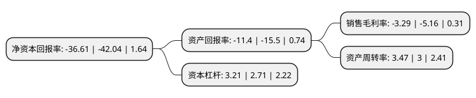

> 本页面由自动化程序生成于 2022年5月20日 01:16
> 内容可能存在错误，如有bug请提交issue至：https://github.com/Eroleice/doc-pi/issues
{.is-warning}

# 上市公司基本情况

## 基本资料

广东佳兆业佳云科技股份有限公司（以下简称“佳云科技”）成立于2002年05月22日，东莞市。于2011年07月12日在深交所创业板上市。

佳云科技注册资本63,455.522万元，主营业务为移动互联网营销业务以下是详细信息：

- 公司名称: 广东佳兆业佳云科技股份有限公司
- 股票代码: 300242.SZ
- 所在地: 广东 - 东莞市
- 成立日期: 2002年05月22日
- 注册资本: 63,455.522万元
- 法定代表人: 钟亮
- 主营业务: 主营业务为移动互联网营销业务
- 公司官网: www.kaisacloud.com
- 公司介绍: 公司是广东省民营高科技企业和国家高新技术企业，公司互联网营销业务包括整合营销和互联网广告营销两大类，客户涵盖百度系、阿里巴巴系、腾讯系客户及游戏、电商、网服、直播、新闻、视频、汽车、旅行、医疗健康等众多领域。整合营销业务旨在为广告主提供优质化、高效性的全产业链服务，主要通过对营销方式、用户行为、智能化技术、热门渠道、传播内容的整合，提供市场战略、投放规划、媒体采购、投放执行、数据分析、效果优化全流程的平台分发、渠道投放服务，帮助流量媒体实现其广告资源最大化，从而达到最优执行效果。互联网广告营销主要通过对媒体资源、应用、广告平台、广告网络联盟等互联网流量资源整合，依靠自身流量定向技术对投放、资源进行优化，为广告主提供快速、精准、全面的一站式落地推广服务。公司提供全网络营销解决方案，形成从消费者洞察到内容创意、全渠道应用和企业销售促进解决方案；充分利用移动互联网技术，为企业在数字时代的品牌、产品与网络消费者搭建专业、精准、极致的沟通平台。未来公司将围绕既已形成的移动营销领域业务优势，实现业务进一步延伸和拓展，最终成为国内顶尖级综合移动互联网服务提供商。

## 股东及高管情况

上市公司第一大股东为深圳市一号仓佳速网络有限公司，持股135,225,900股，占比21.31%，**疑似为**上市公司实际控制人。

截至2022年03月31日，上市公司的前十大股东中，共有8名自然人股东，1名机构股东，1个产品账户，其中5%以上大股东共有1名。上市公司前十大股东明细如下：

> 未能通过持股比例判定出上市公司实际控制人（持股30%以上）
> 可能存在通过间接持股、联合持股、协议控制等方式拥有实际控制权的主体，具体请参考上市公司定期公告！
{.is-warning}

> 截至2022年03月31日，上市公司前十大股东信息如下：

| 股东名称 | 持股数量（股） | 持股比例 |
| --- | --- | --- |
| 深圳市一号仓佳速网络有限公司 | 135,225,900 | 21.31% |
| 周建禄 | 22,397,278 | 3.53% |
| 张鑫 | 10,600,000 | 1.67% |
| 甄勇 | 8,018,879 | 1.26% |
| 上银基金-浦发银行-上银基金财富43号资产管理计划 | 7,530,500 | 1.19% |
| 傅晗 | 5,416,356 | 0.85% |
| 张翔 | 4,978,256 | 0.78% |
| 李红 | 4,798,700 | 0.76% |
| 闫维平 | 4,700,099 | 0.74% |
| 徐媛媛 | 4,254,500 | 0.67% |

## 利润表分析

上市公司2021年总收入为65.29亿元，净利润为-2.15亿元，**未实现盈利**。

## 杜邦分析

> 数据列示周期：2021年 | 2020年 | 2019年
{.is-info}

上市公司的净资产收益率在近一年有所下降，下降幅度为-12.92%，其变化情况分解如下：
- 上市公司的销售毛利率在近一年下降了-36.24%，可能是生产效率的下降、商品原材料价格上涨或商品价格的下跌所致。
- 上市公司的资产周转率在近一年上升了15.67%，可能是源自于更快的销售回款或库存管理效果提升。
- 上市公司的财务杠杆比率在近一年上升了18.45%，可能是增加负债扩大生产规模。

