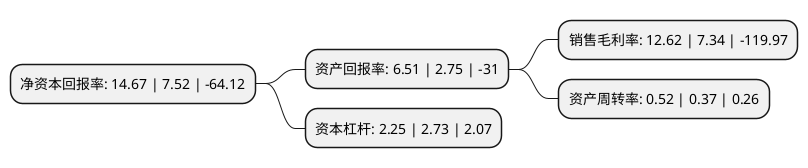

> 本页面由自动化程序生成于 2022年5月20日 01:16
> 内容可能存在错误，如有bug请提交issue至：https://github.com/Eroleice/doc-pi/issues
{.is-warning}

# 上市公司基本情况

## 基本资料

富春科技股份有限公司（以下简称“富春股份”）成立于2001年03月02日，福州市。于2012年03月19日在深交所创业板上市。

富春股份注册资本69,122.949万元，主营业务为通信数据，娱乐消费，文化创意以下是详细信息：

- 公司名称: 富春科技股份有限公司
- 股票代码: 300299.SZ
- 所在地: 福建 - 福州市
- 成立日期: 2001年03月02日
- 注册资本: 69,122.949万元
- 法定代表人: 缪品章
- 主营业务: 主营业务为通信数据，娱乐消费，文化创意
- 公司官网: www.forcom.com.cn
- 公司介绍: 公司起步于为中国移动、中国联通、中国电信等通信运营商提供通信网络建设技术服务，主营业务是为通信运营商、政府、大企业提供网络建设方案、规划、设计、建设管理及业务支撑。2015年初，公司通过并购上海骏梦网络科技有限公司，进入游戏行业，开启文化消费新业务；2016年底，并购成都摩奇卡卡科技有限责任公司，夯实游戏业务，扩大文化消费供给能力。富春股份是一家文化科技企业，拥有通信技术服务和文化消费服务两大核心业务板块。在通信技术服务领域，公司服务于国内三大通信运营商的通信网络建设和运营支撑，培育基于通信、大数据的增值创新业务；服务于政府和大型企事业集团的专网建设。在文化消费领域，公司全资收购了上海骏梦和成都摩奇卡卡两家游戏公司，并通过紧密战略合作和投资参股等方式，将业务延展至网络文学、有声听读、动漫二次元、影视制作等领域，部署和落实了公司在文化产业上的业务拓展和行业上下游联动。

## 股东及高管情况

上市公司第一大股东为福建富春投资有限公司，持股102,868,158股，占比14.88%，**疑似为**上市公司实际控制人。

截至2022年03月31日，上市公司的前十大股东中，共有7名自然人股东，2名机构股东，1个产品账户，其中5%以上大股东共有2名。上市公司前十大股东明细如下：

> 未能通过持股比例判定出上市公司实际控制人（持股30%以上）
> 可能存在通过间接持股、联合持股、协议控制等方式拥有实际控制权的主体，具体请参考上市公司定期公告！
{.is-warning}

> 截至2022年03月31日，上市公司前十大股东信息如下：

| 股东名称 | 持股数量（股） | 持股比例 |
| --- | --- | --- |
| 福建富春投资有限公司 | 102,868,158 | 14.88% |
| 缪品章 | 52,842,879 | 7.64% |
| 平潭奥德投资管理有限公司 | 34,487,500 | 4.99% |
| 郝茜 | 13,883,200 | 2.01% |
| 宋凤毅 | 9,887,400 | 1.43% |
| 缪知邑 | 8,677,379 | 1.26% |
| 上海纯达资产管理有限公司-纯达飞鹰2号私募证券投资基金 | 8,200,000 | 1.19% |
| 林明章 | 5,900,000 | 0.85% |
| 顾梅英 | 5,718,000 | 0.83% |
| 冯美娟 | 5,450,100 | 0.79% |

## 利润表分析

上市公司2021年总收入为5.65亿元，净利润为0.71亿元，实现盈利。

## 杜邦分析

> 数据列示周期：2021年 | 2020年 | 2019年
{.is-info}

上市公司的净资产收益率在近一年有所上升，上升幅度为95.08%，其变化情况分解如下：
- 上市公司的销售毛利率在近一年上升了71.93%，可能是生产效率的提升、商品原材料价格下跌或商品价格的上涨所致。
- 上市公司的资产周转率在近一年上升了40.54%，可能是源自于更快的销售回款或库存管理效果提升。
- 上市公司的财务杠杆比率在近一年下降了-17.58%，可能是减少负债降低财务费用。

