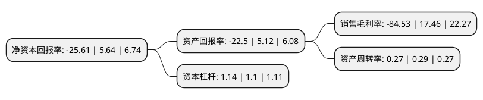

> 本页面由自动化程序生成于 2022年5月20日 01:16
> 内容可能存在错误，如有bug请提交issue至：https://github.com/Eroleice/doc-pi/issues
{.is-warning}

# 上市公司基本情况

## 基本资料

北京掌趣科技股份有限公司（以下简称“掌趣科技”）成立于2004年08月02日，北京市。于2012年05月11日在深交所创业板上市。

掌趣科技注册资本275,748.419万元，公司的主营业务为游戏的开发，发行与运营，目前主要包括移动终端游戏，互联网页面游戏及其周边产品的产品开发，发行推广和运营维护等。主要产品包括190款游戏产品，具有代表性的产品包括手机游戏产品《潜伏》，《格斗三国》，《海绵宝宝运动会》，《石器时代2》，《致命狂飙》，《新绝代双娇3》和《碧血江湖-舞刃江湖》等，互联网页面游戏《篮球经理世界》与《足球经理世界》等，以及跨平台游戏产品《冠军足球》，《热血成吉思汗》等;联合运营的游戏产品中，具有代表性的产品如手机游戏产品《极品飞车无间风云》，《2010FIFA南非世界杯》，《哈利波特与混血王子》，《金刚狼》与《功夫熊猫》等，以及互联网页面游戏《天地英雄》，《魔镜》等以下是详细信息：

- 公司名称: 北京掌趣科技股份有限公司
- 股票代码: 300315.SZ
- 所在地: 北京 - 北京市
- 成立日期: 2004年08月02日
- 注册资本: 275,748.419万元
- 法定代表人: 刘惠城
- 主营业务: 公司的主营业务为游戏的开发，发行与运营，目前主要包括移动终端游戏，互联网页面游戏及其周边产品的产品开发，发行推广和运营维护等主要产品包括190款游戏产品，具有代表性的产品包括手机游戏产品《潜伏》，《格斗三国》，《海绵宝宝运动会》，《石器时代2》，《致命狂飙》，《新绝代双娇3》和《碧血江湖-舞刃江湖》等，互联网页面游戏《篮球经理世界》与《足球经理世界》等，以及跨平台游戏产品《冠军足球》，《热血成吉思汗》等;联合运营的游戏产品中，具有代表性的产品如手机游戏产品《极品飞车无间风云》，《2010FIFA南非世界杯》，《哈利波特与混血王子》，《金刚狼》与《功夫熊猫》等，以及互联网页面游戏《天地英雄》，《魔镜》等
- 公司官网: www.ourpalm.com
- 公司介绍: 公司是国内领先的移动终端游戏开发商、发行商和运营商。公司成立于2004年8月，注册于中关村科技园，是国家高新技术企业和双软认证企业。公司主营业务包括移动终端游戏、互联网页面游戏及其周边产品的产品开发、代理发行和运营维护，已自主研发和代理发行了200余款游戏产品。公司确立了“精品化、泛娱乐化、平台化、全球化”的战略，在“内生增长”的基础上，加强“外延发展”，持续投资、并购有发展潜力的公司及团队。通过内生加外延的整合、协同，公司的手游及页游产品全面覆盖了卡牌、重度ARPG、休闲、竞速、射击、体育、策略塔防等主流游戏类型，成为行业产品门类全的研发、发行商。

## 股东及高管情况

上市公司第一大股东为刘惠城，持股166,890,761股，占比6.05%，**疑似为**上市公司实际控制人。

截至2022年03月31日，上市公司的前十大股东中，共有5名自然人股东，2名机构股东，2个产品账户，1个海外主体，其中5%以上大股东共有2名。上市公司前十大股东明细如下：

> 未能通过持股比例判定出上市公司实际控制人（持股30%以上）
> 可能存在通过间接持股、联合持股、协议控制等方式拥有实际控制权的主体，具体请参考上市公司定期公告！
{.is-warning}

> 上市公司第一大股东持股不超过10%，请检查是否存在公司控制权风险！
{.is-danger}

> 截至2022年03月31日，上市公司前十大股东信息如下：

| 股东名称 | 持股数量（股） | 持股比例 |
| --- | --- | --- |
| 刘惠城 | 166,890,761 | 6.05% |
| 姚文彬 | 138,315,673 | 5.02% |
| 林芝腾讯科技有限公司 | 109,609,726 | 3.97% |
| 中国工商银行股份有限公司-广发中证传媒交易型开放式指数证券投资基金 | 25,971,450 | 0.94% |
| 香港中央结算有限公司(陆股通) | 24,653,890 | 0.89% |
| 青岛城投金融控股集团有限公司 | 23,094,688 | 0.84% |
| 中国农业银行股份有限公司-中证500交易型开放式指数证券投资基金 | 13,233,600 | 0.48% |
| 吕强 | 8,700,000 | 0.32% |
| 乔桐 | 6,350,000 | 0.23% |
| 王荣 | 6,012,800 | 0.22% |

## 利润表分析

上市公司2021年总收入为14.72亿元，净利润为-12.45亿元，**未实现盈利**。

## 杜邦分析

> 数据列示周期：2021年 | 2020年 | 2019年
{.is-info}

上市公司的净资产收益率在近一年有所下降，下降幅度为-554.08%，其变化情况分解如下：
- 上市公司的销售毛利率在近一年下降了-584.14%，可能是生产效率的下降、商品原材料价格上涨或商品价格的下跌所致。
- 上市公司的资产周转率在近一年下降了-6.9%，可能是源自于更慢的销售回款或库存管理效果下降。
- 上市公司的财务杠杆比率在近一年上升了3.64%，可能是增加负债扩大生产规模。

