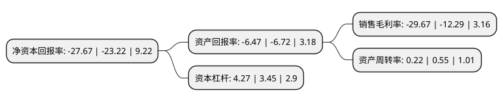

> 本页面由自动化程序生成于 2022年5月20日 01:17
> 内容可能存在错误，如有bug请提交issue至：https://github.com/Eroleice/doc-pi/issues
{.is-warning}

# 上市公司基本情况

## 基本资料

北京腾信创新网络营销技术股份有限公司（以下简称“*ST腾信”）成立于2001年12月06日，北京市。于2014年09月10日在深交所创业板上市。

*ST腾信注册资本38,400万元，主营业务是为客户在互联网上提供广告和公关服务，通过分析相关数据，使得广告和公关服务的精准度更高，服务效果更好。以下是详细信息：

- 公司名称: 北京腾信创新网络营销技术股份有限公司
- 股票代码: 300392.SZ
- 所在地: 北京 - 北京市
- 成立日期: 2001年12月06日
- 注册资本: 38,400万元
- 法定代表人: 田炳信
- 主营业务: 主营业务是为客户在互联网上提供广告和公关服务，通过分析相关数据，使得广告和公关服务的精准度更高，服务效果更好
- 公司官网: www.tensynchina.com
- 公司介绍: 公司是国内一家互联网营销上市公司，是中国商务广告协会综合代理专业委员会(简称“中国4A协会”)，中国内容营销协及中国数字营销协会的理事会成员。公司一直专注于中国广告环境以及营销演变趋势，以技术为内核，以创新为使命，为客户提供高效的整合营销方案。作为一家综合类营销公司，腾信创新以整合营销为服务核心，提供大数据营销、品牌策略与创意、媒介策略与购买、社会化营销、移动营销、内容营销、搜索营销、交互体验优化、舆情监测、电子商务等一系列整合营销服务板块。公司是百度产品五大核心代理商之一；连续多年获得门户类媒体(如凤凰、搜狐)、汽车类媒体(如易车)、视频类媒体(如爱奇艺、腾讯视频)授予的“核心媒介代理商”及“优秀合作伙伴”的荣誉。此外，公司积极加强资源的整合，开发出与部分互联网媒介进行对接的技术平台，可以从重要的互联网媒体中获得数据支持。从而形成庞大的互联网资源监控及采集数据库。

## 股东及高管情况

上市公司第一大股东为徐炜，持股124,303,360股，占比32.37%，为上市公司实际控制人。

截至2022年03月31日，上市公司的前十大股东中，共有7名自然人股东，3名机构股东，其中5%以上大股东共有3名。上市公司前十大股东明细如下：

> 截至2022年03月31日，上市公司前十大股东信息如下：

| 股东名称 | 持股数量（股） | 持股比例 |
| --- | --- | --- |
| 徐炜 | 124,303,360 | 32.37% |
| 青岛浩基资产管理有限公司 | 57,600,000 | 15% |
| 特思尔大宇宙(北京)投资咨询有限公司 | 36,623,520 | 9.54% |
| 北京汇金立方投资管理中心(有限合伙) | 18,000,000 | 4.69% |
| 徐高金 | 4,950,000 | 1.29% |
| 冯军 | 2,034,800 | 0.53% |
| 李振宇 | 1,324,688 | 0.34% |
| 江华 | 1,301,010 | 0.34% |
| 廖东城 | 1,198,800 | 0.31% |
| 王贵生 | 1,170,100 | 0.3% |

## 利润表分析

上市公司2021年总收入为3.43亿元，净利润为-1.02亿元，**未实现盈利**。

## 杜邦分析

> 数据列示周期：2021年 | 2020年 | 2019年
{.is-info}

上市公司的净资产收益率在近一年有所上升，上升幅度为19.16%，其变化情况分解如下：
- 上市公司的销售毛利率在近一年上升了141.42%，可能是生产效率的提升、商品原材料价格下跌或商品价格的上涨所致。
- 上市公司的资产周转率在近一年下降了-60%，可能是源自于更慢的销售回款或库存管理效果下降。
- 上市公司的财务杠杆比率在近一年上升了23.77%，可能是增加负债扩大生产规模。

