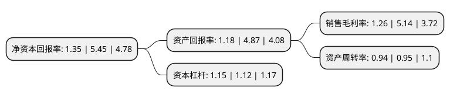

> 本页面由自动化程序生成于 2022年5月20日 01:17
> 内容可能存在错误，如有bug请提交issue至：https://github.com/Eroleice/doc-pi/issues
{.is-warning}

# 上市公司基本情况

## 基本资料

江西天利科技股份有限公司（以下简称“天利科技”）成立于2006年01月18日，上饶市。于2014年10月09日在深交所创业板上市。

天利科技注册资本19,760万元，主营业务为移动信息服务，专业提供移动信息应用整体解决方案，主要与电信运营商合作提供行业移动信息服务和个人移动信息服务。以下是详细信息：

- 公司名称: 江西天利科技股份有限公司
- 股票代码: 300399.SZ
- 所在地: 江西 - 上饶市
- 成立日期: 2006年01月18日
- 注册资本: 19,760万元
- 法定代表人: 高磊
- 主营业务: 主营业务为移动信息服务，专业提供移动信息应用整体解决方案，主要与电信运营商合作提供行业移动信息服务和个人移动信息服务
- 公司官网: www.ihandy.cn
- 公司介绍: 公司是国内领先的行业移动信息系统整体解决方案提供商，同时也在互联网/移动互联网创新业务方面持续探索，拓展新型服务业态。公司的行业移动信息服务主要是为国内大中型集团客户提供移动信息应用整体解决方案，涵盖定制开发、业务集成、运营支撑和客户关系管理等服务，最终协助集团客户向其客户提供以短信彩信应用、云服务平台为主的移动信息服务。公司的互联网/移动互联网创新业务主要聚焦于互联网金融、保险业务，无线天利成功拓展了航班延误险服务、车险服务、手机延保服务手机卫士，以互联网思维重构业务模式，提供专业的服务和体验。公司拥有优秀的核心技术研究与软件开发团队，拥有多项软件著作权及产品证书，并取得多件国家专利授权证书。

## 股东及高管情况

上市公司第一大股东为上饶市数字和金融产业投资集团有限公司，持股59,280,000股，占比30%，**疑似为**上市公司实际控制人。

截至2022年04月14日，上市公司的前十大股东中，共有6名自然人股东，3名机构股东，1个产品账户，其中5%以上大股东共有3名。上市公司前十大股东明细如下：

> 截至2022年04月14日，上市公司前十大股东信息如下：

| 股东名称 | 持股数量（股） | 持股比例 |
| --- | --- | --- |
| 上饶市数字和金融产业投资集团有限公司 | 59,280,000 | 30% |
| 钱永耀 | 34,847,521 | 17.64% |
| 钱永耀 | 34,115,600 | 17.265% |
| 天津智汇投资合伙企业(有限合伙) | 7,904,100 | 4% |
| 长城证券-钱永美-长城富享3号单一资产管理计划 | 6,113,700 | 3.09% |
| 江阴鑫源投资有限公司 | 5,316,877 | 2.69% |
| 邝青 | 3,908,043 | 1.98% |
| 顾虎兴 | 1,326,300 | 0.67% |
| 潘正枝 | 620,000 | 0.31% |
| 陈启良 | 533,300 | 0.27% |

## 利润表分析

上市公司2021年总收入为5.08亿元，净利润为0.06亿元，实现盈利。

## 杜邦分析

> 数据列示周期：2021年 | 2020年 | 2019年
{.is-info}

上市公司的净资产收益率在近一年有所下降，下降幅度为-75.23%，其变化情况分解如下：
- 上市公司的销售毛利率在近一年下降了-75.49%，可能是生产效率的下降、商品原材料价格上涨或商品价格的下跌所致。
- 上市公司的资产周转率在近一年下降了-1.05%，可能是源自于更慢的销售回款或库存管理效果下降。
- 上市公司的财务杠杆比率在近一年上升了2.68%，可能是增加负债扩大生产规模。

