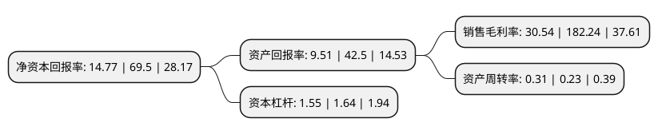

> 本页面由自动化程序生成于 2022年5月20日 01:17
> 内容可能存在错误，如有bug请提交issue至：https://github.com/Eroleice/doc-pi/issues
{.is-warning}

# 上市公司基本情况

## 基本资料

昆仑万维科技股份有限公司（以下简称“昆仑万维”）成立于2008年03月27日，北京市。于2015年01月21日在深交所创业板上市。

昆仑万维注册资本119,778.151万元，主营业务为综合性互联网增值服务，具体包括网络游戏的开发和全球发行，软件应用商店的运营等业务。以下是详细信息：

- 公司名称: 昆仑万维科技股份有限公司
- 股票代码: 300418.SZ
- 所在地: 北京 - 北京市
- 成立日期: 2008年03月27日
- 注册资本: 119,778.151万元
- 法定代表人: 金天
- 主营业务: 主营业务为综合性互联网增值服务，具体包括网络游戏的开发和全球发行，软件应用商店的运营等业务
- 公司官网: www.kunlun.com
- 公司介绍: 公司是一家全球领先、业内前沿的综合性互联网集团。公司聚焦“打造海外领先的社交媒体和内容平台”的发展战略，围绕研发及运营的核心优势，逐渐在全球范围内形成了由移动游戏平台(GameArk)、休闲娱乐社交平台(闲徕互娱)、社交平台(Grindr)、信息咨询(Opera)等四大业务板块组成的社交媒体和内容平台，并通过构建集团大数据系统驱动各板块产生协同效应。一直以来，昆仑万维保持着对互联网前沿趋势的敏锐嗅觉，以坚持不懈的毅力和矢志不渝的动力发展着新模式与新业务。瞄准互联网的巨大增量空间，昆仑万维从移动游戏到互联网工具、视频直播、亚文化领域、人工智能等方向，进行投资布局、精准卡位。公司规模逐年增大，用户群遍及全世界，覆盖了全球不同语种、不同使用习惯的互联网用户。随着集团大数据系统的成功构建，正驱动着各板块产生了潜力巨大的协同效应，形成了令人瞩目的资源聚集效应。

## 股东及高管情况

上市公司第一大股东为新余盈瑞世纪软件研发中心(有限合伙)，持股189,744,943股，占比15.84%，**疑似为**上市公司实际控制人。

截至2022年03月31日，上市公司的前十大股东中，共有5名自然人股东，1名机构股东，3个产品账户，1个海外主体，其中5%以上大股东共有3名。上市公司前十大股东明细如下：

> 未能通过持股比例判定出上市公司实际控制人（持股30%以上）
> 可能存在通过间接持股、联合持股、协议控制等方式拥有实际控制权的主体，具体请参考上市公司定期公告！
{.is-warning}

> 截至2022年03月31日，上市公司前十大股东信息如下：

| 股东名称 | 持股数量（股） | 持股比例 |
| --- | --- | --- |
| 新余盈瑞世纪软件研发中心(有限合伙) | 189,744,943 | 15.84% |
| 周亚辉 | 144,844,325 | 12.09% |
| 李琼 | 132,209,942 | 11.04% |
| 香港中央结算有限公司(陆股通) | 21,100,282 | 1.76% |
| 中国工商银行股份有限公司-广发中证传媒交易型开放式指数证券投资基金 | 8,994,562 | 0.75% |
| 王立伟 | 5,684,566 | 0.47% |
| 蔡强 | 5,255,476 | 0.44% |
| 中国农业银行股份有限公司-中证500交易型开放式指数证券投资基金 | 4,385,754 | 0.37% |
| 勒伍超 | 3,478,000 | 0.29% |
| 中国建设银行股份有限公司-华安创业板50交易型开放式指数证券投资基金 | 3,301,645 | 0.28% |

## 利润表分析

上市公司2021年总收入为48.5亿元，净利润为14.8亿元，实现盈利。

## 杜邦分析

> 数据列示周期：2021年 | 2020年 | 2019年
{.is-info}

上市公司的净资产收益率在近一年有所下降，下降幅度为-78.75%，其变化情况分解如下：
- 上市公司的销售毛利率在近一年下降了-83.24%，可能是生产效率的下降、商品原材料价格上涨或商品价格的下跌所致。
- 上市公司的资产周转率在近一年上升了34.78%，可能是源自于更快的销售回款或库存管理效果提升。
- 上市公司的财务杠杆比率在近一年下降了-5.49%，可能是减少负债降低财务费用。

