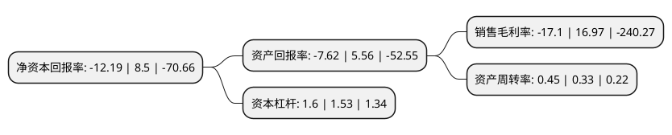

> 本页面由自动化程序生成于 2022年5月20日 01:17
> 内容可能存在错误，如有bug请提交issue至：https://github.com/Eroleice/doc-pi/issues
{.is-warning}

# 上市公司基本情况

## 基本资料

四川迅游网络科技股份有限公司（以下简称“迅游科技”）成立于2008年08月07日，成都市。于2015年05月27日在深交所创业板上市。

迅游科技注册资本20,320.49万元，主营业务:公司目前主营业务是为网游等互联网实时交互应用提供网络加速服务，公司目前主要产品是“迅游网游加速器”。以下是详细信息：

- 公司名称: 四川迅游网络科技股份有限公司
- 股票代码: 300467.SZ
- 所在地: 四川 - 成都市
- 成立日期: 2008年08月07日
- 注册资本: 20,320.49万元
- 法定代表人: 陈俊
- 主营业务: 主营业务:公司目前主营业务是为网游等互联网实时交互应用提供网络加速服务，公司目前主要产品是“迅游网游加速器”
- 公司官网: www.xunyou.com
- 公司介绍: 公司是一家面向互联网用户，为各种互联网实时交互应用提供云加速服务的企业，主营业务为向网游玩家提供云加速服务，主要产品是“迅游网游加速器”。公司先后被评为2012年度成都市高新区优秀高新技术企业、2012年度成都市高新区软件及服务外包十佳企业等，并荣获“360开放平台2012年度软件应用评选”编辑推荐奖、“新浪游戏2012中国游戏英雄榜”年度最佳游戏支持奖等。经过多年发展，公司已经成为我国网游加速服务市场的行业龙头。2017年通过资产重组，上市公司通过收购狮之吼100%股权，并通过募集资金投资使得上市公司主营业务延伸至移动客户端软件的研发、发行与运营等领域，上市公司的产品市场以及服务将得到进一步地延伸。

## 股东及高管情况

上市公司第一大股东为袁旭，持股21,853,924股，占比10.75%，**疑似为**上市公司实际控制人。

截至2022年03月31日，上市公司的前十大股东中，共有5名自然人股东，5名机构股东，其中5%以上大股东共有3名。上市公司前十大股东明细如下：

> 未能通过持股比例判定出上市公司实际控制人（持股30%以上）
> 可能存在通过间接持股、联合持股、协议控制等方式拥有实际控制权的主体，具体请参考上市公司定期公告！
{.is-warning}

> 截至2022年03月31日，上市公司前十大股东信息如下：

| 股东名称 | 持股数量（股） | 持股比例 |
| --- | --- | --- |
| 袁旭 | 21,853,924 | 10.75% |
| 陈俊 | 13,090,105 | 6.44% |
| 章建伟 | 11,344,540 | 5.58% |
| 润泽允能(北京)投资管理有限公司-厦门允能天成投资管理合伙企业(有限合伙) | 8,849,557 | 4.35% |
| 宁波梅山保税港区优达投资合伙企业(有限合伙) | 5,436,156 | 2.68% |
| 上海钱沛创业投资中心(有限合伙) | 5,005,358 | 2.46% |
| 胡欢 | 4,386,152 | 2.16% |
| 鲁锦 | 4,031,994 | 1.98% |
| 润泽允能(北京)投资管理有限公司-厦门允能天宇投资管理合伙企业(有限合伙) | 2,528,445 | 1.24% |
| 贵阳市大数据产业有限公司 | 1,576,900 | 0.78% |

## 利润表分析

上市公司2021年总收入为4.73亿元，净利润为-0.81亿元，**未实现盈利**。

## 杜邦分析

> 数据列示周期：2021年 | 2020年 | 2019年
{.is-info}

上市公司的净资产收益率在近一年有所下降，下降幅度为-243.41%，其变化情况分解如下：
- 上市公司的销售毛利率在近一年下降了-200.77%，可能是生产效率的下降、商品原材料价格上涨或商品价格的下跌所致。
- 上市公司的资产周转率在近一年上升了36.36%，可能是源自于更快的销售回款或库存管理效果提升。
- 上市公司的财务杠杆比率在近一年上升了4.58%，可能是增加负债扩大生产规模。

