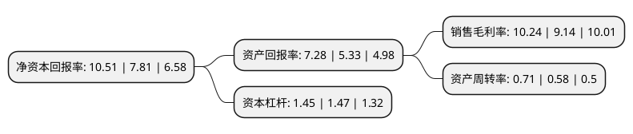

> 本页面由自动化程序生成于 2022年5月20日 01:18
> 内容可能存在错误，如有bug请提交issue至：https://github.com/Eroleice/doc-pi/issues
{.is-warning}

# 上市公司基本情况

## 基本资料

湖北盛天网络技术股份有限公司（以下简称“盛天网络”）成立于2009年11月24日，武汉市。于2015年12月31日在深交所创业板上市。

盛天网络注册资本27,166.56万元，主营业务:主要从事互联网娱乐平台的设计，开发，推广和基于此平台上的网络广告推广及互联网增值服务，以及游戏联合运营业务。主要产品有易乐游，易乐途，易乐玩，随乐游，连乐无线等以下是详细信息：

- 公司名称: 湖北盛天网络技术股份有限公司
- 股票代码: 300494.SZ
- 所在地: 湖北 - 武汉市
- 成立日期: 2009年11月24日
- 注册资本: 27,166.56万元
- 法定代表人: 赖春临
- 主营业务: 主营业务:主要从事互联网娱乐平台的设计，开发，推广和基于此平台上的网络广告推广及互联网增值服务，以及游戏联合运营业务主要产品有易乐游，易乐途，易乐玩，随乐游，连乐无线等
- 公司官网: www.shengtian.com
- 公司介绍: 公司是湖北省大规模的互联网企业，是国内领先的场景化互联网用户运营平台，是国家规划布局内重点软件企业。盛天网络以场景化运营为核心，通过泛娱乐内容提供和大数据技术支撑进行企业战略布局，为用户提供个性化的互联网产品与服务。盛天网络主营网娱平台、电子竞技、游戏运营、媒体内容、移动互联与大数据等业务。通过对互联网内容、应用与服务的精心编辑、分类与集中呈现，广大的互联网用户可以通过公司旗下内容与服务聚合平台方便、安全的使用符合个性化需求的信息与服务，获得互联网内容与服务的一站式体验。公司旗下的平台与软件产品主要覆盖通过网吧、教育行业与酒店等各类公众互联网服务场所的上网人群。目前公司的平台与软件产品正逐步打破场所限制，覆盖越来越多的互联网网民。

## 股东及高管情况

上市公司第一大股东为赖春临，持股80,160,000股，占比29.51%，**疑似为**上市公司实际控制人。

截至2022年03月31日，上市公司的前十大股东中，共有6名自然人股东，3名机构股东，1个产品账户，其中5%以上大股东共有1名。上市公司前十大股东明细如下：

> 未能通过持股比例判定出上市公司实际控制人（持股30%以上）
> 可能存在通过间接持股、联合持股、协议控制等方式拥有实际控制权的主体，具体请参考上市公司定期公告！
{.is-warning}

> 截至2022年03月31日，上市公司前十大股东信息如下：

| 股东名称 | 持股数量（股） | 持股比例 |
| --- | --- | --- |
| 赖春临 | 80,160,000 | 29.51% |
| 天津盛润企业管理咨询合伙企业(有限合伙) | 13,413,900 | 4.94% |
| 崔建平 | 7,046,981 | 2.59% |
| 吴笑宇 | 7,000,064 | 2.58% |
| 吕强 | 5,208,333 | 1.92% |
| 冯威 | 4,700,062 | 1.73% |
| 邝耀华 | 4,600,000 | 1.69% |
| 西藏瑞华资本管理有限公司 | 3,450,520 | 1.27% |
| 广州灵犀互动娱乐有限公司 | 3,255,208 | 1.2% |
| 中国工商银行股份有限公司-华夏磐利一年定期开放混合型证券投资基金 | 2,466,385 | 0.91% |

## 利润表分析

上市公司2021年总收入为12.2亿元，净利润为1.25亿元，实现盈利。

## 杜邦分析

> 数据列示周期：2021年 | 2020年 | 2019年
{.is-info}

上市公司的净资产收益率在近一年有所上升，上升幅度为34.57%，其变化情况分解如下：
- 上市公司的销售毛利率在近一年上升了12.04%，可能是生产效率的提升、商品原材料价格下跌或商品价格的上涨所致。
- 上市公司的资产周转率在近一年上升了22.41%，可能是源自于更快的销售回款或库存管理效果提升。
- 上市公司的财务杠杆比率在近一年下降了-1.36%，可能是减少负债降低财务费用。

