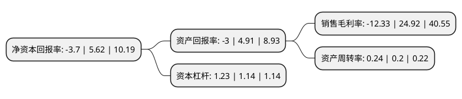

> 本页面由自动化程序生成于 2022年5月20日 01:18
> 内容可能存在错误，如有bug请提交issue至：https://github.com/Eroleice/doc-pi/issues
{.is-warning}

# 上市公司基本情况

## 基本资料

深圳冰川网络股份有限公司（以下简称“冰川网络”）成立于2008年01月21日，深圳市。于2016年08月18日在深交所创业板上市。

冰川网络注册资本15,083.34万元，主营业务:基于自主研发的引擎技术开发大型多人在线网络游戏，并采用以自主运营为主，境外授权运营，联合运营相结合的方式，运营自主开发的网络游戏;主要产品:客户端网络游戏，包括《远征OL》和《龙武》。以下是详细信息：

- 公司名称: 深圳冰川网络股份有限公司
- 股票代码: 300533.SZ
- 所在地: 广东 - 深圳市
- 成立日期: 2008年01月21日
- 注册资本: 15,083.34万元
- 法定代表人: 刘和国
- 主营业务: 主营业务:基于自主研发的引擎技术开发大型多人在线网络游戏，并采用以自主运营为主，境外授权运营，联合运营相结合的方式，运营自主开发的网络游戏;主要产品:客户端网络游戏，包括《远征OL》和《龙武》
- 公司官网: www.q1.com
- 公司介绍: 公司成立以来，先后获得“双软企业”、国家高新技术企业、深圳市重点软件企业、深圳市优秀新兴业态文化创意企业以及深圳市重点文化企业认证。公司组织结构完善，集强大的研发与运营实力于一体，是国内知名的网络游戏企业。2012年，在深圳市政府提出深入实施文化立市战略、建设文化强市的目标下，公司作为深圳市文化创意产业动漫游戏行业的创新者和领跑者，在建设文化强市的工作会议上得到了市政府及主管部门的高度关注。公司发展到今天，旗下已拥有了五款大型网络游戏产品以及一个自主页游运营平台，成功完成了公司产品格局和运营模式的变革。公司先后荣获“中国最受欢迎网络游戏”、“中国最佳2D网游”、“中国十大新锐网游”、“中国十大最受欢迎民族网络游戏”、“中国版权产业新锐企业”、“中国最受欢迎2D网游”、金翎奖“最佳原创网游”等20多项产业奖项。公司致力于民族品牌的打造和中国传统文化的输出，产品《远征OL》先后与中国香港、中国台湾、马来西亚、越南、泰国、新加坡、日本、韩国、澳大利亚等地区和国家的当地运营商达成了合作协议并成功上市运营。目前，公司已经成为国内的少数几家集大型网络游戏研发与运营和社区服务为一体的全新互联网娱乐平台。

## 股东及高管情况

上市公司第一大股东为刘和国，持股61,295,538股，占比40.64%，为上市公司实际控制人。

截至2022年03月31日，上市公司的前十大股东中，共有6名自然人股东，4个产品账户，其中5%以上大股东共有1名。上市公司前十大股东明细如下：

> 截至2022年03月31日，上市公司前十大股东信息如下：

| 股东名称 | 持股数量（股） | 持股比例 |
| --- | --- | --- |
| 刘和国 | 61,295,538 | 40.64% |
| 上海少薮派投资管理有限公司-少数派万象更新27号私募证券投资基金 | 3,887,290 | 2.58% |
| 宁波宁聚资产管理中心(有限合伙)-宁聚映山红16号私募证券投资基金 | 3,863,500 | 2.56% |
| 广州市玄元投资管理有限公司-玄元元创1号私募证券投资基金 | 3,530,600 | 2.34% |
| 陈涛 | 1,772,075 | 1.17% |
| 广州市玄元投资管理有限公司-玄元元创8号私募证券投资基金 | 1,733,700 | 1.15% |
| 唐国平 | 1,719,850 | 1.14% |
| 高家义 | 1,590,115 | 1.05% |
| 高锋 | 1,508,800 | 1% |
| 王林 | 1,508,300 | 1% |

## 利润表分析

上市公司2021年总收入为5.06亿元，净利润为-0.63亿元，**未实现盈利**。

## 杜邦分析

> 数据列示周期：2021年 | 2020年 | 2019年
{.is-info}

上市公司的净资产收益率在近一年有所下降，下降幅度为-165.84%，其变化情况分解如下：
- 上市公司的销售毛利率在近一年下降了-149.48%，可能是生产效率的下降、商品原材料价格上涨或商品价格的下跌所致。
- 上市公司的资产周转率在近一年上升了20%，可能是源自于更快的销售回款或库存管理效果提升。
- 上市公司的财务杠杆比率在近一年上升了7.89%，可能是增加负债扩大生产规模。

