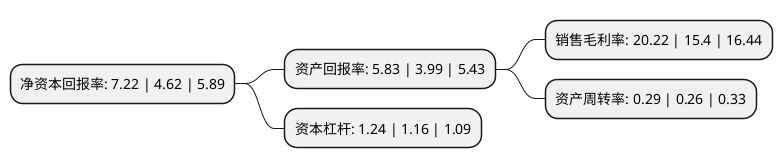

> 本页面由自动化程序生成于 2022年5月20日 01:20
> 内容可能存在错误，如有bug请提交issue至：https://github.com/Eroleice/doc-pi/issues
{.is-warning}

# 上市公司基本情况

## 基本资料

每日互动股份有限公司（以下简称“每日互动”）成立于2010年12月07日，杭州市。于2019年03月25日在深交所创业板上市。

每日互动注册资本40,010万元，主营业务:发行人是一家基于大数据的移动互联网综合服务提供商，主要利用大数据能力提供面向移动应用开发者的技术服务，面向广告主的移动互联网营销服务，以及面向其他垂直领域客户的数据服务。以下是详细信息：

- 公司名称: 每日互动股份有限公司
- 股票代码: 300766.SZ
- 所在地: 浙江 - 杭州市
- 成立日期: 2010年12月07日
- 注册资本: 40,010万元
- 法定代表人: 方毅
- 主营业务: 主营业务:发行人是一家基于大数据的移动互联网综合服务提供商，主要利用大数据能力提供面向移动应用开发者的技术服务，面向广告主的移动互联网营销服务，以及面向其他垂直领域客户的数据服务
- 公司官网: www.ge.cn
- 公司介绍: 公司成立于2010年12月，总部位于杭州，在北京、上海、广州等地均有本地团队。个推是独立的智能大数据服务商，致力于用数据驱动产业新未来。公司主要业务包括提供开发者服务、精准营销服务和各垂直领域的大数据服务。个推是国内第三方推送市场的早期进入者和开拓者，领跑推送市场多年。个推大数据研究中心依托多年推送服务积累和海量数据资源，不断突破数据智能的研究发展，为移动互联网、精准营销、金融、智慧旅游和公共服务等各行各业提供大数据解决方案。

## 股东及高管情况

上市公司第一大股东为方毅，持股48,636,692股，占比12.16%，**疑似为**上市公司实际控制人。

截至2022年03月31日，上市公司的前十大股东中，共有4名自然人股东，6名机构股东，其中5%以上大股东共有5名。上市公司前十大股东明细如下：

> 未能通过持股比例判定出上市公司实际控制人（持股30%以上）
> 可能存在通过间接持股、联合持股、协议控制等方式拥有实际控制权的主体，具体请参考上市公司定期公告！
{.is-warning}

> 截至2022年03月31日，上市公司前十大股东信息如下：

| 股东名称 | 持股数量（股） | 持股比例 |
| --- | --- | --- |
| 方毅 | 48,636,692 | 12.16% |
| 北京鼎鹿中原科技有限公司 | 39,261,596 | 9.81% |
| 北京禾裕创业投资中心(有限合伙) | 31,629,591 | 7.91% |
| 杭州我了个推投资管理合伙企业(有限合伙) | 21,372,477 | 5.34% |
| 沈欣 | 20,959,197 | 5.24% |
| 阮寿国 | 9,593,407 | 2.4% |
| 初石投资有限公司 | 3,140,000 | 0.78% |
| 天津信天企业管理咨询服务有限公司 | 2,142,619 | 0.54% |
| 陈奎军 | 2,136,000 | 0.53% |
| 达孜怡君实业有限公司 | 1,932,200 | 0.48% |

## 利润表分析

上市公司2021年总收入为6亿元，净利润为1.21亿元，实现盈利。

## 杜邦分析

> 数据列示周期：2021年 | 2020年 | 2019年
{.is-info}

上市公司的净资产收益率在近一年有所上升，上升幅度为56.28%，其变化情况分解如下：
- 上市公司的销售毛利率在近一年上升了31.3%，可能是生产效率的提升、商品原材料价格下跌或商品价格的上涨所致。
- 上市公司的资产周转率在近一年上升了11.54%，可能是源自于更快的销售回款或库存管理效果提升。
- 上市公司的财务杠杆比率在近一年上升了6.9%，可能是增加负债扩大生产规模。

