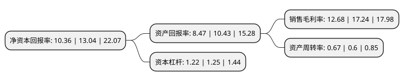

> 本页面由自动化程序生成于 2022年5月20日 01:20
> 内容可能存在错误，如有bug请提交issue至：https://github.com/Eroleice/doc-pi/issues
{.is-warning}

# 上市公司基本情况

## 基本资料

北京值得买科技股份有限公司（以下简称“值得买”）成立于2011年11月10日，北京市。于2019年07月15日在深交所创业板上市。

值得买注册资本8,874.425万元，主营业务是运营内容类导购平台什么值得买网站及相应的移动客户端，为电商，品牌商等提供信息推广服务，并以此为延伸提供海淘代购平台服务和互联网效果营销平台服务。以下是详细信息：

- 公司名称: 北京值得买科技股份有限公司
- 股票代码: 300785.SZ
- 所在地: 北京 - 北京市
- 成立日期: 2011年11月10日
- 注册资本: 8,874.425万元
- 法定代表人: 隋国栋
- 主营业务: 主营业务是运营内容类导购平台什么值得买网站及相应的移动客户端，为电商，品牌商等提供信息推广服务，并以此为延伸提供海淘代购平台服务和互联网效果营销平台服务
- 公司官网: www.zhidemai.com
- 公司介绍: 公司是一家集导购、媒体、工具、社区属性为一体的消费领域门户型网站服务平台，主营业务是运营内容类导购平台什么值得买网站及相应的移动客户端，为电商、品牌商等提供信息推广服务，并以此为延伸提供海淘代购平台服务和互联网效果营销平台服务。什么值得买集导购、媒体、工具、社区属性于一体，以高质量的消费类内容向用户介绍高性价比、好口碑的商品及服务，为用户提供高效、精准、中立、专业的消费决策支持。公司的合作伙伴主要包括阿里巴巴、京东、亚马逊全球、苏宁易购、国美在线、沃尔玛、eBay、Ashford、Macy’s等国内外电商或零售商，Linkshare、Affiliate Window和Commission Junction等联盟平台(指集合媒体资源组成联盟，通过联盟平台帮助电商、品牌商等实现信息推广服务，并按照相应的实际推广效果向媒体支付费用的平台形式)，以及耐克、Visa、戴森、DELL、雅诗兰黛、华为、中国银行、银联国际、美的、iRobot和松下等国内外品牌商。

## 股东及高管情况

上市公司第一大股东为隋国栋，持股34,542,768股，占比38.92%，为上市公司实际控制人。

截至2022年03月31日，上市公司的前十大股东中，共有3名自然人股东，2名机构股东，4个产品账户，1个海外主体，其中5%以上大股东共有4名。上市公司前十大股东明细如下：

> 截至2022年03月31日，上市公司前十大股东信息如下：

| 股东名称 | 持股数量（股） | 持股比例 |
| --- | --- | --- |
| 隋国栋 | 34,542,768 | 38.92% |
| 刘峰 | 9,941,956 | 11.2% |
| 刘超 | 6,354,961 | 7.16% |
| 北京国脉创新投资管理中心(有限合伙) | 5,978,326 | 6.74% |
| 共青城尚麒投资管理合伙企业(有限合伙) | 2,383,830 | 2.69% |
| 全国社保基金五零四组合 | 1,743,258 | 1.96% |
| 中国光大银行股份有限公司-兴全商业模式优选混合型证券投资基金(LOF) | 1,120,537 | 1.26% |
| 中意人寿保险有限公司-分红产品2 | 749,380 | 0.84% |
| 招商银行股份有限公司-兴全合润混合型证券投资基金 | 607,809 | 0.68% |
| 香港中央结算有限公司(陆股通) | 586,823 | 0.66% |

## 利润表分析

上市公司2021年总收入为14.03亿元，净利润为1.77亿元，实现盈利。

## 杜邦分析

> 数据列示周期：2021年 | 2020年 | 2019年
{.is-info}

上市公司的净资产收益率在近一年有所下降，下降幅度为-20.55%，其变化情况分解如下：
- 上市公司的销售毛利率在近一年下降了-26.45%，可能是生产效率的下降、商品原材料价格上涨或商品价格的下跌所致。
- 上市公司的资产周转率在近一年上升了11.67%，可能是源自于更快的销售回款或库存管理效果提升。
- 上市公司的财务杠杆比率在近一年下降了-2.4%，可能是减少负债降低财务费用。

