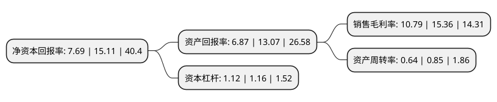

> 本页面由自动化程序生成于 2022年5月20日 01:21
> 内容可能存在错误，如有bug请提交issue至：https://github.com/Eroleice/doc-pi/issues
{.is-warning}

# 上市公司基本情况

## 基本资料

南凌科技股份有限公司（以下简称“南凌科技”）成立于1996年12月30日，深圳市。于2020年12月22日在深交所创业板上市。

南凌科技注册资本13,168.737万元，公司主营业务以虚拟专用网和企业级互联网接入服务为主，公司主要产品包括虚拟专用网，企业级互联网接入及其他服务。以下是详细信息：

- 公司名称: 南凌科技股份有限公司
- 股票代码: 300921.SZ
- 所在地: 广东 - 深圳市
- 成立日期: 1996年12月30日
- 注册资本: 13,168.737万元
- 法定代表人: 陈树林
- 主营业务: 公司主营业务以虚拟专用网和企业级互联网接入服务为主，公司主要产品包括虚拟专用网，企业级互联网接入及其他服务
- 公司官网: www.nova.net.cn
- 公司介绍: 公司面向企事业客户提供增值电信服务及信息系统集成解决方案，是国内位于行业前列的专用网络服务提供商。公司提供的增值电信服务可分为虚拟专用网服务、企业级互联网接入服务及其他服务，其中虚拟专用网服务为公司的主要收入来源；其他服务主要是为客户提供数据中心托管、云计算产品等服务。公司是国内首批获得《跨地区因特网虚拟专用网业务经营许可证》的两家企业之一，已拥有全面的增值电信业务资质。多年来，公司密切跟进信息技术与网络通信技术的发展动态，积极响应客户对大数据、云计算、软件定义网络(SDN)、移动应用的需求，依托自主研发的“骨干网管控系统”和“智能安全接入系统”、覆盖全国的骨干网络平台及技术服务体系，能够“一站式”高效、规范、及时、可控地满足跨区域企事业单位的网络通信及信息化建设需求。公司形成了模块化的产品系列，在对客户进行咨询和分析后，能够针对不同客户内部通信、外部访问的网络需求提供全面支撑企业业务和流程体系的解决方案，可以满足客户在使用场景等方面的多样化需求。

## 股东及高管情况

上市公司第一大股东为陈树林，持股34,965,000股，占比26.55%，**疑似为**上市公司实际控制人。

截至2022年03月31日，上市公司的前十大股东中，共有5名自然人股东，4名机构股东，1个海外主体，其中5%以上大股东共有4名。上市公司前十大股东明细如下：

> 未能通过持股比例判定出上市公司实际控制人（持股30%以上）
> 可能存在通过间接持股、联合持股、协议控制等方式拥有实际控制权的主体，具体请参考上市公司定期公告！
{.is-warning}

> 截至2022年03月31日，上市公司前十大股东信息如下：

| 股东名称 | 持股数量（股） | 持股比例 |
| --- | --- | --- |
| 陈树林 | 34,965,000 | 26.55% |
| 蒋小明 | 34,857,000 | 26.47% |
| 深圳市东方富海创业投资企业(有限合伙) | 9,368,600 | 7.11% |
| 深圳市众创佳业投资企业(有限合伙) | 9,360,000 | 7.11% |
| 深圳市远致创业投资有限公司 | 1,613,790 | 1.23% |
| 吴前栋 | 530,040 | 0.4% |
| 楼建芳 | 386,700 | 0.29% |
| 中信里昂资产管理有限公司-客户资金 | 268,933 | 0.2% |
| 刘广益 | 225,300 | 0.17% |
| UBS  AG | 212,044 | 0.16% |

## 利润表分析

上市公司2021年总收入为5.76亿元，净利润为0.62亿元，实现盈利。

## 杜邦分析

> 数据列示周期：2021年 | 2020年 | 2019年
{.is-info}

上市公司的净资产收益率在近一年有所下降，下降幅度为-49.11%，其变化情况分解如下：
- 上市公司的销售毛利率在近一年下降了-29.75%，可能是生产效率的下降、商品原材料价格上涨或商品价格的下跌所致。
- 上市公司的资产周转率在近一年下降了-24.71%，可能是源自于更慢的销售回款或库存管理效果下降。
- 上市公司的财务杠杆比率在近一年下降了-3.45%，可能是减少负债降低财务费用。

