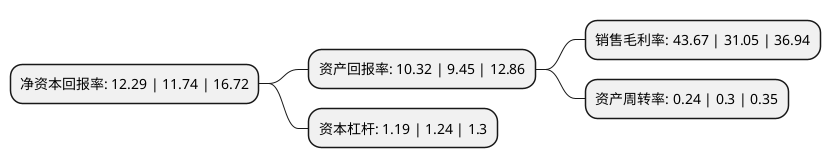

> 本页面由自动化程序生成于 2022年5月20日 01:22
> 内容可能存在错误，如有bug请提交issue至：https://github.com/Eroleice/doc-pi/issues
{.is-warning}

# 上市公司基本情况

## 基本资料

四川新闻网传媒(集团)股份有限公司（以下简称“川网传媒”）成立于2009年12月23日，成都市。于2021年05月11日在深交所创业板上市。

川网传媒注册资本13,336万元，公司为一家以互联网技术和移动通信技术为支撑的新媒体企业，主营业务为信息传播服务业务。主要产品:互联网信息传播务，移动信息传播业务，互联网舆情信息服务业务和媒介代理业务。以下是详细信息：

- 公司名称: 四川新闻网传媒(集团)股份有限公司
- 股票代码: 300987.SZ
- 所在地: 四川 - 成都市
- 成立日期: 2009年12月23日
- 注册资本: 13,336万元
- 法定代表人: 方埜
- 主营业务: 公司为一家以互联网技术和移动通信技术为支撑的新媒体企业，主营业务为信息传播服务业务主要产品:互联网信息传播务，移动信息传播业务，互联网舆情信息服务业务和媒介代理业务
- 公司官网: www.newssc.net
- 公司介绍: 公司为一家以互联网技术和移动通信技术为支撑的新媒体企业，主营业务为信息传播服务业务。公司作为国务院新闻办批准的拥有网站登载新闻业务资质的互联网新闻信息服务单位，依托四川省内新闻资源，自主生产新闻内容，并通过PC终端和移动终端等新媒体渠道向用户提供新闻资讯。经过多年经营和行业积累，公司已建立起以时政新闻为主、民生资讯为辅的信息传播和交互平台，成为普通受众与政府沟通的重要桥梁。公司的产品和服务主要包括以下三类：互联网信息传播业务、移动信息传播业务和互联网舆情信息服务业务。

## 股东及高管情况

上市公司第一大股东为四川省新传媒有限公司，持股60,000,000股，占比44.99%，为上市公司实际控制人。

截至2022年03月31日，上市公司的前十大股东中，共有7名机构股东，2个产品账户，1名其他股东，其中5%以上大股东共有3名。上市公司前十大股东明细如下：

> 截至2022年03月31日，上市公司前十大股东信息如下：

| 股东名称 | 持股数量（股） | 持股比例 |
| --- | --- | --- |
| 四川省新传媒有限公司 | 60,000,000 | 44.99% |
| 四川产业振兴发展投资基金有限公司 | 9,000,000 | 6.75% |
| 成都博瑞投资控股集团有限公司 | 7,000,000 | 5.25% |
| 国广环球传媒控股有限公司 | 4,900,000 | 3.67% |
| 深圳证券时报社有限公司 | 4,900,000 | 3.67% |
| 中国青年出版总社有限公司 | 4,300,000 | 3.22% |
| 四川九洲创业投资有限责任公司 | 4,000,000 | 3% |
| 峨眉电影集团有限公司 | 4,000,000 | 3% |
| 中国青年杂志社 | 1,900,000 | 1.42% |
| 中金公司-农业银行-中金公司丰众36号员工参与创业板战略配售集合资产管理计划 | 1,646,656 | 1.23% |

## 利润表分析

上市公司2021年总收入为1.89亿元，净利润为0.82亿元，实现盈利。

## 杜邦分析

> 数据列示周期：2021年 | 2020年 | 2019年
{.is-info}

上市公司的净资产收益率在近一年有所上升，上升幅度为4.68%，其变化情况分解如下：
- 上市公司的销售毛利率在近一年上升了40.64%，可能是生产效率的提升、商品原材料价格下跌或商品价格的上涨所致。
- 上市公司的资产周转率在近一年下降了-20%，可能是源自于更慢的销售回款或库存管理效果下降。
- 上市公司的财务杠杆比率在近一年下降了-4.03%，可能是减少负债降低财务费用。

