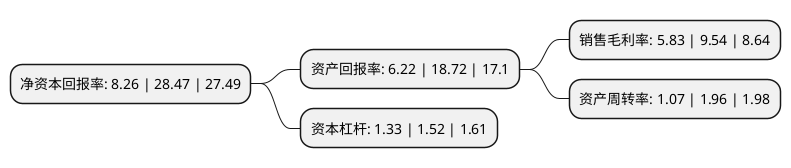

> 本页面由自动化程序生成于 2022年5月20日 01:22
> 内容可能存在错误，如有bug请提交issue至：https://github.com/Eroleice/doc-pi/issues
{.is-warning}

# 上市公司基本情况

## 基本资料

上海凯淳实业股份有限公司（以下简称“凯淳股份”）成立于2008年12月02日，上海市。于2021年05月28日在深交所创业板上市。

凯淳股份注册资本8,000万元，品牌线上销售服务，品牌线上运营服务，客户关系管理服务以下是详细信息：

- 公司名称: 上海凯淳实业股份有限公司
- 股票代码: 301001.SZ
- 所在地: 上海 - 上海市
- 成立日期: 2008年12月02日
- 注册资本: 8,000万元
- 法定代表人: 王莉
- 主营业务: 品牌线上销售服务，品牌线上运营服务，客户关系管理服务
- 公司官网: www.kaytune.com.cn
- 公司介绍: 公司的主营业务是为国内外知名品牌提供全渠道、全触点的电子商务服务以及客户关系管理服务。全渠道是指公司的服务支持目前线上全部主流渠道，包括天猫、淘宝、京东、唯品会、小红书、网易考拉、微信官方商城以及品牌官网商城等。全触点是指公司为商品流转至消费者的每个触点提供服务，包括潜客管理、品牌营销、视觉设计、店铺运营、物流配送、系统开发、会员管理、客服中心等全链路服务。作为品牌方的电子商务及客户关系管理服务商，公司助力品牌发展，与品牌方形成紧密的伙伴关系，共同成长。公司目前服务品牌涉足的行业涵盖日化品、轻奢饰品、美妆、厨房家居、食品、母婴、航空、汽车等。

## 股东及高管情况

上市公司第一大股东为王莉，持股31,200,000股，占比39%，为上市公司实际控制人。

截至2022年03月31日，上市公司的前十大股东中，共有5名自然人股东，4名机构股东，1个产品账户，其中5%以上大股东共有4名。上市公司前十大股东明细如下：

> 截至2022年03月31日，上市公司前十大股东信息如下：

| 股东名称 | 持股数量（股） | 持股比例 |
| --- | --- | --- |
| 王莉 | 31,200,000 | 39% |
| 徐磊 | 8,400,000 | 10.5% |
| 珠海市省广益松壹号文化传媒合伙企业(有限合伙) | 7,200,000 | 9% |
| 上海淳溶投资中心(有限合伙) | 6,000,000 | 7.5% |
| 上海庄鋆投资中心(有限合伙) | 1,800,000 | 2.25% |
| 海宁东证汉德投资合伙企业(有限合伙) | 1,500,000 | 1.88% |
| 蜂巢股权投资基金管理(大连)有限公司-咸宁蜂巢发展创业投资管理合伙企业(有限合伙) | 1,500,000 | 1.88% |
| 栾志刚 | 1,200,000 | 1.5% |
| 须国宝 | 375,000 | 0.47% |
| 黄友平 | 321,300 | 0.4% |

## 利润表分析

上市公司2021年总收入为8.3亿元，净利润为0.48亿元，实现盈利。

## 杜邦分析

> 数据列示周期：2021年 | 2020年 | 2019年
{.is-info}

上市公司的净资产收益率在近一年有所下降，下降幅度为-70.99%，其变化情况分解如下：
- 上市公司的销售毛利率在近一年下降了-38.89%，可能是生产效率的下降、商品原材料价格上涨或商品价格的下跌所致。
- 上市公司的资产周转率在近一年下降了-45.41%，可能是源自于更慢的销售回款或库存管理效果下降。
- 上市公司的财务杠杆比率在近一年下降了-12.5%，可能是减少负债降低财务费用。

