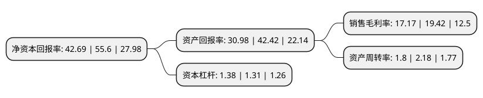

> 本页面由自动化程序生成于 2022年5月20日 01:23
> 内容可能存在错误，如有bug请提交issue至：https://github.com/Eroleice/doc-pi/issues
{.is-warning}

# 上市公司基本情况

## 基本资料

青木数字技术股份有限公司（以下简称“青木股份”）成立于2009年08月05日，广州市。于2022年03月11日在深交所创业板上市。

青木股份注册资本6,666.667万元，公司主营业务是为全球知名品牌提供一站式综合电商服务。公司主营业务涵盖电商销售服务，品牌数字营销，技术解决方案及消费者运营服务三大板块，具体服务内容包括电商代运营服务，渠道分销，电商渠道零售，品牌数字营销，技术解决方案，消费者运营服务等。以下是详细信息：

- 公司名称: 青木数字技术股份有限公司
- 股票代码: 301110.SZ
- 所在地: 广东 - 广州市
- 成立日期: 2009年08月05日
- 注册资本: 6,666.667万元
- 法定代表人: 吕斌
- 主营业务: 公司主营业务是为全球知名品牌提供一站式综合电商服务公司主营业务涵盖电商销售服务，品牌数字营销，技术解决方案及消费者运营服务三大板块，具体服务内容包括电商代运营服务，渠道分销，电商渠道零售，品牌数字营销，技术解决方案，消费者运营服务等
- 公司官网: www.qingmutec.com
- 公司介绍: 青木数字技术股份有限公司面向国内外知名品牌提供电商销售服务，主要包括电商代运营、渠道分销和电商渠道零售三种业务模式。公司作为行业领先的电子商务服务商，为国内外知名品牌提供一站式综合电商服务。经过多年的行业沉淀和积累，公司现已发展为中国电商服务行业顶级的服务商之一，尤其在大服饰行业内优势明显，是大服饰行业最具口碑的服务商之一。公司屡次获得天猫、京东等电商平台的服务商殊荣，是首家同时拥有天猫六星资质和天猫国际紫星资质的服务商。公司2014年起多次获得天猫“金牌淘拍档”称号，2018年至今连续被评为“天猫六星服务商”(天猫平台最高级别)，是“天猫国际紫星服务商”(天猫国际平台最高级别)；公司获得“天猫服饰-品牌营销综合型服务商”、“天猫消费者运营优秀推荐服务商”、“京东数坊进阶能力认证”等资质认证；获得“2017年度最佳天猫合作伙伴”、“品牌营销金服奖”等奖项；公司代运营店铺被京东授予“2018年最佳销售合作奖”、“2019最佳经营店铺奖”等奖项。除了电商平台的认可，公司也收获了来自国家及政府行业机构的肯定，被商务部评为“2017-2018年度国家级电子商务示范企业”。

## 股东及高管情况

上市公司第一大股东为吕斌，持股14,175,000股，占比21.26%，**疑似为**上市公司实际控制人。

截至2022年03月31日，上市公司的前十大股东中，共有4名自然人股东，6名机构股东，其中5%以上大股东共有4名。上市公司前十大股东明细如下：

> 未能通过持股比例判定出上市公司实际控制人（持股30%以上）
> 可能存在通过间接持股、联合持股、协议控制等方式拥有实际控制权的主体，具体请参考上市公司定期公告！
{.is-warning}

> 截至2022年03月31日，上市公司前十大股东信息如下：

| 股东名称 | 持股数量（股） | 持股比例 |
| --- | --- | --- |
| 吕斌 | 14,175,000 | 21.26% |
| 卢彬 | 9,900,000 | 14.85% |
| 孙建龙 | 7,500,000 | 11.25% |
| 广州市允能企业管理合伙企业(有限合伙) | 6,000,000 | 9% |
| 广州市允嘉企业管理合伙企业(有限合伙) | 2,400,000 | 3.6% |
| 广州市陌仟投资合伙企业(有限合伙) | 2,400,000 | 3.6% |
| 广州市穗晖投资合伙企业(有限合伙) | 2,000,000 | 3% |
| 广州市允杰投资合伙企业(有限合伙) | 1,896,325 | 2.84% |
| 刘旭晖 | 1,800,000 | 2.7% |
| 广州市允培投资合伙企业(有限合伙) | 728,675 | 1.09% |

## 利润表分析

上市公司2021年总收入为8.79亿元，净利润为1.5亿元，实现盈利。

## 杜邦分析

> 数据列示周期：2021年 | 2020年 | 2019年
{.is-info}

上市公司的净资产收益率在近一年有所下降，下降幅度为-23.22%，其变化情况分解如下：
- 上市公司的销售毛利率在近一年下降了-11.59%，可能是生产效率的下降、商品原材料价格上涨或商品价格的下跌所致。
- 上市公司的资产周转率在近一年下降了-17.43%，可能是源自于更慢的销售回款或库存管理效果下降。
- 上市公司的财务杠杆比率在近一年上升了5.34%，可能是增加负债扩大生产规模。

