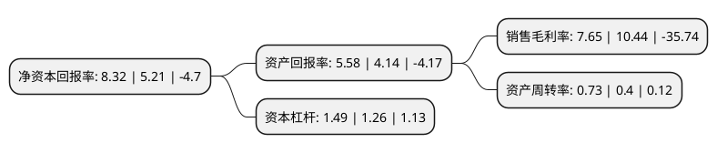

> 本页面由自动化程序生成于 2022年5月20日 01:27
> 内容可能存在错误，如有bug请提交issue至：https://github.com/Eroleice/doc-pi/issues
{.is-warning}

# 上市公司基本情况

## 基本资料

狮头科技发展股份有限公司（以下简称“狮头股份”）成立于1999年02月28日，太原市。于2001年08月24日在上交所主板上市。

狮头股份注册资本23,000万元，主营业务:净水龙头及配件的生产与销售，污水处理项目工程，河道治理等水技术，环保技术相关业务以下是详细信息：

- 公司名称: 狮头科技发展股份有限公司
- 股票代码: 600539.SH
- 所在地: 山西 - 太原市
- 成立日期: 1999年02月28日
- 注册资本: 23,000万元
- 法定代表人: 赵冬梅
- 主营业务: 主营业务:净水龙头及配件的生产与销售，污水处理项目工程，河道治理等水技术，环保技术相关业务
- 公司官网: www.lionhead.com.cn
- 公司介绍: 公司原主导产品“狮头牌”水泥是享誉国内外的老字号品牌。拥有全国最大的特种水泥生产基地，所生产“钰牌”硫铝酸盐等特种水泥畅销全国各地，并出口到韩国、日本等东南亚国家。2016年，公司出售公司与水泥主业相关的业务、资产和负债，收购龙净水业70%的股权，龙净水业以净水龙头及配件的生产与销售为主，增加了污水处理项目工程、河道治理等水技术、环保技术相关业务。龙净水业各类产品不仅通过NSF、ROHS等检测，而且在同行业内率先获得GMC环球制造商认证、ISO9001质量体系认证、ISO14001环境体系认证等，是“中国质量万里行”的全国先进单位。

## 股东及高管情况

上市公司第一大股东为上海远涪企业管理有限公司，持股61,412,700股，占比26.7%，**疑似为**上市公司实际控制人。

截至2022年03月31日，上市公司的前十大股东中，共有5名自然人股东，4名机构股东，1个产品账户，其中5%以上大股东共有3名。上市公司前十大股东明细如下：

> 未能通过持股比例判定出上市公司实际控制人（持股30%以上）
> 可能存在通过间接持股、联合持股、协议控制等方式拥有实际控制权的主体，具体请参考上市公司定期公告！
{.is-warning}

> 截至2022年03月31日，上市公司前十大股东信息如下：

| 股东名称 | 持股数量（股） | 持股比例 |
| --- | --- | --- |
| 上海远涪企业管理有限公司 | 61,412,700 | 26.7% |
| 山西潞安工程有限公司 | 25,857,300 | 11.24% |
| 华远陆港资本运营有限公司 | 11,651,549 | 5.07% |
| 王泽洋 | 7,195,646 | 3.13% |
| 北京云杉千里资产管理有限公司-云杉华彩专属定向私募证券投资基金 | 6,500,000 | 2.83% |
| 上海桦悦企业管理有限公司 | 4,652,204 | 2.02% |
| 吴德英 | 4,122,800 | 1.79% |
| 魏文浩 | 4,007,673 | 1.74% |
| 赵文普 | 3,896,871 | 1.69% |
| 何建东 | 3,650,000 | 1.59% |

## 杜邦分析

> 数据列示周期：2021年 | 2020年 | 2019年
{.is-info}

上市公司的净资产收益率在近一年有所上升，上升幅度为59.69%，其变化情况分解如下：
- 上市公司的销售毛利率在近一年下降了-26.72%，可能是生产效率的下降、商品原材料价格上涨或商品价格的下跌所致。
- 上市公司的资产周转率在近一年上升了82.5%，可能是源自于更快的销售回款或库存管理效果提升。
- 上市公司的财务杠杆比率在近一年上升了18.25%，可能是增加负债扩大生产规模。

