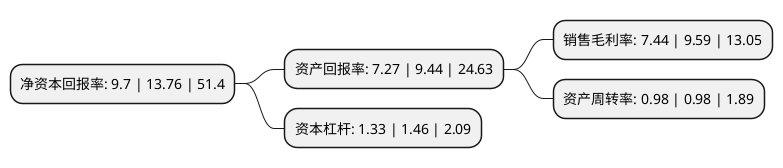

> 本页面由自动化程序生成于 2022年5月20日 01:27
> 内容可能存在错误，如有bug请提交issue至：https://github.com/Eroleice/doc-pi/issues
{.is-warning}

# 上市公司基本情况

## 基本资料

天下秀数字科技(集团)股份有限公司（以下简称“天下秀”）成立于1993年11月28日，北海市。于2001年08月07日在上交所主板上市。

天下秀注册资本180,774.764万元，主营业务:智慧城市相关业务。以下是详细信息：

- 公司名称: 天下秀数字科技(集团)股份有限公司
- 股票代码: 600556.SH
- 所在地: 广西 - 北海市
- 成立日期: 1993年11月28日
- 注册资本: 180,774.764万元
- 法定代表人: 李檬
- 主营业务: 主营业务:智慧城市相关业务
- 公司官网: www.inmyshow.com
- 公司介绍: 天下秀是一家立足于红人新经济领域的平台型企业，核心服务红人(内容创业者)、MCN(红人经纪公司)、品牌商家、中小商家，致力于用技术驱动去中心化的红人新经济的新型基础设施建设。公司搭建了大数据平台，连接红人与企业，通过大数据技术为企业的营销需求与红人账号实现精准匹配，帮助红人实现私域流量的商业变现，以及帮助企业更好的提高经营效益。

## 股东及高管情况

上市公司第一大股东为Show World HongKong Limited，持股332,615,750股，占比18.4%，**疑似为**上市公司实际控制人。

截至2022年05月06日，上市公司的前十大股东中，共有8名机构股东，2个海外主体，其中5%以上大股东共有10名。上市公司前十大股东明细如下：

> 未能通过持股比例判定出上市公司实际控制人（持股30%以上）
> 可能存在通过间接持股、联合持股、协议控制等方式拥有实际控制权的主体，具体请参考上市公司定期公告！
{.is-warning}

> 截至2022年05月06日，上市公司前十大股东信息如下：

| 股东名称 | 持股数量（股） | 持股比例 |
| --- | --- | --- |
| Show World HongKong Limited | 332,615,750 | 18.4% |
| WB Online Investment Limited | 147,726,614 | 8.17% |
| 青岛利兹利投资合伙企业(有限合伙) | 127,186,438 | 7.04% |
| 深圳庥隆金实投资管理中心(有限合伙) | 100,387,904 | 5.55% |
| 青岛永盟投资合伙企业(有限合伙) | 95,510,860 | 5.28% |
| 深圳庥隆金实投资管理中心(有限合伙) | 95,392,249 | 5.2769% |
| 澄迈新升投资管理中心(有限合伙) | 93,543,291 | 5.17% |
| 澄迈新升投资管理中心(有限合伙) | 93,273,791 | 5.1597% |
| 嘉兴腾元投资合伙企业(有限合伙) | 90,471,207 | 5.0046% |
| 厦门赛富股权投资合伙企业(有限合伙) | 90,471,167 | 5.0046% |

## 利润表分析

上市公司2021年总收入为45.11亿元，净利润为3.35亿元，实现盈利。

## 杜邦分析

> 数据列示周期：2021年 | 2020年 | 2019年
{.is-info}

上市公司的净资产收益率在近一年有所下降，下降幅度为-29.51%，其变化情况分解如下：
- 上市公司的销售毛利率在近一年下降了-22.42%，可能是生产效率的下降、商品原材料价格上涨或商品价格的下跌所致。
- 上市公司的资产周转率在近一年下降了0%，可能是源自于更慢的销售回款或库存管理效果下降。
- 上市公司的财务杠杆比率在近一年下降了-8.9%，可能是减少负债降低财务费用。

