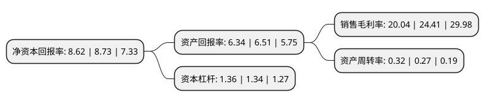

> 本页面由自动化程序生成于 2022年5月20日 01:27
> 内容可能存在错误，如有bug请提交issue至：https://github.com/Eroleice/doc-pi/issues
{.is-warning}

# 上市公司基本情况

## 基本资料

浙报数字文化集团股份有限公司（以下简称“浙数文化”）成立于1992年07月01日，杭州市。于1993年03月04日在上交所主板上市。

浙数文化注册资本126,573.052万元，主营业务为设计，制作，代理，发布国内各类广告，实业投资，新媒体技术开发，经营进出口业务，工艺美术品，文化用品，办公用品的销售，企业管理咨询，会展服务。以下是详细信息：

- 公司名称: 浙报数字文化集团股份有限公司
- 股票代码: 600633.SH
- 所在地: 浙江 - 杭州市
- 成立日期: 1992年07月01日
- 注册资本: 126,573.052万元
- 法定代表人: 张雪南
- 主营业务: 主营业务为设计，制作，代理，发布国内各类广告，实业投资，新媒体技术开发，经营进出口业务，工艺美术品，文化用品，办公用品的销售，企业管理咨询，会展服务
- 公司官网: www.600633.cn
- 公司介绍: 公司是中国报业集团中一家媒体经营性资产整体上市的公司。公司致力于全面互联网化发展并不断推动产业优化升级。公司以“建设国内领先的互联网数字文化产业集团”为目标，全面发展基于互联网的数字文化产业。重点聚焦以优质IP为核心的数字娱乐产业、数字体育产业、“四位一体”的大数据产业等三大板块，同时着力发展具备先发优势的电商服务、艺术品服务等文化产业服务和文化产业投资业务。公司坚持领先的持续创新，致力于为用户创造大价值，公司业绩持续保持较快增长，先后入选上证公司治理指数、上证180指数、沪深300指数样本股，2014、2015连续两年荣获“年度最受投资者尊重的上市公司百强”称号。2016年跻身中国上市公司市值500强，入选亚洲品牌500强，公司监事会获评“卓有成效30强”奖。

## 股东及高管情况

上市公司第一大股东为浙报传媒控股集团有限公司，持股613,172,413股，占比48.44%，为上市公司实际控制人。

截至2022年03月31日，上市公司的前十大股东中，共有3名自然人股东，5名机构股东，2个产品账户，其中5%以上大股东共有1名。上市公司前十大股东明细如下：

> 截至2022年03月31日，上市公司前十大股东信息如下：

| 股东名称 | 持股数量（股） | 持股比例 |
| --- | --- | --- |
| 浙报传媒控股集团有限公司 | 613,172,413 | 48.44% |
| 广东省铁路发展基金有限责任公司 | 23,834,502 | 1.88% |
| 上海白猫(集团)有限公司 | 18,061,122 | 1.43% |
| 中央汇金资产管理有限责任公司 | 17,551,600 | 1.39% |
| 浙江新干线传媒投资有限公司 | 8,015,951 | 0.63% |
| 王梦婕 | 7,700,600 | 0.61% |
| 中国工商银行股份有限公司-广发中证传媒交易型开放式指数证券投资基金 | 7,069,126 | 0.56% |
| 冯晓明 | 4,409,700 | 0.35% |
| 上海机电股份有限公司 | 4,382,400 | 0.35% |
| 朱小斌 | 3,408,100 | 0.27% |

## 利润表分析

上市公司2021年总收入为30.63亿元，净利润为6.31亿元，实现盈利。

## 杜邦分析

> 数据列示周期：2020年 | 2019年 | 2018年
{.is-info}

上市公司的净资产收益率在近一年有所下降，下降幅度为-1.26%，其变化情况分解如下：
- 上市公司的销售毛利率在近一年下降了-17.9%，可能是生产效率的下降、商品原材料价格上涨或商品价格的下跌所致。
- 上市公司的资产周转率在近一年上升了18.52%，可能是源自于更快的销售回款或库存管理效果提升。
- 上市公司的财务杠杆比率在近一年上升了1.49%，可能是增加负债扩大生产规模。

