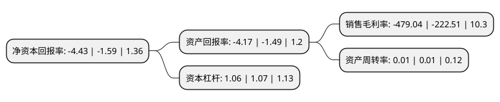

> 本页面由自动化程序生成于 2022年5月20日 01:28
> 内容可能存在错误，如有bug请提交issue至：https://github.com/Eroleice/doc-pi/issues
{.is-warning}

# 上市公司基本情况

## 基本资料

上海游久游戏股份有限公司（以下简称“*ST游久”）成立于1984年12月12日，上海市。于1990年12月19日在上交所主板上市。

*ST游久注册资本83,270.35万元，煤炭，计算机软硬件。以下是详细信息：

- 公司名称: 上海游久游戏股份有限公司
- 股票代码: 600652.SH
- 所在地: 上海 - 上海市
- 成立日期: 1984年12月12日
- 注册资本: 83,270.35万元
- 法定代表人: 谢鹏
- 主营业务: 煤炭，计算机软硬件
- 公司官网: www.u9game.com.cn
- 公司介绍: 公司是上海市首批股份制试点企业和股票上市公司之一，也是证券市场上著名的“老八股”。公司于2015年调整产业结构、剥离亏损煤炭资产、全面转型互联网游戏行业，以“创新发展、协调发展、可持续发展”为导向，在确保游戏业务健康、快速发展的同时，加快消除煤炭业务持续恶化给企业带来的不利影响。游戏业务主要以网络游戏发行与研发为核心，致力于对网络游戏新模式、新渠道和新产品的研发与探索，为互联网用户提供源源不断的互动式娱乐体验，全方位打造国内一线互联网游戏发行商与研发商。目前公司旗下拥有游龙腾与上海紫钥两大发行公司、出色的手游研发团队和游戏行业一流的媒体资讯平台——游久网。公司将以“优化资源配置，提升产品质量，增强盈利能力”为发展目标，继续坚持精品游戏战略，利用现有的资源优势为发展主业创造有利条件，将重心放在从游戏研发、发行，到电子竞技与直播平台，再到海外市场的整个游戏产业链布局上，积极寻找新的发展空间及利润增长点，从而进一步提升企业盈利能力和持续竞争实力。

## 股东及高管情况

上市公司第一大股东为天天科技有限公司，持股152,642,856股，占比18.33%，**疑似为**上市公司实际控制人。

截至2022年03月31日，上市公司的前十大股东中，共有8名自然人股东，2名机构股东，其中5%以上大股东共有2名。上市公司前十大股东明细如下：

> 未能通过持股比例判定出上市公司实际控制人（持股30%以上）
> 可能存在通过间接持股、联合持股、协议控制等方式拥有实际控制权的主体，具体请参考上市公司定期公告！
{.is-warning}

> 截至2022年03月31日，上市公司前十大股东信息如下：

| 股东名称 | 持股数量（股） | 持股比例 |
| --- | --- | --- |
| 天天科技有限公司 | 152,642,856 | 18.33% |
| 吴涛 | 49,022,858 | 5.89% |
| 陈士皓 | 41,400,000 | 4.97% |
| 丛传友 | 28,721,200 | 3.45% |
| 大连卓皓贸易有限公司 | 20,677,570 | 2.48% |
| 代琳 | 17,092,893 | 2.05% |
| 党慧 | 5,472,500 | 0.66% |
| 吴域潇 | 5,432,600 | 0.65% |
| 尹晓晗 | 5,387,614 | 0.65% |
| 余伟 | 4,925,000 | 0.59% |

## 利润表分析

上市公司2021年总收入为0.15亿元，净利润为-0.76亿元，**未实现盈利**。

## 杜邦分析

> 数据列示周期：2021年 | 2020年 | 2019年
{.is-info}

上市公司的净资产收益率在近一年有所上升，上升幅度为178.62%，其变化情况分解如下：
- 上市公司的销售毛利率在近一年上升了115.29%，可能是生产效率的提升、商品原材料价格下跌或商品价格的上涨所致。
- 上市公司的资产周转率在近一年下降了0%，可能是源自于更慢的销售回款或库存管理效果下降。
- 上市公司的财务杠杆比率在近一年下降了-0.93%，可能是减少负债降低财务费用。

