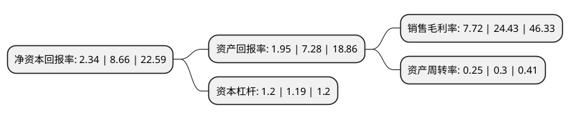

> 本页面由自动化程序生成于 2022年5月20日 01:31
> 内容可能存在错误，如有bug请提交issue至：https://github.com/Eroleice/doc-pi/issues
{.is-warning}

# 上市公司基本情况

## 基本资料

三六零安全科技股份有限公司（以下简称“三六零”）成立于1992年06月20日，天津市。于2012年01月16日在上交所主板上市。

三六零注册资本714,536.32万元，主营业务是互联网安全技术的研发，互联网安全产品的设计，研发，推广，以及基于互联网安全产品的互联网广告及服务，互联网增值服务，智能硬件业务等商业化服务。以下是详细信息：

- 公司名称: 三六零安全科技股份有限公司
- 股票代码: 601360.SH
- 所在地: 天津 - 天津市
- 成立日期: 1992年06月20日
- 注册资本: 714,536.32万元
- 法定代表人: 周鸿祎
- 主营业务: 主营业务是互联网安全技术的研发，互联网安全产品的设计，研发，推广，以及基于互联网安全产品的互联网广告及服务，互联网增值服务，智能硬件业务等商业化服务
- 公司官网: www.360.cn
- 公司介绍: 公司是中国领先的互联网和手机安全产品及服务供应商。公司主要从事互联网技术(特别是互联网安全技术)的研发及网络安全产品的设计、研发、运营，以及基于网络安全产品的互联网广告及服务、互联网增值服务、智能硬件业务等商业化服务。公司致力于通过提供高品质的免费安全服务，为中国互联网用户解决上网时遇到的各种安全问题。面对互联网时代木马、病毒、流氓软件、钓鱼欺诈网页等多元化的安全威胁，360以互联网的思路解决网络安全问题。公司免费提供互联网安全和移动安全产品，为用户提供安全的互联网活动接入点和信息内容。由此，公司积累了大量用户，在此基础上公司将业务拓展至互联网广告及服务、互联网增值服务、智能硬件业务等业务领域。公司构建了以核心技术为驱动、以产品体系为载体、以商业化为保障的互联网生态体系。作为中国大型的互联网安全公司之一，360拥有国内规模领先的高水平安全技术团队，旗下360安全卫士、360杀毒、360安全浏览器、360安全桌面、360手机卫士等系列产品深受用户好评，使360成为无可争议的网络安全领先品牌。

## 股东及高管情况

上市公司第一大股东为天津奇信志成科技有限公司，持股3,296,744,163股，占比46.14%，为上市公司实际控制人。

截至2022年03月31日，上市公司的前十大股东中，共有1名自然人股东，7名机构股东，1个产品账户，1个海外主体，其中5%以上大股东共有2名。上市公司前十大股东明细如下：

> 截至2022年03月31日，上市公司前十大股东信息如下：

| 股东名称 | 持股数量（股） | 持股比例 |
| --- | --- | --- |
| 天津奇信志成科技有限公司 | 3,296,744,163 | 46.14% |
| 周鸿祎 | 821,281,583 | 11.49% |
| 天津欣新盛股权投资合伙企业(有限合伙) | 145,715,666 | 2.04% |
| 香港中央结算有限公司(陆股通) | 106,518,663 | 1.49% |
| 天津信心奇缘股权投资合伙企业(有限合伙) | 87,974,952 | 1.23% |
| 北京中关村资本基金管理有限公司-北京中发助力壹号投资基金(有限合伙) | 77,339,520 | 1.08% |
| 金砖丝路(银川)股权投资合伙企业(有限合伙) | 69,326,916 | 0.97% |
| 珠海科技创业投资有限公司 | 54,137,664 | 0.76% |
| 北京红杉懿远股权投资中心(有限合伙) | 53,138,635 | 0.74% |
| 成都高新新经济创业投资有限公司 | 52,590,873 | 0.74% |

## 利润表分析

上市公司2021年总收入为108.85亿元，净利润为8.4亿元，实现盈利。

## 杜邦分析

> 数据列示周期：2021年 | 2020年 | 2019年
{.is-info}

上市公司的净资产收益率在近一年有所下降，下降幅度为-72.98%，其变化情况分解如下：
- 上市公司的销售毛利率在近一年下降了-68.4%，可能是生产效率的下降、商品原材料价格上涨或商品价格的下跌所致。
- 上市公司的资产周转率在近一年下降了-16.67%，可能是源自于更慢的销售回款或库存管理效果下降。
- 上市公司的财务杠杆比率在近一年上升了0.84%，可能是增加负债扩大生产规模。

