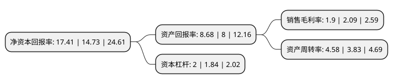

> 本页面由自动化程序生成于 2022年5月20日 01:34
> 内容可能存在错误，如有bug请提交issue至：https://github.com/Eroleice/doc-pi/issues
{.is-warning}

# 上市公司基本情况

## 基本资料

北京国联视讯信息技术股份有限公司（以下简称“国联股份”）成立于2002年09月06日，北京市。于2019年07月30日在上交所主板上市。

国联股份注册资本34,390.028万元，主营业务:B2B电子商务;主要产品和服务:公司以B2B电子商务业务为主，公司定位于B2B综合服务平台，以工业电子商务为基础，以互联网数据为支撑，为相关行业客户提供工业品和原材料的网上商品交易，商业信息服务和互联网技术服务。1，网上商品交易业务——通过涂多多，卫多多，玻多多三个B2B垂直电商平台为涂料化工，卫生用品，玻璃等产业链的注册企业提供自营电商，第三方电商和SaaS服务。2，商业信息服务——通过国联资源网为各行业客户提供基于互联网，线上线下结合的网站会员，行业会展，资讯等商业信息服务。3，互联网技术服务—为客户提供基于“互联网+”的全网总体设计，平台建设，系统开发，咨询培训和电子商务工程等专业服务;帮助传统品牌企业运营其在天猫，京东的网上店铺以下是详细信息：

- 公司名称: 北京国联视讯信息技术股份有限公司
- 股票代码: 603613.SH
- 所在地: 北京 - 北京市
- 成立日期: 2002年09月06日
- 注册资本: 34,390.028万元
- 法定代表人: 刘泉
- 主营业务: 主营业务:B2B电子商务;主要产品和服务:公司以B2B电子商务业务为主，公司定位于B2B综合服务平台，以工业电子商务为基础，以互联网数据为支撑，为相关行业客户提供工业品和原材料的网上商品交易，商业信息服务和互联网技术服务1，网上商品交易业务——通过涂多多，卫多多，玻多多三个B2B垂直电商平台为涂料化工，卫生用品，玻璃等产业链的注册企业提供自营电商，第三方电商和SaaS服务2，商业信息服务——通过国联资源网为各行业客户提供基于互联网，线上线下结合的网站会员，行业会展，资讯等商业信息服务3，互联网技术服务—为客户提供基于“互联网+”的全网总体设计，平台建设，系统开发，咨询培训和电子商务工程等专业服务;帮助传统品牌企业运营其在天猫，京东的网上店铺
- 公司官网: www.ueiibi.com
- 公司介绍: 2002年9月6日，公司取得了北京市工商行政管理局核发的《企业法人营业执照》(注册号：1100001458746)，股份公司正式成立，企业的名称为北京国联视讯信息技术股份有限公司。北京国联视讯信息技术股份有限公司，证券简称：国联股份，证券代码：603613。国联股份主营B2B电子商务和产业互联网平台，以工业电子商务为基础，以互联网大数据为支撑，为相关行业提供网上商品交易、产业信息服务和产业科技服务。公司主要业务板块：B2B信息服务平台-国联资源网；B2B垂直电商平台-涂多多、卫多多、玻多多等多多平台；产业科技服务-行业软件、物联网、云计算、大数据、金融科技.公司主营产品：工业品电子商务、产业信息服务、产业科技服务(行业软件、物联网、云计算、大数据、金融科技)公司致力于互联网、物联网等新技术与传统产业的深度融合，实现促进传统产业降本增效的价值使命。公司是商务部、工信部、中国人民银行等八部委共同认定的全国供应链创新与应用试点企业，是工信部认定的2019年制造业与互联网融合试点示范项目企业。

## 股东及高管情况

上市公司第一大股东为钱晓钧，持股59,416,308股，占比17.2772%，**疑似为**上市公司实际控制人。

截至2022年05月17日，上市公司的前十大股东中，共有7名自然人股东，2名机构股东，1个产品账户，其中5%以上大股东共有7名。上市公司前十大股东明细如下：

> 未能通过持股比例判定出上市公司实际控制人（持股30%以上）
> 可能存在通过间接持股、联合持股、协议控制等方式拥有实际控制权的主体，具体请参考上市公司定期公告！
{.is-warning}

> 截至2022年05月17日，上市公司前十大股东信息如下：

| 股东名称 | 持股数量（股） | 持股比例 |
| --- | --- | --- |
| 钱晓钧 | 59,416,308 | 17.2772% |
| 钱晓钧 | 59,226,131 | 17.2219% |
| 钱晓钧 | 58,938,331 | 17.14% |
| 刘泉 | 58,834,027 | 17.1079% |
| 刘泉 | 58,582,991 | 17.0349% |
| 刘泉 | 58,544,319 | 17.0236% |
| 刘泉 | 58,339,119 | 16.96% |
| 招商银行股份有限公司-交银施罗德新成长混合型证券投资基金 | 5,617,173 | 1.63% |
| 北京丰颖企业管理合伙企业(有限合伙) | 4,730,625 | 1.38% |
| 宁波三安投资控股有限公司 | 4,673,380 | 1.36% |

## 利润表分析

上市公司2021年总收入为372.29亿元，净利润为7.05亿元，实现盈利。

## 杜邦分析

> 数据列示周期：2021年 | 2020年 | 2019年
{.is-info}

上市公司的净资产收益率在近一年有所上升，上升幅度为18.19%，其变化情况分解如下：
- 上市公司的销售毛利率在近一年下降了-9.09%，可能是生产效率的下降、商品原材料价格上涨或商品价格的下跌所致。
- 上市公司的资产周转率在近一年上升了19.58%，可能是源自于更快的销售回款或库存管理效果提升。
- 上市公司的财务杠杆比率在近一年上升了8.7%，可能是增加负债扩大生产规模。

