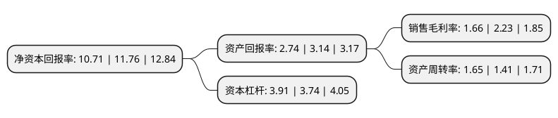

> 本页面由自动化程序生成于 2022年5月20日 01:35
> 内容可能存在错误，如有bug请提交issue至：https://github.com/Eroleice/doc-pi/issues
{.is-warning}

# 上市公司基本情况

## 基本资料

华扬联众数字技术股份有限公司（以下简称“华扬联众”）成立于1994年06月28日，北京市。于2017年08月02日在上交所主板上市。

华扬联众注册资本25,333.655万元，主营业务:互联网广告服务和买断式销售代理服务，主要业务类型:展示类营销，搜索引擎营销，精准营销，内容营销，移动互联网营销等主流的互联网营销方式以下是详细信息：

- 公司名称: 华扬联众数字技术股份有限公司
- 股票代码: 603825.SH
- 所在地: 北京 - 北京市
- 成立日期: 1994年06月28日
- 注册资本: 25,333.655万元
- 法定代表人: 苏同
- 主营业务: 主营业务:互联网广告服务和买断式销售代理服务，主要业务类型:展示类营销，搜索引擎营销，精准营销，内容营销，移动互联网营销等主流的互联网营销方式
- 公司官网: www.hylink.com
- 公司介绍: 公司是国内以驱动增长为核心、整合全渠道营销的信息技术服务公司，旗下整合了信息技术营销服务、媒体渠道数据平台、文化传媒IP内容三大优势业务板块，并形成了高效联动、以商业数据赋能全渠道营销的闭环，助力商业伙伴在快速变化的竞争环境中实现价值，以商业力量创造美好生活。公司一直专注于互联网行业的发展，积累了行业内最为丰富的营销服务经验，并坚持通过自身技术研发和积累，将互联网的技术、内容制作和广告投放进行有效整合，全面指导和协助客户品牌形象传播和产品销售宣传的互联网营销战略，以优质的专业服务和营销效果增加粘性，吸引住客户并保持长期合作关系。公司目前已发展成为业内业务布局和技术储备完整，极具竞争力的企业之一。公司曾多荣膺国内、国际营销及创意大赛的诸项殊荣，并多次选送代表担任戛纳国际创意节的评审。秉承着“台作共赢、科技利人、高效行动力”的价值观，公司将一如既往引领行业在创新中不断前行。

## 股东及高管情况

上市公司第一大股东为苏同，持股66,389,131股，占比26.21%，**疑似为**上市公司实际控制人。

截至2022年03月31日，上市公司的前十大股东中，共有3名自然人股东，5名机构股东，2个产品账户，其中5%以上大股东共有3名。上市公司前十大股东明细如下：

> 未能通过持股比例判定出上市公司实际控制人（持股30%以上）
> 可能存在通过间接持股、联合持股、协议控制等方式拥有实际控制权的主体，具体请参考上市公司定期公告！
{.is-warning}

> 截至2022年03月31日，上市公司前十大股东信息如下：

| 股东名称 | 持股数量（股） | 持股比例 |
| --- | --- | --- |
| 苏同 | 66,389,131 | 26.21% |
| 姜香蕊 | 27,705,970 | 10.94% |
| 上海华扬联众企业管理有限公司 | 19,742,923 | 7.79% |
| 林芝安大投资有限公司 | 7,012,622 | 2.77% |
| 卢珠琴 | 4,894,000 | 1.93% |
| 北京百度网讯科技有限公司 | 3,359,989 | 1.33% |
| 北京搜狐互联网信息服务有限公司 | 3,019,989 | 1.19% |
| 海通证券股份有限公司 | 2,504,922 | 0.99% |
| 湖南轻盐创业投资管理有限公司-轻盐智选19号私募证券投资基金 | 2,364,656 | 0.93% |
| 上海烜鼎资产管理有限公司-烜鼎星宿4号私募证券投资基金 | 2,170,000 | 0.86% |

## 利润表分析

上市公司2021年总收入为132.13亿元，净利润为2.19亿元，实现盈利。

## 杜邦分析

> 数据列示周期：2021年 | 2020年 | 2019年
{.is-info}

上市公司的净资产收益率在近一年有所下降，下降幅度为-8.93%，其变化情况分解如下：
- 上市公司的销售毛利率在近一年下降了-25.56%，可能是生产效率的下降、商品原材料价格上涨或商品价格的下跌所致。
- 上市公司的资产周转率在近一年上升了17.02%，可能是源自于更快的销售回款或库存管理效果提升。
- 上市公司的财务杠杆比率在近一年上升了4.55%，可能是增加负债扩大生产规模。

