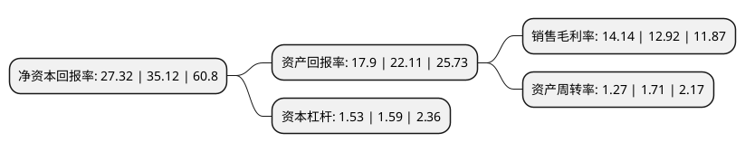

> 本页面由自动化程序生成于 2022年5月20日 01:36
> 内容可能存在错误，如有bug请提交issue至：https://github.com/Eroleice/doc-pi/issues
{.is-warning}

# 上市公司基本情况

## 基本资料

三人行传媒集团股份有限公司（以下简称“三人行”）成立于2003年08月13日，西安市。于2020年05月28日在上交所主板上市。

三人行注册资本6,967.78万元，专业从事整合营销服务的综合型广告传媒企业，主营业务包括数字营销服务，场景活动服务和校园媒体营销服务。以下是详细信息：

- 公司名称: 三人行传媒集团股份有限公司
- 股票代码: 605168.SH
- 所在地: 陕西 - 西安市
- 成立日期: 2003年08月13日
- 注册资本: 6,967.78万元
- 法定代表人: 钱俊冬
- 主营业务: 专业从事整合营销服务的综合型广告传媒企业，主营业务包括数字营销服务，场景活动服务和校园媒体营销服务
- 公司官网: www.topsrx.com
- 公司介绍: 公司是专业从事整合营销服务的综合型广告传媒企业，主营业务包括数字营销服务、场景活动服务和校园媒体营销服务。公司在洞察客户品牌的市场定位、发掘客户产品或服务的营销亮点的基础上，结合自身在数字营销、场景活动和校园媒体营销等业务领域的布局，为客户提供品牌策略、创意策划、内容制作、媒介策略、广告投放、活动执行、效果评估及优化等全流程的整合营销服务，满足客户在全国范围内跨媒体、多渠道的品牌曝光和产品或服务推广的营销需求。公司是中国4A协会会员单位及中国广告协会互联网广告委员会常务委员单位，获得了中国广告协会“数字营销类一级广告企业”认证。公司获得多项广告行业奖项，包括长城奖“互动创意奖”、长城奖“媒介营销奖”、金网奖“互联网传播奖”、金网奖“场景营销奖”、金网奖“移动营销奖”、金网奖“体育营销奖”、金网奖“电商O2O奖”、金鼠标“创意传播奖”、金鼠标“社会化营销奖”、虎啸奖“营销创意奖”等。

## 股东及高管情况

上市公司第一大股东为青岛多多行投资有限公司，持股18,595,532股，占比26.69%，**疑似为**上市公司实际控制人。

截至2022年03月31日，上市公司的前十大股东中，共有2名自然人股东，4名机构股东，3个产品账户，1个海外主体，其中5%以上大股东共有3名。上市公司前十大股东明细如下：

> 未能通过持股比例判定出上市公司实际控制人（持股30%以上）
> 可能存在通过间接持股、联合持股、协议控制等方式拥有实际控制权的主体，具体请参考上市公司定期公告！
{.is-warning}

> 截至2022年03月31日，上市公司前十大股东信息如下：

| 股东名称 | 持股数量（股） | 持股比例 |
| --- | --- | --- |
| 青岛多多行投资有限公司 | 18,595,532 | 26.69% |
| 青岛众行投资合伙企业(有限合伙) | 8,658,300 | 12.43% |
| 钱俊冬 | 8,425,500 | 12.09% |
| 崔蕾 | 3,340,400 | 4.79% |
| 科大讯飞股份有限公司 | 2,205,000 | 3.16% |
| 中国工商银行股份有限公司-富国创新科技混合型证券投资基金 | 1,360,907 | 1.95% |
| 珠海光控众明产业投资基金合伙企业(有限合伙) | 1,035,912 | 1.49% |
| 宁波梅山保税港区君度德瑞股权投资管理中心(有限合伙) | 972,000 | 1.39% |
| 香港中央结算有限公司(陆股通) | 883,328 | 1.27% |
| 全国社保基金一一八组合 | 606,753 | 0.87% |

## 利润表分析

上市公司2021年总收入为35.7亿元，净利润为5.04亿元，实现盈利。

## 杜邦分析

> 数据列示周期：2021年 | 2020年 | 2019年
{.is-info}

上市公司的净资产收益率在近一年有所下降，下降幅度为-22.21%，其变化情况分解如下：
- 上市公司的销售毛利率在近一年上升了9.44%，可能是生产效率的提升、商品原材料价格下跌或商品价格的上涨所致。
- 上市公司的资产周转率在近一年下降了-25.73%，可能是源自于更慢的销售回款或库存管理效果下降。
- 上市公司的财务杠杆比率在近一年下降了-3.77%，可能是减少负债降低财务费用。

