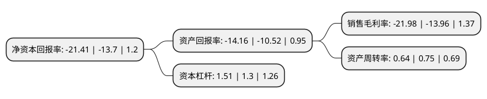

> 本页面由自动化程序生成于 2022年5月20日 01:38
> 内容可能存在错误，如有bug请提交issue至：https://github.com/Eroleice/doc-pi/issues
{.is-warning}

# 上市公司基本情况

## 基本资料

优刻得科技股份有限公司（以下简称“优刻得-W”）成立于2012年03月16日，上海市。于2020年01月20日在上交所科创板上市。

优刻得-W注册资本45,309.508万元，自主研发并提供计算，网络，存储等基础资源和构建在这些基础资源之上的基础IT架构产品，以及大数据，人工智能等产品，通过公有云，私有云，混合云三种模式为用户提供服务。以下是详细信息：

- 公司名称: 优刻得科技股份有限公司
- 股票代码: 688158.SH
- 所在地: 上海 - 上海市
- 成立日期: 2012年03月16日
- 注册资本: 45,309.508万元
- 法定代表人: 季昕华
- 主营业务: 自主研发并提供计算，网络，存储等基础资源和构建在这些基础资源之上的基础IT架构产品，以及大数据，人工智能等产品，通过公有云，私有云，混合云三种模式为用户提供服务
- 公司官网: www.ucloud.cn
- 公司介绍: 公司是国内领先的第三方云计算服务商，提供公有云、私有云、混合云三种模式服务。公有云是核心业务，私有云、混合云是重点发展领域。切入互动娱乐、移动互联、企业服务、教育、零售、金融等几个细分领域，形成完整的系列产品线。公有云产品包括计算、网络、存储、数据库、数据分析、分发等；私有云核心产品包括UMOS、UMstor、MCP、专有云服务及容器等；混合云主要由机柜托管、定制化物理机、VPN网关、外网、内网、云互通服务、运维服务等模块组成。已拥有包括内核热补丁技术、数据回滚技术、软件定义网络、负载均衡技术、分布式数据库、安全屋等在内的多项业内领先或创新的云计算技术。2018年上半年国内公有云市场排名第六。

## 股东及高管情况

上市公司第一大股东为季昕华，持股50,831,173股，占比11.22%，**疑似为**上市公司实际控制人。

截至2022年03月31日，上市公司的前十大股东中，共有3名自然人股东，4名机构股东，3个产品账户，其中5%以上大股东共有6名。上市公司前十大股东明细如下：

> 未能通过持股比例判定出上市公司实际控制人（持股30%以上）
> 可能存在通过间接持股、联合持股、协议控制等方式拥有实际控制权的主体，具体请参考上市公司定期公告！
{.is-warning}

> 截至2022年03月31日，上市公司前十大股东信息如下：

| 股东名称 | 持股数量（股） | 持股比例 |
| --- | --- | --- |
| 季昕华 | 50,831,173 | 11.22% |
| 苏州工业园区元禾重元股权投资基金管理有限公司-苏州工业园区元禾重元优云创业投资企业(有限合伙) | 32,095,203 | 7.08% |
| 君联资本管理股份有限公司-天津君联博珩投资合伙企业(有限合伙) | 30,690,660 | 6.77% |
| 中移资本控股有限责任公司 | 23,537,521 | 5.19% |
| 莫显峰 | 23,428,536 | 5.17% |
| 华琨 | 23,428,536 | 5.17% |
| 交通银行股份有限公司-万家行业优选混合型证券投资基金(LOF) | 20,000,000 | 4.41% |
| 北京甲子齐心投资管理合伙企业(有限合伙)-北京中金甲子拾号股权投资合伙企业(有限合伙) | 18,141,554 | 4% |
| 嘉兴红柳私募基金管理合伙企业(有限合伙)-嘉兴优亮投资合伙企业(有限合伙) | 14,312,790 | 3.16% |
| 嘉兴大马投资管理合伙企业(有限合伙)-嘉兴华亮投资合伙企业(有限合伙) | 13,941,288 | 3.08% |

## 利润表分析

上市公司2021年总收入为29.01亿元，净利润为-6.38亿元，**未实现盈利**。

## 杜邦分析

> 数据列示周期：2021年 | 2020年 | 2019年
{.is-info}

上市公司的净资产收益率在近一年有所上升，上升幅度为56.28%，其变化情况分解如下：
- 上市公司的销售毛利率在近一年上升了57.45%，可能是生产效率的提升、商品原材料价格下跌或商品价格的上涨所致。
- 上市公司的资产周转率在近一年下降了-14.67%，可能是源自于更慢的销售回款或库存管理效果下降。
- 上市公司的财务杠杆比率在近一年上升了16.15%，可能是增加负债扩大生产规模。

