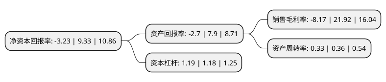

> 本页面由自动化程序生成于 2022年5月20日 01:39
> 内容可能存在错误，如有bug请提交issue至：https://github.com/Eroleice/doc-pi/issues
{.is-warning}

# 上市公司基本情况

## 基本资料

北京慧辰资道资讯股份有限公司（以下简称“慧辰股份”）成立于2008年11月14日，北京市。于2020年07月16日在上交所科创板上市。

慧辰股份注册资本7,427.451万元，为行业头部企业和国内政府机构提供基于企业内外部数据，消费者态度与行为数据和行业数据的业务经营分析与应用，定制化行业分析应用解决方案等服务以下是详细信息：

- 公司名称: 北京慧辰资道资讯股份有限公司
- 股票代码: 688500.SH
- 所在地: 北京 - 北京市
- 成立日期: 2008年11月14日
- 注册资本: 7,427.451万元
- 法定代表人: 赵龙
- 主营业务: 为行业头部企业和国内政府机构提供基于企业内外部数据，消费者态度与行为数据和行业数据的业务经营分析与应用，定制化行业分析应用解决方案等服务
- 公司官网: www.hcr.com.cn
- 公司介绍: 公司是一家数据分析服务提供商。公司主要为行业头部企业和国内政府机构提供基于企业内外部数据、消费者态度与行为数据和行业数据的业务经营分析与应用、定制化行业分析应用解决方案等服务，是以数据分析应用技术为核心的科技创新型企业。基于对垂直领域的深刻理解以及在数据科学领域多年的技术积累，公司将数据科学技术和垂直领域专业分析方法模型进行了有效融合，通过优化传统算法模型解决成熟行业中企业的实际问题，并通过算法模型的迁移，快速开拓全新业务场景，体现了较强的技术独特性和创新性。凭借专业的技术能力、应用落地能力和多年积累的行业经验，公司产品覆盖了众多商业领域，广泛应用于汽车、TMT、环保、教育、快消、医疗等多个商业领域，获得了大量优质客户，其中包括华为、联合利华、欧莱雅、奔驰、奥迪、西安杨森等国内外知名企业，以及中国移动、中石油、国家电网、一汽集团、中国烟草等大型行业客户。在政府与公共服务领域，公司的数据分析与应用能力得到了众多客户的认可，在智慧旅游、生态环保等领域为北京、天津、江苏等多地政府提供相关服务。

## 股东及高管情况

上市公司第一大股东为新疆良知正德企业管理咨询有限公司，持股16,803,750股，占比22.62%，**疑似为**上市公司实际控制人。

截至2022年04月29日，上市公司的前十大股东中，共有1名自然人股东，8名机构股东，1个产品账户，其中5%以上大股东共有3名。上市公司前十大股东明细如下：

> 未能通过持股比例判定出上市公司实际控制人（持股30%以上）
> 可能存在通过间接持股、联合持股、协议控制等方式拥有实际控制权的主体，具体请参考上市公司定期公告！
{.is-warning}

> 截至2022年04月29日，上市公司前十大股东信息如下：

| 股东名称 | 持股数量（股） | 持股比例 |
| --- | --- | --- |
| 新疆良知正德企业管理咨询有限公司 | 16,803,750 | 22.62% |
| 新疆慧聪创业投资有限公司 | 6,827,500 | 9.19% |
| 上海琢朴企业管理事务所(有限合伙) | 5,668,565 | 7.63% |
| 湖南文化旅游创业投资基金企业(有限合伙) | 3,523,000 | 4.74% |
| 上海秉樊企业管理合伙企业(有限合伙) | 2,670,817 | 3.6% |
| 聚行知(天津)企业管理咨询中心(有限合伙) | 2,508,300 | 3.38% |
| 承合一(天津)企业管理咨询中心(有限合伙) | 1,241,700 | 1.67% |
| 广发乾和投资有限公司 | 1,167,315 | 1.57% |
| 李洪滨 | 1,163,170 | 1.57% |
| 上海越日企业管理咨询中心(有限合伙) | 1,160,000 | 1.56% |

## 利润表分析

上市公司2021年总收入为4.75亿元，净利润为-0.39亿元，**未实现盈利**。

## 杜邦分析

> 数据列示周期：2021年 | 2020年 | 2019年
{.is-info}

上市公司的净资产收益率在近一年有所下降，下降幅度为-134.62%，其变化情况分解如下：
- 上市公司的销售毛利率在近一年下降了-137.27%，可能是生产效率的下降、商品原材料价格上涨或商品价格的下跌所致。
- 上市公司的资产周转率在近一年下降了-8.33%，可能是源自于更慢的销售回款或库存管理效果下降。
- 上市公司的财务杠杆比率在近一年上升了0.85%，可能是增加负债扩大生产规模。

