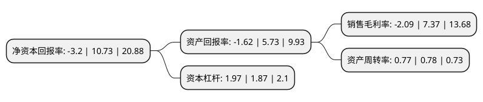

> 本页面由自动化程序生成于 2022年5月20日 01:03
> 内容可能存在错误，如有bug请提交issue至：https://github.com/Eroleice/doc-pi/issues
{.is-warning}

# 上市公司基本情况

## 基本资料

山东新能泰山发电股份有限公司（以下简称“新能泰山”）成立于1994年03月28日，泰安市。于1997年05月09日在深交所主板上市。

新能泰山注册资本128,965.096万元，主要业务:产业园开发运营，电线电缆为主业。以下是详细信息：

- 公司名称: 山东新能泰山发电股份有限公司
- 股票代码: 000720.SZ
- 所在地: 山东 - 泰安市
- 成立日期: 1994年03月28日
- 注册资本: 128,965.096万元
- 法定代表人: 吴永钢
- 主营业务: 产业园开发运营，电线电缆为主业
- 公司官网: www.xntsgs.com
- 公司介绍: 公司是集生产、经营、科研、外经外贸于一体，国家定点生产电线电缆的大型骨干企业，拥有进出口自营权。目前公司以产业园开发运营、电线电缆为主业，经营模式以自主开发、生产、销售为主。公司未来将向大宗商品供应链集成服务方向发展，重点发展冶金、能源、工程配送、备品备件四方面供应链业务，在物流仓储平台、电商交易平台、供应链金融服务平台三个主方向进行布局和建设。公司产业园开发运营项目主要在南京市，全资子公司宁华世纪的江山汇项目位于南京市鼓楼滨江商务区，是鼓楼区重点项目，被作为全市重点功能板块进行打造。公司控股子公司曲阜电缆拥有独立完整的采购、生产和销售体系，公司根据生产能力、市场需求，独立自主开展生产经营活动。公司积极采用国内外先进的生产、检测设备，工艺技术、工艺装备均处于国内引用开发先进水平，拥有实用新型专利多项，被山东省科学技术厅等部门授予高新技术企业称号。公司先后承担了北京天安门线路改造、大秦、宝中、京九铁路、三峡工程、北京西客站等上百项国家重点建设项目的部分配套任务。

## 股东及高管情况

上市公司第一大股东为华能能源交通产业控股有限公司，持股300,007,395股，占比23.26%，**疑似为**上市公司实际控制人。

截至2022年03月31日，上市公司的前十大股东中，共有6名自然人股东，3名机构股东，1个产品账户，其中5%以上大股东共有3名。上市公司前十大股东明细如下：

> 未能通过持股比例判定出上市公司实际控制人（持股30%以上）
> 可能存在通过间接持股、联合持股、协议控制等方式拥有实际控制权的主体，具体请参考上市公司定期公告！
{.is-warning}

> 截至2022年03月31日，上市公司前十大股东信息如下：

| 股东名称 | 持股数量（股） | 持股比例 |
| --- | --- | --- |
| 华能能源交通产业控股有限公司 | 300,007,395 | 23.26% |
| 南京华能南方实业开发股份有限公司 | 223,910,769 | 17.36% |
| 广东世纪城集团有限公司 | 88,153,557 | 6.84% |
| 张秀东 | 9,018,700 | 0.7% |
| 北京万珑私募基金管理有限公司-万珑资产新时代21号私募证券投资基金 | 7,497,301 | 0.58% |
| 周立镇 | 6,545,000 | 0.51% |
| 田华 | 5,260,000 | 0.41% |
| 安宁 | 4,043,400 | 0.31% |
| 魏宏斌 | 3,736,385 | 0.29% |
| 康振宇 | 3,588,900 | 0.28% |

## 杜邦分析

> 数据列示周期：2021年 | 2020年 | 2019年
{.is-info}

上市公司的净资产收益率在近一年有所下降，下降幅度为-129.82%，其变化情况分解如下：
- 上市公司的销售毛利率在近一年下降了-128.36%，可能是生产效率的下降、商品原材料价格上涨或商品价格的下跌所致。
- 上市公司的资产周转率在近一年下降了-1.28%，可能是源自于更慢的销售回款或库存管理效果下降。
- 上市公司的财务杠杆比率在近一年上升了5.35%，可能是增加负债扩大生产规模。

