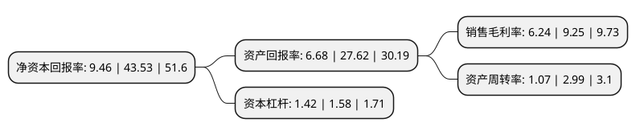

> 本页面由自动化程序生成于 2022年5月20日 01:05
> 内容可能存在错误，如有bug请提交issue至：https://github.com/Eroleice/doc-pi/issues
{.is-warning}

# 上市公司基本情况

## 基本资料

广东炬申物流股份有限公司（以下简称“炬申股份”）成立于2011年11月10日，佛山市。于2021年04月29日在深交所主板上市。

炬申股份注册资本12,880万元，公司主营业务一直专注于有色金属物流领域，为客户提供集物流方案设计，运输，仓储装卸，期货交割与标准仓单制作，货权转移登记，仓储管理输出为一体的多元化综合物流服务。以下是详细信息：

- 公司名称: 广东炬申物流股份有限公司
- 股票代码: 001202.SZ
- 所在地: 广东 - 佛山市
- 成立日期: 2011年11月10日
- 注册资本: 12,880万元
- 法定代表人: 雷琦
- 主营业务: 公司主营业务一直专注于有色金属物流领域，为客户提供集物流方案设计，运输，仓储装卸，期货交割与标准仓单制作，货权转移登记，仓储管理输出为一体的多元化综合物流服务
- 公司官网: www.jushen.co
- 公司介绍: 公司始终坚持秉承诚信、安全、效益、规范的服务理念，自成立以来一直专注于有色金属物流领域，通过“紧贴铝产业链、横纵辐射有色金属领域其他品类”的战略部署，形成了与客户产业链深度融合、横向综合化发展、纵向深耕多式联运的业务格局，并通过建立运输专线优势及完善物流网络布局，推动有色金属产业链的资源流通和价值流通，已成为有色金属领域领先的综合型第三方物流企业。公司为客户提供多式联运、直运等货物运输服务，同时提供仓储装卸、期货交割与标准仓单制作、货权转移登记、仓储管理输出等物流链配套增值服务。经过多年的发展，公司已成为集物流方案设计、运输、仓储装卸、期货交割与标准仓单制作、货权转移登记、仓储管理输出为一体的多元化综合物流服务提供商。

## 股东及高管情况

上市公司第一大股东为雷琦，持股51,145,800股，占比39.71%，为上市公司实际控制人。

截至2022年03月31日，上市公司的前十大股东中，共有5名自然人股东，5名机构股东，其中5%以上大股东共有2名。上市公司前十大股东明细如下：

> 截至2022年03月31日，上市公司前十大股东信息如下：

| 股东名称 | 持股数量（股） | 持股比例 |
| --- | --- | --- |
| 雷琦 | 51,145,800 | 39.71% |
| 雷高潮 | 32,432,200 | 25.18% |
| 上海聚升资产管理有限公司-宁波海益投资合伙企业(有限合伙) | 5,660,000 | 4.39% |
| 上海聚升资产管理有限公司-宁波保润资产管理合伙企业(有限合伙) | 5,320,000 | 4.13% |
| 佛山市鑫隆企业管理合伙企业(有限合伙) | 1,000,000 | 0.78% |
| 佛山盛茂企业管理合伙企业(有限合伙) | 1,000,000 | 0.78% |
| 傅永江 | 267,000 | 0.21% |
| 姚瑶 | 264,300 | 0.21% |
| 华泰证券股份有限公司 | 193,762 | 0.15% |
| 陆勤 | 186,300 | 0.14% |

## 利润表分析

上市公司2021年总收入为7.46亿元，净利润为0.46亿元，实现盈利。

## 杜邦分析

> 数据列示周期：2021年 | 2020年 | 2019年
{.is-info}

上市公司的净资产收益率在近一年有所下降，下降幅度为-78.27%，其变化情况分解如下：
- 上市公司的销售毛利率在近一年下降了-32.54%，可能是生产效率的下降、商品原材料价格上涨或商品价格的下跌所致。
- 上市公司的资产周转率在近一年下降了-64.21%，可能是源自于更慢的销售回款或库存管理效果下降。
- 上市公司的财务杠杆比率在近一年下降了-10.13%，可能是减少负债降低财务费用。

