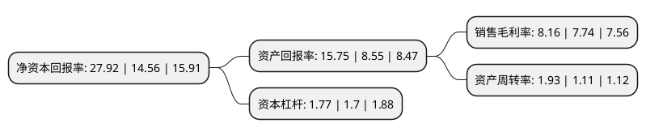

> 本页面由自动化程序生成于 2022年5月20日 01:05
> 内容可能存在错误，如有bug请提交issue至：https://github.com/Eroleice/doc-pi/issues
{.is-warning}

## 股东及高管情况

上市公司第一大股东为陈永夫，持股32,000,000股，占比30.81%，为上市公司实际控制人。

截至2022年04月29日，上市公司的前十大股东中，共有3名自然人股东，6名机构股东，1个产品账户，其中5%以上大股东共有5名。上市公司前十大股东明细如下：

> 截至2022年04月29日，上市公司前十大股东信息如下：

| 股东名称 | 持股数量（股） | 持股比例 |
| --- | --- | --- |
| 陈永夫 | 32,000,000 | 30.81% |
| 宁波永泰秦唐投资合伙企业(有限合伙) | 6,550,000 | 6.31% |
| 王巧玲 | 6,000,000 | 5.78% |
| 深圳众汇投资管理有限公司—宁波梅山保税港区众汇象田创业投资合伙企业(有限合伙) | 5,813,953 | 5.6% |
| 绍兴上虞乾泰股权投资合伙企业(有限合伙) | 5,813,953 | 5.6% |
| 绍兴上虞璟华股权投资合伙企业(有限合伙) | 4,651,163 | 4.48% |
| 浙江财通资本投资有限公司—德清锦烨财股权投资基金管理合伙企业(有限合伙) | 2,906,977 | 2.8% |
| 浙江龙盛集团股份有限公司 | 2,488,646 | 2.4% |
| 谈国梁 | 2,450,000 | 2.36% |
| 杭州财通尤创创业投资合伙企业(有限合伙) | 2,325,581 | 2.24% |

## 利润表分析

上市公司2021年总收入为21.44亿元，净利润为1.74亿元，实现盈利。

## 杜邦分析

> 数据列示周期：2021年 | 2020年 | 2019年
{.is-info}

上市公司的净资产收益率在近一年有所上升，上升幅度为91.76%，其变化情况分解如下：
- 上市公司的销售毛利率在近一年上升了5.43%，可能是生产效率的提升、商品原材料价格下跌或商品价格的上涨所致。
- 上市公司的资产周转率在近一年上升了73.87%，可能是源自于更快的销售回款或库存管理效果提升。
- 上市公司的财务杠杆比率在近一年上升了4.12%，可能是增加负债扩大生产规模。

