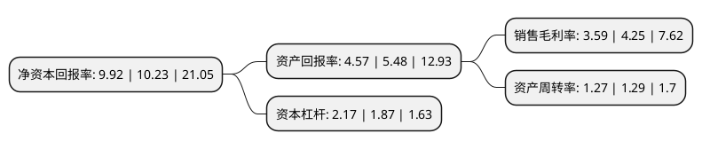

> 本页面由自动化程序生成于 2022年5月20日 01:06
> 内容可能存在错误，如有bug请提交issue至：https://github.com/Eroleice/doc-pi/issues
{.is-warning}

# 上市公司基本情况

## 基本资料

韵达控股股份有限公司（以下简称“韵达股份”）成立于1996年04月05日，宁波市。于2007年03月06日在深交所中小板上市。

韵达股份注册资本290,276.603万元，主营业务:快递服务业。以下是详细信息：

- 公司名称: 韵达控股股份有限公司
- 股票代码: 002120.SZ
- 所在地: 浙江 - 宁波市
- 成立日期: 1996年04月05日
- 注册资本: 290,276.603万元
- 法定代表人: 聂腾云
- 主营业务: 主营业务:快递服务业
- 公司官网: www.yundaex.com
- 公司介绍: 公司是国内知名快递物流企业，在“韵达+”发展理念的引领下，公司以科技为驱动力、以大数据能力为载体，通过多样化的快递产品、“最后一公里”、“末端100米”的配送和信息化技术的建设，致力于构建以快递为核心，涵盖仓配、云便利、跨境物流和智能快递柜为内容的综合服务物流平台。公司提供的专业快递服务累计近100亿人次，凭借在快递领域积累的优势，通过全面整合线上线下的信息流、资金流和物流，努力实现韵达货运与股东、用户、员工、加盟商、供应商及全社会的“共创、共赢、共生、共享”，最终将韵达货运打造成为以快递为核心，拥有高端电商物流平台、自动化传输与分拣系统的信息化技术平台。公司业务已覆盖30多个省、市、自治区，并相继开拓了包括英国、荷兰、加拿大、新西兰、新加坡、韩国、日本、中国香港、中国台湾、泰国等国家和地区在内的国际快件物流网络。

## 股东及高管情况

上市公司第一大股东为上海罗颉思投资管理有限公司，持股1,510,552,788股，占比52.04%，为上市公司实际控制人。

截至2022年03月31日，上市公司的前十大股东中，共有2名自然人股东，3名机构股东，4个产品账户，1个海外主体，其中5%以上大股东共有1名。上市公司前十大股东明细如下：

> 截至2022年03月31日，上市公司前十大股东信息如下：

| 股东名称 | 持股数量（股） | 持股比例 |
| --- | --- | --- |
| 上海罗颉思投资管理有限公司 | 1,510,552,788 | 52.04% |
| 聂腾云 | 80,361,697 | 2.77% |
| 上海丰科企业管理合伙企业(有限合伙) | 60,335,810 | 2.08% |
| 杭州阿里巴巴创业投资管理有限公司 | 57,883,280 | 1.99% |
| 香港中央结算有限公司(陆股通) | 57,796,446 | 1.99% |
| 招商银行股份有限公司-兴全合润混合型证券投资基金 | 39,240,789 | 1.35% |
| 全国社保基金一零六组合 | 38,085,505 | 1.31% |
| 全国社保基金一零二组合 | 33,662,173 | 1.16% |
| 黄新华 | 32,645,156 | 1.12% |
| 招商银行股份有限公司-兴全合宜灵活配置混合型证券投资基金(LOF) | 30,636,423 | 1.06% |

## 利润表分析

上市公司2021年总收入为417.29亿元，净利润为14.96亿元，实现盈利。

## 杜邦分析

> 数据列示周期：2021年 | 2020年 | 2019年
{.is-info}

上市公司的净资产收益率在近一年有所下降，下降幅度为-3.03%，其变化情况分解如下：
- 上市公司的销售毛利率在近一年下降了-15.53%，可能是生产效率的下降、商品原材料价格上涨或商品价格的下跌所致。
- 上市公司的资产周转率在近一年下降了-1.55%，可能是源自于更慢的销售回款或库存管理效果下降。
- 上市公司的财务杠杆比率在近一年上升了16.04%，可能是增加负债扩大生产规模。

