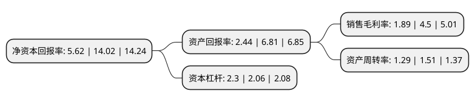

> 本页面由自动化程序生成于 2022年5月20日 01:08
> 内容可能存在错误，如有bug请提交issue至：https://github.com/Eroleice/doc-pi/issues
{.is-warning}

# 上市公司基本情况

## 基本资料

顺丰控股股份有限公司（以下简称“顺丰控股”）成立于2003年05月22日，深圳市。于2010年02月05日在深交所中小板上市。

顺丰控股注册资本490,621.31万元，主要业务:为客户提供仓储管理，销售预测，大数据分析，金融管理等一揽子解决方案。物流产品主要包含:时效快递，经济快递，同城配送，仓储服务，国际快递等多种快递服务，物流普运，重货快运等快运服务，以及为生鲜，食品和医药领域的客户提供冷链运输服务。以下是详细信息：

- 公司名称: 顺丰控股股份有限公司
- 股票代码: 002352.SZ
- 所在地: 广东 - 深圳市
- 成立日期: 2003年05月22日
- 注册资本: 490,621.31万元
- 法定代表人: 王卫
- 主营业务: 为客户提供仓储管理，销售预测，大数据分析，金融管理等一揽子解决方案物流产品主要包含:时效快递，经济快递，同城配送，仓储服务，国际快递等多种快递服务，物流普运，重货快运等快运服务，以及为生鲜，食品和医药领域的客户提供冷链运输服务
- 公司官网: www.sf-express.com
- 公司介绍: 公司是国内领先的快递物流综合服务商，经过多年发展，已初步建立为客户提供一体化综合物流解决方案的能力，不仅提供配送端的高质量物流服务，还延伸至价值链前端的产、供、销、配等环节，以消费者需求出发，利用大数据分析和云计算技术，为客户提供仓储管理、销售预测、大数据分析、金融管理等一揽子解决方案。公司的物流产品主要包含：时效快递、经济快递、同城配送、仓储服务、国际快递等多种快递服务，物流普运、重货快运等快运服务，以及为生鲜、食品和医药领域的客户提供冷链运输服务。此外，公司还提供保价、代收货款等增值服务，以满足客户个性化需求。经过多年潜心经营和前瞻性战略布局，公司已形成拥有“天网+地网+信息网”三网合一、可覆盖国内外的综合物流服务网络。公司荣获中国物流与采购联合会“AAAAA”物流企业，中国物流与采购联合会“中国物流改革开放30年旗帜企业”，中国快递物流示范基地，十佳电子商务物流创新企业等荣誉。

## 股东及高管情况

上市公司第一大股东为深圳明德控股发展有限公司，持股2,501,927,139股，占比51%，为上市公司实际控制人。

截至2022年03月31日，上市公司的前十大股东中，共有1名自然人股东，4名机构股东，1个产品账户，3个海外主体，1名其他股东，其中5%以上大股东共有1名。上市公司前十大股东明细如下：

> 截至2022年03月31日，上市公司前十大股东信息如下：

| 股东名称 | 持股数量（股） | 持股比例 |
| --- | --- | --- |
| 深圳明德控股发展有限公司 | 2,501,927,139 | 51% |
| 香港中央结算有限公司(陆股通) | 237,964,666 | 4.85% |
| 明德控股-华泰联合证券-21明德EB担保及信托财产专户 | 200,000,000 | 4.08% |
| 深圳市招广投资有限公司 | 193,451,173 | 3.94% |
| 宁波顺达丰润创业投资合伙企业(有限合伙) | 111,499,207 | 2.27% |
| UBS AG | 54,021,968 | 1.1% |
| 刘冀鲁 | 44,723,780 | 0.91% |
| 上海重阳战略投资有限公司-重阳战略才智基金 | 39,349,422 | 0.8% |
| 苏州工业园区元禾顺风股权投资企业(有限合伙) | 37,055,000 | 0.76% |
| 挪威中央银行-自有资金 | 36,112,984 | 0.74% |

## 利润表分析

上市公司2021年总收入为2,071.86亿元，净利润为39.19亿元，实现盈利。

## 杜邦分析

> 数据列示周期：2021年 | 2020年 | 2019年
{.is-info}

上市公司的净资产收益率在近一年有所下降，下降幅度为-59.91%，其变化情况分解如下：
- 上市公司的销售毛利率在近一年下降了-58%，可能是生产效率的下降、商品原材料价格上涨或商品价格的下跌所致。
- 上市公司的资产周转率在近一年下降了-14.57%，可能是源自于更慢的销售回款或库存管理效果下降。
- 上市公司的财务杠杆比率在近一年上升了11.65%，可能是增加负债扩大生产规模。

