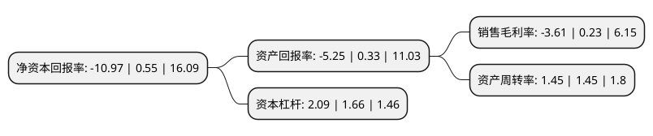

> 本页面由自动化程序生成于 2022年5月20日 01:09
> 内容可能存在错误，如有bug请提交issue至：https://github.com/Eroleice/doc-pi/issues
{.is-warning}

# 上市公司基本情况

## 基本资料

申通快递股份有限公司（以下简称“申通快递”）成立于2001年11月01日，台州市。于2010年09月08日在深交所中小板上市。

申通快递注册资本153,080.217万元，主要业务:快递业务，快递业务的产品分为三类，一是标准快递业务产品:汽运时效产品，包括限时递，当日递，次晨递，24小时件，48小时件等;航空时效产品，包括重点城市间24小时件;二是增值服务产品:推出承诺达，代收货款等，三是快递辅料产品，提供信封，文件袋，纸箱等快递包装物。以下是详细信息：

- 公司名称: 申通快递股份有限公司
- 股票代码: 002468.SZ
- 所在地: 浙江 - 台州市
- 成立日期: 2001年11月01日
- 注册资本: 153,080.217万元
- 法定代表人: 陈德军
- 主营业务: 快递业务，快递业务的产品分为三类，一是标准快递业务产品:汽运时效产品，包括限时递，当日递，次晨递，24小时件，48小时件等;航空时效产品，包括重点城市间24小时件;二是增值服务产品:推出承诺达，代收货款等，三是快递辅料产品，提供信封，文件袋，纸箱等快递包装物
- 公司官网: www.sto.cn
- 公司介绍: 公司致力于民族品牌的建设和发展，不断完善终端网络、中转运输网络和信息网络三网一体的立体运行体系，立足传统快递业务，全面进入电子商务物流领域，以专业的服务和严格的质量管理来推动中国物流和快递行业的发展，成为对国民经济和人们生活最具影响力的民营快递企业之一。公司目前的主要业务为快递业务，快递业务的产品分为三类，一是标准快递业务产品：汽运时效产品，包括限时递、当日递、次晨递、24小时件、48小时件等；航空时效产品，包括重点城市间24小时件；二是增值服务产品：推出承诺达、代收货款等，三是快递辅料产品，提供信封、文件袋、纸箱等快递包装物。随着中国快递市场的发展，公司在提供传统快递服务的同时，也在积极开拓新兴业务，为国内大型C2C、B2C企业提供物流配送、第三方物流和仓储、代收货款、贵重物品通道等服务，在国内建立了庞大的信息采集、市场开发、物流配送、快件收派等业务机构，同时，也积极拓展国际件服务，已经成为国内快递网络最完整、规模最大的民营快递企业之一。目前公司是中国快递协会、上海市快递行业协会和浙江省快递行业协会的副会长单位、旗下的加盟商在各个省份也分别是副会长或理事单位。

## 股东及高管情况

上市公司第一大股东为上海德峨实业发展有限公司，持股382,700,542股，占比25%，**疑似为**上市公司实际控制人。

截至2022年03月31日，上市公司的前十大股东中，共有2名自然人股东，6名机构股东，1个产品账户，1个海外主体，其中5%以上大股东共有3名。上市公司前十大股东明细如下：

> 未能通过持股比例判定出上市公司实际控制人（持股30%以上）
> 可能存在通过间接持股、联合持股、协议控制等方式拥有实际控制权的主体，具体请参考上市公司定期公告！
{.is-warning}

> 截至2022年03月31日，上市公司前十大股东信息如下：

| 股东名称 | 持股数量（股） | 持股比例 |
| --- | --- | --- |
| 上海德峨实业发展有限公司 | 382,700,542 | 25% |
| 上海恭之润实业发展有限公司 | 246,459,149 | 16.1% |
| 上海德殷投资控股有限公司 | 118,715,969 | 7.76% |
| 上海德润二实业发展有限公司 | 75,009,306 | 4.9% |
| 陈德军 | 51,675,345 | 3.38% |
| 陈小英 | 40,589,072 | 2.65% |
| 宁波艾缤股权投资合伙企业(有限合伙) | 38,716,981 | 2.53% |
| 香港中央结算有限公司(陆股通) | 25,035,404 | 1.64% |
| 珠海市天阔投资合伙企业(有限合伙) | 18,259,281 | 1.19% |
| 上海磐耀资产管理有限公司-磐耀通享3号私募证券投资基金 | 16,183,928 | 1.06% |

## 利润表分析

上市公司2021年总收入为252.54亿元，净利润为-9.12亿元，**未实现盈利**。

## 杜邦分析

> 数据列示周期：2021年 | 2020年 | 2019年
{.is-info}

上市公司的净资产收益率在近一年有所下降，下降幅度为-2094.55%，其变化情况分解如下：
- 上市公司的销售毛利率在近一年下降了-1669.57%，可能是生产效率的下降、商品原材料价格上涨或商品价格的下跌所致。
- 上市公司的资产周转率在近一年下降了0%，可能是源自于更慢的销售回款或库存管理效果下降。
- 上市公司的财务杠杆比率在近一年上升了25.9%，可能是增加负债扩大生产规模。

