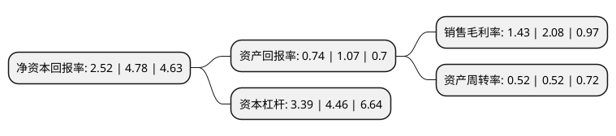

> 本页面由自动化程序生成于 2022年5月20日 01:12
> 内容可能存在错误，如有bug请提交issue至：https://github.com/Eroleice/doc-pi/issues
{.is-warning}

# 上市公司基本情况

## 基本资料

深圳市普路通供应链管理股份有限公司（以下简称“普路通”）成立于2005年12月19日，深圳市。于2015年06月29日在深交所中小板上市。

普路通注册资本37,331.805万元，致力于通过提供供应链管理服务，综合运用包括管理，金融，信息在内的各种手段和工具，创新性地为客户提供包括物流，商流，资金流，信息流和工作流在内的供应链改进方案并协助其执行，为客户提供包括供应链方案设计，采购，分销，库存管理，资金结算，通关物流以及信息系统支持等诸多环节在内的一体化供应链管理服务，以帮助客户提高其供应链的运作效率并降低其运作成本。目前，公司的供应链管理主要服务于电子信息行业和医疗器械行业，并涉足农产品等行业。以下是详细信息：

- 公司名称: 深圳市普路通供应链管理股份有限公司
- 股票代码: 002769.SZ
- 所在地: 广东 - 深圳市
- 成立日期: 2005年12月19日
- 注册资本: 37,331.805万元
- 法定代表人: 吴立扬
- 主营业务: 致力于通过提供供应链管理服务，综合运用包括管理，金融，信息在内的各种手段和工具，创新性地为客户提供包括物流，商流，资金流，信息流和工作流在内的供应链改进方案并协助其执行，为客户提供包括供应链方案设计，采购，分销，库存管理，资金结算，通关物流以及信息系统支持等诸多环节在内的一体化供应链管理服务，以帮助客户提高其供应链的运作效率并降低其运作成本目前，公司的供应链管理主要服务于电子信息行业和医疗器械行业，并涉足农产品等行业
- 公司官网: www.prolto.com
- 公司介绍: 公司致力于通过提供智慧供应链管理服务，综合运用包括管理、金融、信息在内的各种手段和工具，创新性地为客户提供包括物流、商流、资金流、信息流和工作流在内的供应链改进方案并协助其执行，为客户提供包括供应链方案设计、代理采购和分销、库存管理、资金结算、通关物流以及信息系统支持等诸多环节在内的一体化供应链管理服务，以帮助客户提高其供应链的运作效率并降低其运作成本。公司供应链管理服务主要集中于电子信息行业，是目前境内供应链管理服务行业的领先企业之一。随着公司的长足发展，涉猎范围也越来越广，现已包括了医疗器械、食品、红酒等行业的代理、进口等业务，已成为境内供应链管理服务行业的领先企业之一。连续数年，公司营业收入和净利润保持持续稳步增长态势，业务也从单纯的供应链领域逐步迈向多元化的现代领域，目前，公司在北京、上海、武汉、新疆乌鲁木齐、广西北海及中国香港等地区均设有分支机构。

## 股东及高管情况

上市公司第一大股东为陈书智，持股64,149,567股，占比17.18%，**疑似为**上市公司实际控制人。

截至2022年03月31日，上市公司的前十大股东中，共有7名自然人股东，3名机构股东，其中5%以上大股东共有5名。上市公司前十大股东明细如下：

> 未能通过持股比例判定出上市公司实际控制人（持股30%以上）
> 可能存在通过间接持股、联合持股、协议控制等方式拥有实际控制权的主体，具体请参考上市公司定期公告！
{.is-warning}

> 截至2022年03月31日，上市公司前十大股东信息如下：

| 股东名称 | 持股数量（股） | 持股比例 |
| --- | --- | --- |
| 陈书智 | 64,149,567 | 17.18% |
| 张云 | 25,877,963 | 6.93% |
| 赵野 | 20,917,401 | 5.6% |
| 广州金控绿金投资有限公司 | 20,066,931 | 5.38% |
| 深圳市聚智通信息技术有限公司 | 19,743,607 | 5.29% |
| 何帆 | 17,895,053 | 4.79% |
| 天津鼎若投资中心(有限合伙) | 12,806,500 | 3.43% |
| 罗新高 | 8,358,797 | 2.24% |
| 邹勇 | 7,142,901 | 1.91% |
| 王竹 | 5,024,300 | 1.35% |

## 利润表分析

上市公司2021年总收入为25.72亿元，净利润为0.36亿元，实现盈利。

## 杜邦分析

> 数据列示周期：2021年 | 2020年 | 2019年
{.is-info}

上市公司的净资产收益率在近一年有所下降，下降幅度为-47.28%，其变化情况分解如下：
- 上市公司的销售毛利率在近一年下降了-31.25%，可能是生产效率的下降、商品原材料价格上涨或商品价格的下跌所致。
- 上市公司的资产周转率在近一年下降了0%，可能是源自于更慢的销售回款或库存管理效果下降。
- 上市公司的财务杠杆比率在近一年下降了-23.99%，可能是减少负债降低财务费用。

